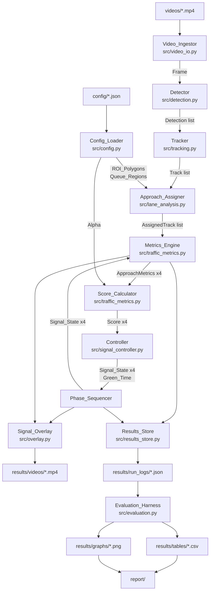
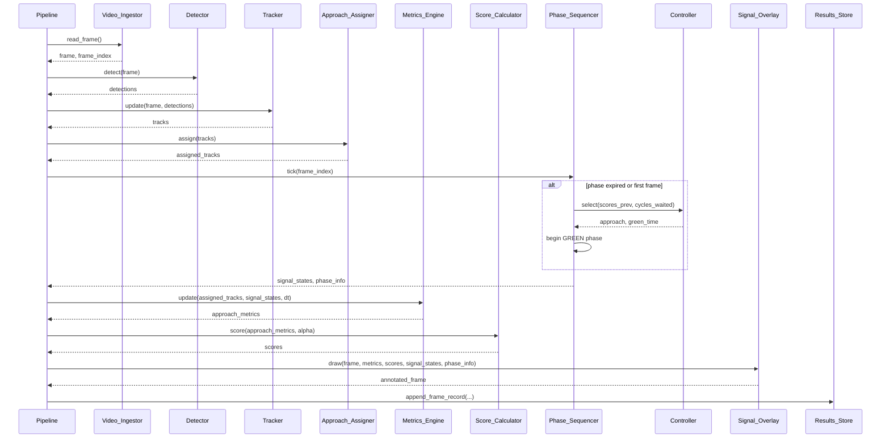
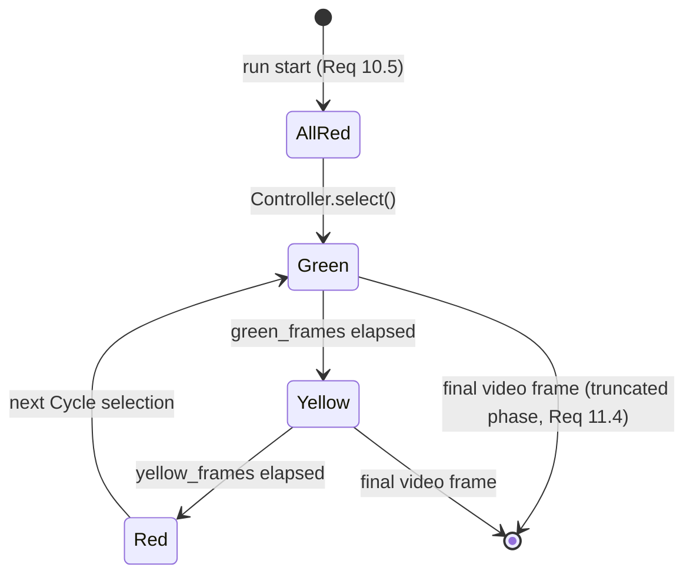
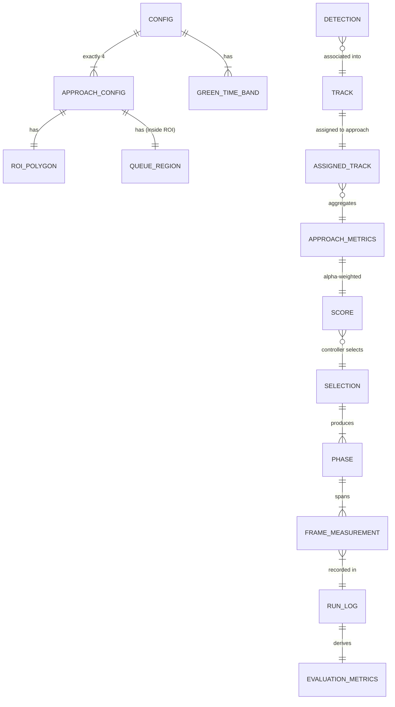

# Design Document

## Overview

The System is a single-process, offline-batch Python application. It consumes a traffic-junction video file, runs a frame-by-frame vision pipeline over it, drives a simulated four-phase traffic signal from the measurements produced by that pipeline, and writes annotated video, per-run logs, comparison tables, and Matplotlib graphs to disk.

The controlling design constraint is that **the video is the clock**. There is no wall-clock timing in the control path. The Simulated_Clock is `frame_index / frame_rate`, and a Green_Time of `g` seconds is realised as `max(1, round(g * frame_rate))` frames. This makes every run deterministic and exactly reproducible for a given video plus configuration, which is what makes the fixed-time and adaptive comparison in Requirement 13 valid: both controllers see an identical frame sequence and identical measurements, and differ only in phase selection and phase duration.

The second controlling constraint is that **measurement and control are separated**. The vision stages (ingest, detect, track, assign, measure, score) are pure functions of the frame and the accumulated track state; they never read Signal_State except in the one place waiting time is accumulated. The controller reads Scores and emits Signal_State. This separation is what allows the same recorded measurement stream to drive two different controllers, and allows the controller to be unit-tested and property-tested without any video, YOLO weights, or GPU.

Design decisions worth stating up front:

- **Configuration is JSON, loaded with the standard-library `json` module.** Requirement 15.8 restricts runtime dependencies to Python, OpenCV, Ultralytics YOLO, ByteTrack, NumPy, and Matplotlib. YAML would add PyYAML, so JSON is used.
- **ByteTrack is consumed through Ultralytics' built-in tracker** (`model.track(..., tracker="bytetrack.yaml", persist=True)`) rather than as a separate package. Ultralytics ships a ByteTrack implementation, so this satisfies Requirement 3 without adding a dependency. `src/tracking.py` wraps it behind an interface that a pure-Python fake can substitute during tests.
- **Geometry uses `cv2.pointPolygonTest`** for point-in-polygon, so approach assignment matches exactly what the overlay draws.
- **Run_Logs are the single source of truth for every reported number.** Graph and table generation reads Run_Logs, never live pipeline state, which is what makes Requirement 14.7 (regenerate graphs without reprocessing video) fall out naturally rather than needing a separate cache.

### Requirements Traceability

| Component | Requirements |
|---|---|
| `Config_Loader` (`src/config.py`) | 4.1, 4.7, 4.8, 5.10, 6.7, 6.8, 8.9, 9.7, 14.1, 14.2, 14.5 |
| `Video_Ingestor` (`src/video_io.py`) | 1.1–1.6, 11.1, 11.3, 15.1 |
| `Detector` (`src/detection.py`) | 2.1–2.7, 15.2 |
| `Tracker` (`src/tracking.py`) | 3.1–3.5, 15.3 |
| `Approach_Assigner` (`src/lane_analysis.py`) | 4.2–4.6, 16.5 |
| `Metrics_Engine` (`src/traffic_metrics.py`) | 5.1–5.9, 13.2 |
| `Score_Calculator` (`src/traffic_metrics.py`) | 6.1–6.6 |
| `Fixed_Time_Controller` (`src/signal_controller.py`) | 7.1–7.5, 10.6 |
| `Adaptive_Controller` (`src/signal_controller.py`) | 8.1–8.10, 9.1–9.6, 10.6 |
| `Phase_Sequencer` (`src/signal_controller.py`) | 10.1–10.5, 11.2, 11.4 |
| `Signal_Overlay` (`src/overlay.py`) | 3.6, 12.1–12.7 |
| `Results_Store` (`src/results_store.py`) | 1.5, 4.4, 9.6, 11.4, 14.3, 14.4, 14.6 |
| `Evaluation_Harness` (`src/evaluation.py`) | 13.1–13.9, 14.7, 16.1–16.4, 17.1–17.6 |
| `Pipeline` + CLI (`src/main.py`) | 15.1–15.6 |
| Project layout | 15.7, 15.8 |

## Architecture

### Pipeline data flow



The edge from `Phase_Sequencer` back into `Metrics_Engine` is the only feedback edge in the pipeline. It exists solely so Waiting_Time can be suppressed while an Approach is GREEN (Requirements 5.5, 5.6). Everything else flows forward.

### Per-frame loop



Ordering note: the Phase_Sequencer ticks **before** the Metrics_Engine update for the current frame, so the Signal_State used to gate Waiting_Time accumulation on frame `n` is the state in force during frame `n`. Controller selection at a phase boundary uses the Scores computed on frame `n-1`, because the frame-`n` Scores do not exist yet at that point in the loop. This is recorded in the Run_Log as `selection_score_frame` so results remain auditable.

### Controller state machine



Only one Approach is ever in the non-RED part of this machine. The Phase_Sequencer owns a single `active_approach` plus a single `active_state`, and derives the four-element Signal_State vector from them. That representation makes Requirements 10.1–10.3 structurally impossible to violate rather than something that needs checking.

## Components and Interfaces

### Config_Loader — `src/config.py`

Loads and validates every tunable parameter. Validation is total: a configuration that passes `load_config` is guaranteed usable by every downstream component, so no downstream component re-validates.

```python
@dataclass(frozen=True)
class ApproachConfig:
    name: str                      # "North" | "East" | "South" | "West"
    roi_polygon: list[tuple[int, int]]
    queue_region: list[tuple[int, int]]
    saturation_count: float        # > 0   (Req 5.10)
    queue_capacity: float          # > 0   (Req 5.10)

@dataclass(frozen=True)
class GreenTimeBand:
    min_score: float               # inclusive lower bound
    green_time: float              # simulated seconds

@dataclass(frozen=True)
class Config:
    alpha: float                   # 0..1  (Req 6.7)
    confidence_threshold: float
    model_path: str
    track_buffer: int
    trajectory_length: int
    approaches: tuple[ApproachConfig, ...]     # exactly 4 (Req 4.1)
    green_time_bands: tuple[GreenTimeBand, ...]
    min_green_time: float
    max_green_time: float
    yellow_duration: float
    starvation_limit: int          # >= 1  (Req 9.7)
    default_frame_rate: float
    use_pce_weighting: bool
    pce_weights: dict[str, float]  # per Vehicle_Class (Req 5.9)
    quit_key: str
    frame_size: tuple[int, int]    # for ROI bounds validation (Req 4.8)

def load_config(path: str) -> Config: ...
def to_json_obj(config: Config) -> dict: ...     # Req 14.5 round-trip
def from_json_obj(obj: dict) -> Config: ...
```

Validation rules, each raising `ConfigError` naming the offending field:

| Rule | Requirement |
|---|---|
| exactly four approaches named North, East, South, West | 4.1 |
| each `roi_polygon` has ≥ 3 vertices, all within `frame_size` | 4.8 |
| every `queue_region` vertex lies inside its parent `roi_polygon` | 4.7 |
| `saturation_count > 0` and `queue_capacity > 0` | 5.10 |
| `0 <= alpha <= 1` | 6.7 |
| `starvation_limit >= 1`, integer | 9.7 |
| `green_time_bands` non-empty, strictly increasing `min_score`, non-decreasing `green_time`, first band `min_score == 0` | 8.7, 8.9 |
| every band `green_time` within `[min_green_time, max_green_time]` | 8.8 |
| every required key present | 14.2 |

`load_config` raises; `src/main.py` catches `ConfigError`, prints it, and exits with status 1 (Requirement 14.2).

The `green_time_bands` representation is deliberately a sorted list rather than three hard-coded thresholds. The defaults shipped in `config/default.json` are `[(0.0, 30), (0.3, 45), (0.6, 60)]`, which reproduces Requirements 8.4–8.6 exactly, while the monotonicity validation guarantees Requirement 8.7 for any tuned replacement.

### Video_Ingestor — `src/video_io.py`

```python
@dataclass(frozen=True)
class VideoInfo:
    path: str
    width: int
    height: int
    frame_count: int
    frame_rate: float
    frame_rate_substituted: bool     # True when Req 1.5 fallback applied

class VideoIngestor:
    def __init__(self, path: str, config: Config) -> None: ...
    @property
    def info(self) -> VideoInfo: ...
    def frames(self) -> Iterator[tuple[int, np.ndarray]]: ...   # (index, frame)
    def close(self) -> None: ...
```

`__init__` opens the file with `cv2.VideoCapture` and raises `VideoError` naming the path if `isOpened()` is false or the first frame cannot be decoded (Requirement 1.4). If the reported FPS is `<= 0` or NaN, it substitutes `config.default_frame_rate` and sets `frame_rate_substituted`, which the Results_Store records as a warning (Requirement 1.5).

`frames()` is a generator yielding strictly consecutive indices from 0 (Requirement 1.2). It is the only place frames are read, so index integrity has one owner. `close()` releases the capture and calls `cv2.destroyAllWindows()`, and is invoked from a `finally` block so the quit key and exceptions both clean up (Requirements 1.3, 1.6).

Display mode is a separate wrapper function rather than a flag inside the generator, so the headless evaluation path never touches GUI calls:

```python
def play(path: str, config: Config) -> VideoInfo: ...   # Req 15.1 entry point
```

### Detector — `src/detection.py`

```python
VEHICLE_CLASSES = ("car", "motorcycle", "bus", "truck")

@dataclass(frozen=True)
class Detection:
    x1: int; y1: int; x2: int; y2: int
    vehicle_class: str          # in VEHICLE_CLASSES
    confidence: float           # 0..1

class Detector(Protocol):
    def detect(self, frame: np.ndarray) -> list[Detection]: ...

class YoloDetector:
    def __init__(self, config: Config) -> None: ...
    def detect(self, frame: np.ndarray) -> list[Detection]: ...
```

`YoloDetector.__init__` loads the Ultralytics model from `config.model_path` with no training call, raising `ModelError` naming the path on failure (Requirements 2.4, 2.6). `detect` maps COCO class ids to the four Vehicle_Classes and drops everything else (Requirement 2.2), drops detections below `confidence_threshold` (Requirement 2.3), and clips box coordinates to frame bounds, discarding any box that degenerates to zero width or height after clipping (Requirement 2.5).

`Detector` is a `Protocol` so tests inject a scripted fake and the whole downstream pipeline runs without weights or a GPU.

Requirement 2.7 (annotated detection-only video) is a thin entry point:

```python
def run_detection_video(video_path: str, config: Config, out_path: str) -> None: ...
```

It writes one output frame per processed input frame via `cv2.VideoWriter` at the input frame rate.

### Tracker — `src/tracking.py`

```python
@dataclass
class Track:
    track_id: int
    x1: int; y1: int; x2: int; y2: int
    vehicle_class: str
    trajectory: deque[tuple[int, int]]     # maxlen = trajectory_length

class Tracker(Protocol):
    def update(self, frame: np.ndarray, detections: list[Detection]) -> list[Track]: ...

class ByteTrackTracker:
    def __init__(self, config: Config) -> None: ...
    def update(self, frame: np.ndarray, detections: list[Detection]) -> list[Track]: ...
```

Implementation notes:

- ByteTrack is reached through Ultralytics' persistent tracking with a generated tracker config carrying `track_buffer` from `Config`. Retirement after `track_buffer` frames of absence and never reissuing a retired id are properties of ByteTrack itself; the wrapper additionally records retired ids in a `frozenset` and asserts no reissue, so Requirement 3.4 is checked rather than assumed.
- The wrapper owns trajectory history in a `dict[int, deque]` with `maxlen=config.trajectory_length` (Requirement 3.5), appending the reference point each frame and deleting the entry on retirement so memory is bounded by the number of live tracks.
- Distinctness of ids within a frame (Requirement 3.2) is asserted in the wrapper.

### Approach_Assigner — `src/lane_analysis.py`

```python
@dataclass(frozen=True)
class AssignedTrack:
    track_id: int
    vehicle_class: str
    ref_point: tuple[int, int]
    approach: str | None        # None => unassigned (Req 4.5)
    is_queueing: bool

def reference_point(track: Track) -> tuple[int, int]:
    """Midpoint of the bottom edge of the bounding box (Req 4.2)."""
    return ((track.x1 + track.x2) // 2, track.y2)

class ApproachAssigner:
    def __init__(self, config: Config) -> None: ...
    def assign(self, tracks: list[Track]) -> tuple[list[AssignedTrack], list[OverlapEvent]]: ...
```

Assignment algorithm per track:

1. Compute `ref_point` as the bottom-edge midpoint.
2. Collect every Approach whose `roi_polygon` contains `ref_point`, tested with `cv2.pointPolygonTest(..., measureDist=False) >= 0` so boundary points count as inside.
3. Zero matches → `approach = None`, `is_queueing = False`; the track is excluded from all per-approach measurement (Requirement 4.5).
4. Exactly one match → assign it (Requirement 4.3).
5. Two or more matches → assign the Approach whose precomputed polygon centroid is nearest in Euclidean distance to `ref_point`, and emit an `OverlapEvent(track_id, frame_index, candidates, chosen)` for the Run_Log (Requirement 4.4).
6. `is_queueing` is true if and only if `ref_point` is inside the assigned Approach's `queue_region` (Requirement 4.6). Because config validation guarantees the queue region lies inside its parent ROI, `is_queueing` implies assignment to that same Approach, which is what makes Requirement 5.8 (`Queue_Length <= Vehicle_Count`) hold structurally.

Polygon centroids and `np.ndarray` polygon representations are computed once in `__init__`, not per frame.

Requirement 16.5 (viewpoint mismatch) is served by a standalone check invoked before a video enters the evaluation set:

```python
def check_roi_coverage(video_path: str, config: Config) -> list[str]:
    """Return names of Approaches whose ROI saw no assigned track over a
    sample of frames; a non-empty result excludes the video (Req 16.5)."""
```

### Metrics_Engine — `src/traffic_metrics.py`

```python
@dataclass(frozen=True)
class ApproachMetrics:
    approach: str
    vehicle_count: int          # >= 0
    vehicle_density: float      # 0..1
    queue_length: int           # >= 0, <= vehicle_count
    normalized_queue: float     # 0..1

@dataclass(frozen=True)
class FrameMeasurement:
    frame_index: int
    simulated_time: float
    metrics: dict[str, ApproachMetrics]
    scores: dict[str, float]
    signal_states: dict[str, str]

class MetricsEngine:
    def __init__(self, config: Config) -> None: ...
    def update(self,
               assigned: list[AssignedTrack],
               signal_states: dict[str, str],
               dt: float) -> dict[str, ApproachMetrics]: ...
    @property
    def waiting_times(self) -> dict[int, float]: ...
    @property
    def vehicles_served(self) -> int: ...
```

Per-frame computation:

- `vehicle_count` = number of distinct Track_IDs assigned to the Approach this frame (Requirement 5.1). A `set` of Track_IDs enforces distinctness.
- `vehicle_density` = `clamp(numerator / saturation_count, 0, 1)` where the numerator is `vehicle_count` normally, or `sum(pce_weights[cls] for assigned tracks)` when `use_pce_weighting` is enabled (Requirements 5.2, 5.9). The divisor and clamping are identical in both modes, so switching modes cannot break the 0..1 range.
- `queue_length` = number of distinct assigned Track_IDs with `is_queueing` (Requirement 5.3); `normalized_queue` = `clamp(queue_length / queue_capacity, 0, 1)` (Requirement 5.4).
- Waiting time: for each queueing track whose Approach state is not `GREEN`, `waiting_times[track_id] += dt` with `dt = 1 / frame_rate` (Requirement 5.5). When the Approach state is `GREEN`, no track assigned to that Approach is touched, so its waiting time is held (Requirement 5.6).
- Vehicles served: a track counted as queueing on frame `n-1` for Approach `a`, and on frame `n` either not queueing or absent, while `a` was `GREEN` on frame `n`, increments `vehicles_served` (definition of Vehicles_Served for Requirement 13.2). Previous-frame queue membership is held in a `dict[str, set[int]]`.

`clamp` is applied in one shared helper so Requirement 5.7 has a single implementation point.

### Score_Calculator — `src/traffic_metrics.py`

```python
def compute_score(metrics: ApproachMetrics, alpha: float) -> float:
    return alpha * metrics.vehicle_density + (1.0 - alpha) * metrics.normalized_queue

def compute_scores(metrics: dict[str, ApproachMetrics],
                   alpha: float) -> dict[str, float]: ...
```

A convex combination of two values already clamped to 0..1 with a weight in 0..1 is itself in 0..1, so Requirement 6.2 holds by construction, and Requirements 6.3–6.6 (α=1 reduces to density, α=0 reduces to queue, and monotonicity in each argument) are algebraic consequences. These are the properties the property-based tests target. Requirement 6.8 is satisfied because `alpha` and every threshold arrive as `Config` fields; no numeric literal for a tunable appears in this module.

### Signal controllers and sequencer — `src/signal_controller.py`

```python
class SignalState(str, Enum):
    GREEN = "GREEN"; YELLOW = "YELLOW"; RED = "RED"

APPROACH_ORDER = ("North", "East", "South", "West")

@dataclass(frozen=True)
class Selection:
    approach: str
    green_time: float
    starvation_override: bool
    selection_score: float

class Controller(Protocol):
    name: str
    def select(self, scores: dict[str, float]) -> Selection: ...

class FixedTimeController:
    """Round-robin, constant 30 s (Req 7.1-7.5)."""

class AdaptiveController:
    """Queue-aware selection with starvation prevention (Req 8, 9)."""

class PhaseSequencer:
    def __init__(self, controller: Controller, config: Config, frame_rate: float) -> None: ...
    def tick(self, frame_index: int, scores: dict[str, float]) -> PhaseInfo: ...
    def signal_states(self) -> dict[str, SignalState]: ...
    def finalize(self, last_frame_index: int) -> None: ...
```

**FixedTimeController** holds an index into `APPROACH_ORDER`, advances it modulo 4 on each `select`, and returns `green_time = 30.0` unconditionally, ignoring `scores` entirely (Requirements 7.1–7.3, 7.5).

**AdaptiveController** holds `cycles_waited: dict[str, int]`. On `select`:

1. If any Approach has `cycles_waited >= starvation_limit`, choose the one with the greatest `cycles_waited`, ties broken by `APPROACH_ORDER`, and set `starvation_override = True` (Requirement 9.3).
2. Otherwise choose among the Approaches holding the maximal Score; ties broken first by greatest `cycles_waited`, then by `APPROACH_ORDER` (Requirements 8.2, 8.3).
3. Green_Time comes from `green_time_bands`: the band with the greatest `min_score` not exceeding the selected Approach's Score. With the default bands this is 30 s below 0.3, 45 s in [0.3, 0.6), and 60 s at or above 0.6 (Requirements 8.4–8.6). Because bands are validated as non-decreasing in `green_time` and bounded by `[min_green_time, max_green_time]`, Requirements 8.7 and 8.8 hold for any tuned band set. The same lookup runs for a starvation override, so an overridden Approach still receives the Green_Time matching its Score (Requirement 9.6).
4. Reset the selected Approach's counter to 0 and increment the other three (Requirement 9.2).

Ordering point for Requirement 9.4: counters are updated at the end of `select`, so immediately after a Cycle the maximum possible counter value is `starvation_limit`. Step 1 then forces selection of that Approach on the next Cycle, which bounds every counter by `starvation_limit` at every Cycle end and guarantees each Approach is served within any window of `starvation_limit + 1` consecutive Cycles (Requirement 9.5). That window bound is a property-based test target.

**PhaseSequencer** owns all timing and state integrity:

- State is `(active_approach, active_state, phase_end_frame)`. `signal_states()` returns `GREEN`/`YELLOW` for `active_approach` and `RED` for the other three, which makes Requirements 10.1–10.3 unfalsifiable by construction. Before the first Cycle, `active_approach is None` and all four read `RED` (Requirement 10.5).
- Frame conversion: `green_frames = max(1, round(green_time * frame_rate))`, `yellow_frames = max(1, round(yellow_duration * frame_rate))` (Requirement 11.2).
- Transitions follow RED→GREEN→YELLOW→RED only (Requirement 10.4); the sequencer exposes no method that can produce another edge.
- `finalize` marks a phase still in progress at the final frame as truncated and flags it for exclusion from per-phase averages (Requirement 11.4).
- The sequencer is shared by both controllers, so Requirement 10.6 needs no duplicated logic.

### Signal_Overlay — `src/overlay.py`

```python
class SignalOverlay:
    def __init__(self, config: Config) -> None: ...
    def draw(self, frame: np.ndarray,
             tracks: list[Track],
             assigned: list[AssignedTrack],
             metrics: dict[str, ApproachMetrics],
             scores: dict[str, float],
             signal_states: dict[str, SignalState],
             phase_info: PhaseInfo,
             controller_name: str,
             simulated_time: float) -> np.ndarray: ...
```

Draw order, back to front: ROI polygons and queue regions with per-Approach labels (Requirement 12.1) → track boxes with Track_ID, Vehicle_Class, and trajectory polylines (Requirement 3.6) → a per-Approach text panel showing name, Vehicle_Count, Queue_Length, and Score at two decimals (Requirement 12.2) → a simulated traffic-light glyph per Approach coloured by Signal_State (Requirement 12.3) → a phase banner naming the GREEN Approach with its assigned and remaining seconds (Requirement 12.4) → a header with controller name and Simulated_Clock (Requirement 12.5). When the selected Approach changes between Cycles, the banner also shows the Score that produced the selection (Requirement 12.7).

Queue regions are drawn in a distinct colour from their parent ROI so the screenshots in `report/` show the two regions separately. Video writing is handled by a small `AnnotatedVideoWriter` that opens `cv2.VideoWriter` at the input frame rate and writes every drawn frame (Requirement 12.6).

### Results_Store — `src/results_store.py`

```python
@dataclass
class RunLog:
    run_id: str
    video_path: str
    controller_name: str
    alpha: float
    config: dict                       # resolved config (Req 14.3)
    video_info: dict
    warnings: list[str]                # e.g. frame-rate substitution (Req 1.5)
    overlap_events: list[dict]         # Req 4.4
    starvation_overrides: list[dict]   # Req 9.6
    phases: list[dict]                 # incl. truncated flag (Req 11.4)
    frames: list[dict]                 # Req 14.6
    evaluation_metrics: dict           # Req 13.2, 13.3, 13.5
    complete: bool                     # Req 13.8

class ResultsStore:
    def start_run(self, video_path: str, controller_name: str, config: Config,
                  video_info: VideoInfo) -> RunLog: ...
    def append_frame_record(self, log: RunLog, m: FrameMeasurement) -> None: ...
    def finish_run(self, log: RunLog, metrics: dict, complete: bool) -> str: ...
    def write(self, log: RunLog, path: str) -> None: ...
    def read(self, path: str) -> RunLog: ...
```

Run_Logs are JSON at `results/run_logs/{video_stem}__{controller}__alpha{a}__{timestamp}.json`. `write` records the resolved configuration, video path, and controller name at run start (Requirement 14.3), and one record per frame carrying Vehicle_Count, Queue_Length, Score, and Signal_State for each Approach (Requirement 14.6). Decimals are serialised with `repr`-level precision so the `write`/`read` round trip reproduces values well within the 0.001 tolerance of Requirement 14.4; that round trip is a property-based test target alongside the config round trip of Requirement 14.5.

### Evaluation_Harness — `src/evaluation.py`

```python
@dataclass(frozen=True)
class EvaluationMetrics:
    avg_waiting_time: float
    avg_queue_length: float
    max_queue_length: int
    vehicles_served: int
    throughput: float            # vehicles per minute
    processing_fps: float | None  # adaptive runs only (Req 13.3)

def compute_metrics(log: RunLog) -> tuple[dict[str, EvaluationMetrics], EvaluationMetrics]:
    """Per-Approach and aggregate metrics from a Run_Log (Req 13.4, 13.5)."""

def run_evaluation(video_specs: list[VideoSpec], config: Config) -> list[RunLog]: ...
def write_comparison_table(logs: list[RunLog], out_dir: str) -> str: ...
def write_comparison_graphs(logs: list[RunLog], out_dir: str) -> list[str]: ...
def build_report_artifacts(logs: list[RunLog], report_dir: str) -> None: ...
```

`run_evaluation` executes, for each video, one Fixed_Time run and one Adaptive run per configured Alpha, reusing the identical `Config` for ROIs, queue regions, detector, and tracker so the only difference between runs is the controller (Requirement 13.1). Detection and tracking are re-run per controller rather than cached, because ByteTrack state is deterministic given the same frames and detections, keeping the two runs comparable without a caching layer to get wrong. An Alpha sweep produces one Run_Log per Alpha value (Requirement 13.9).

`compute_metrics` derives every value from the Run_Log only (Requirement 13.4):

- `avg_waiting_time` — mean of per-Track_ID accumulated Waiting_Time
- `avg_queue_length` — mean of per-frame Queue_Length over all frames
- `max_queue_length` — maximum per-frame Queue_Length
- `vehicles_served` — as accumulated by the Metrics_Engine
- `throughput` — `vehicles_served / (simulated_duration_seconds / 60)`
- `processing_fps` — frames processed divided by wall-clock run seconds, recorded for adaptive runs (Requirement 13.3)

Phases flagged truncated are excluded from per-phase averages (Requirement 11.4). A Run_Log with `complete = False` is written into the table marked incomplete and excluded from the controller comparison (Requirement 13.8).

`write_comparison_table` emits CSV to `results/tables/` with one row per (video, controller, alpha) and one column per metric (Requirement 13.6). `write_comparison_graphs` emits Matplotlib grouped bar charts to `results/graphs/` for average Waiting_Time, average Queue_Length, maximum Queue_Length, and Throughput (Requirement 13.7). Both read Run_Logs only, so `--graphs-only` regenerates every artefact with no video decoding (Requirement 14.7).

Video designation and metadata come from `data/annotations/videos.json`:

```python
@dataclass(frozen=True)
class VideoSpec:
    path: str
    role: str                    # "development" | "final"
    frame_rate: float
    resolution: tuple[int, int]
    duration_seconds: float
    visible_approaches: tuple[str, ...]
```

The harness validates that the set holds 2 to 5 videos (Requirement 16.1), records the metadata and role (Requirements 16.2, 16.3), and reports final-evaluation videos in a table section separate from development videos (Requirement 16.4).

`build_report_artifacts` copies graphs and tables into `report/`, exports demonstration screenshots from annotated frames, and writes the architecture diagram source and the literature-comparison table for Raza 2025, Saraff 2025, YOLO-LIGHT 2026, Jin 2024, and Lamrabet 2026 with a per-work "how this System differs" column (Requirements 17.1–17.3). Each numeric cell it emits carries the `run_id` it was measured from (Requirement 17.6). The contribution framing and the Out of Scope list are template text shared by `report/` and `README.md` (Requirements 17.4, 17.5).

### Pipeline and CLI — `src/main.py`

One `Pipeline` class runs the per-frame loop; the CLI selects which stages are active, giving the six runnable entry points of Requirement 15:

| Command | Requirement |
|---|---|
| `python -m src.main play --video V` | 15.1 |
| `python -m src.main detect --video V` | 15.2, 2.7 |
| `python -m src.main track --video V` | 15.3 |
| `python -m src.main measure --video V` | 15.4 |
| `python -m src.main control --video V --controller {fixed,adaptive}` | 15.5 |
| `python -m src.main evaluate [--alpha-sweep A,B,C] [--graphs-only]` | 15.6, 13.9, 14.7 |

Every command takes `--config` (default `config/default.json`) and `--no-display` for headless runs.

### Project layout

```
traffic-signal-cv/
├── config/default.json
├── data/{raw,processed,annotations}/
├── videos/
├── models/
├── src/
│   ├── config.py           # Config_Loader
│   ├── video_io.py         # Video_Ingestor
│   ├── detection.py        # Detector
│   ├── tracking.py         # Tracker
│   ├── lane_analysis.py    # Approach_Assigner
│   ├── traffic_metrics.py  # Metrics_Engine + Score_Calculator
│   ├── signal_controller.py# controllers + Phase_Sequencer
│   ├── overlay.py          # Signal_Overlay
│   ├── results_store.py    # Results_Store
│   ├── evaluation.py       # Evaluation_Harness
│   └── main.py             # Pipeline + CLI
├── tests/
├── notebooks/
├── report/
├── results/{videos,graphs,tables,run_logs}/
└── README.md
```

The six file names mandated by Requirement 15.7 are present with the mandated responsibilities; `config.py`, `video_io.py`, `overlay.py`, `results_store.py`, and `evaluation.py` are additional modules that keep those six focused. Runtime imports are limited to the standard library plus OpenCV, Ultralytics, NumPy, and Matplotlib (Requirement 15.8).

## Data Models



Invariants carried by these models:

| Invariant | Requirement |
|---|---|
| `0 <= vehicle_density <= 1`, `0 <= normalized_queue <= 1` | 5.7 |
| `0 <= queue_length <= vehicle_count` | 5.8 |
| `0 <= score <= 1` | 6.2 |
| exactly one Approach non-RED once running | 10.1–10.3 |
| `min_green_time <= green_time <= max_green_time` | 8.8 |
| `cycles_waited[a] <= starvation_limit` at every Cycle end | 9.4 |
| Simulated_Clock strictly increasing | 11.3 |

## Error Handling

| Condition | Handling | Requirement |
|---|---|---|
| Video path missing or undecodable | `VideoError` naming the path; exit 1 | 1.4 |
| Reported frame rate ≤ 0 | Substitute `default_frame_rate`; warn in Run_Log; continue | 1.5 |
| Quit key pressed | Stop reading, release capture and windows, finalize truncated phase | 1.6, 11.4 |
| YOLO weights unloadable | `ModelError` naming `model_path`; exit 1 | 2.6 |
| Box degenerate after clipping | Discard the detection | 2.5 |
| Retired Track_ID reissued | Assertion failure naming the id | 3.4 |
| Track in overlapping ROIs | Nearest-centroid tiebreak; log `OverlapEvent` | 4.4 |
| Track outside all ROIs | Mark unassigned; exclude from measurement | 4.5 |
| Queue region vertex outside parent ROI | `ConfigError` naming Approach and vertex; exit 1 | 4.7 |
| ROI with < 3 vertices or vertex outside frame | `ConfigError` naming Approach; exit 1 | 4.8 |
| `saturation_count` or `queue_capacity` ≤ 0 | `ConfigError` naming Approach and parameter; exit 1 | 5.10 |
| Alpha outside 0..1 | `ConfigError` naming the value; exit 1 | 6.7 |
| `starvation_limit` < 1 or non-integer | `ConfigError` naming the value; exit 1 | 9.7 |
| Required config key absent | `ConfigError` naming the key; exit 1 | 14.2 |
| Video ends mid-phase | End run, mark phase truncated, exclude from per-phase averages | 11.4 |
| Run ends before final frame | Mark Run_Log incomplete; table marks it; excluded from comparison | 13.8 |
| ROI no longer covers its Approach road | `check_roi_coverage` reports mismatch; video excluded from set | 16.5 |
| Evaluation set outside 2..5 videos | `EvaluationError` naming the count; exit 1 | 16.1 |

All custom errors derive from a single `TrafficSignalError` base so `src/main.py` has one `except` clause that prints the message and exits 1.

## Correctness Properties

These are the invariants the System must hold for **all** inputs, not just the example cases. Each names the generated inputs it ranges over, the mechanism that enforces it, and the requirement it discharges. They are the specification the property-based tests encode.

### Property 1: Normalized measures stay in range

For any set of assigned tracks and any Approach, `0 <= vehicle_density <= 1` and `0 <= normalized_queue <= 1`. Enforced by a single shared `clamp` helper applied to both ratios, with config validation guaranteeing positive divisors.

**Validates: Requirements 5.7**

### Property 2: Queue length never exceeds vehicle count

For any set of assigned tracks and any Approach, `0 <= queue_length <= vehicle_count` in the same frame. Enforced structurally: config validation guarantees each Queue_Region is a subset of its parent ROI_Polygon, so `is_queueing` implies assignment to that same Approach.

**Validates: Requirements 5.8**

### Property 3: PCE weighting changes only the density numerator

For any set of assigned tracks and any positive PCE weights, enabling per-class weighting alters the density numerator but preserves the 0..1 range, because both code paths share the same divisor and the same clamp.

**Validates: Requirements 5.9**

### Property 4: Waiting time accumulates only while queueing and not green

For any run, a Track_ID's Waiting_Time is non-decreasing, and increases on a frame if and only if that track is queueing and its Approach Signal_State is not GREEN. Enforced by gating the `+= dt` on both conditions with no subtracting path.

**Validates: Requirements 5.5, 5.6**

### Property 5: Score stays in range

For any `ApproachMetrics` and any `alpha` in 0..1, `0 <= score <= 1`, because the score is a convex combination of two values already clamped to 0..1.

**Validates: Requirements 6.2**

### Property 6: Score degenerates to its endpoints

For any `ApproachMetrics`, `alpha == 1` yields `score == vehicle_density` and `alpha == 0` yields `score == normalized_queue`, by algebraic identity of the combination.

**Validates: Requirements 6.3, 6.4**

### Property 7: Score is monotone in each measure

For any `ApproachMetrics` and any `alpha`: with `alpha < 1` and density held fixed, score is non-decreasing in `normalized_queue`; with `alpha > 0` and queue held fixed, score is non-decreasing in `vehicle_density`. Enforced by non-negative coefficients on both terms.

**Validates: Requirements 6.5, 6.6**

### Property 8: Exactly one approach is non-red

At every frame after the first Cycle begins, exactly one Approach is GREEN or YELLOW and the other three are RED, for any Score sequence and any controller. Enforced structurally: the Phase_Sequencer stores one `(active_approach, active_state)` pair and derives the four-element Signal_State vector from it.

**Validates: Requirements 10.1, 10.2, 10.3**

### Property 9: Signal transitions follow the legal cycle

For any run, every observed per-Approach Signal_State transition lies in `{RED→GREEN, GREEN→YELLOW, YELLOW→RED}`. Enforced by the sequencer exposing no operation that can produce another edge.

**Validates: Requirements 10.4**

### Property 10: The run starts all-red

Before the first Cycle begins, all four Approaches are RED, because `active_approach` is `None` at construction.

**Validates: Requirements 10.5**

### Property 11: Green time stays within configured bounds

For any Score sequence and any accepted configuration, the assigned Green_Time lies in `[min_green_time, max_green_time]`. Enforced by config validation bounding every band's `green_time`.

**Validates: Requirements 8.8**

### Property 12: Green time is monotone in score

For any two Scores `s1 <= s2`, the Green_Time selected for `s1` is at most the Green_Time selected for `s2`. Enforced by validating bands as strictly increasing in `min_score` and non-decreasing in `green_time`.

**Validates: Requirements 8.7**

### Property 13: Waiting counters stay bounded

For any Score sequence, `cycles_waited[a] <= starvation_limit` holds for every Approach at the end of every Cycle. Enforced by updating counters at the end of `select`, so a counter reaching the limit forces selection of that Approach on the next Cycle.

**Validates: Requirements 9.4**

### Property 14: No approach starves

For any Score sequence, every Approach is selected at least once in any window of `starvation_limit + 1` consecutive Cycles. Follows from Property 13 plus the unconditional override branch that ignores Scores.

**Validates: Requirements 9.5**

### Property 15: Fixed-time control is score-independent

For any two Score sequences of equal length, the Fixed_Time_Controller produces an identical sequence of selected Approaches and Green_Times, because `FixedTimeController.select` ignores its `scores` argument.

**Validates: Requirements 7.3**

### Property 16: The simulated clock is strictly increasing

For any run, Simulated_Clock strictly increases across processed frames, because it is derived from a strictly increasing frame index over a fixed frame rate.

**Validates: Requirements 11.3**

### Property 17: Every phase spans at least one frame

For any `green_time > 0` and any `frame_rate > 0`, the phase spans at least 1 frame, enforced by `max(1, round(g * fps))`.

**Validates: Requirements 11.2**

### Property 18: Frame indices are consecutive from zero

For any readable video, the frame indices yielded over a run are consecutive starting at 0, with none skipped and none repeated, because one generator owns all frame reading.

**Validates: Requirements 1.2**

### Property 19: Run logs round-trip

For all Run_Logs, reading back a written Run_Log reproduces the configuration values and Evaluation_Metrics that were written, within 0.001 for values represented as decimals. Enforced by full-precision JSON serialization of plain data.

**Validates: Requirements 14.4**

### Property 20: Configurations round-trip

For all configurations accepted by the Config_Loader, `from_json_obj(to_json_obj(c))` equals `c`. Enforced by frozen dataclasses with total field coverage in both directions.

**Validates: Requirements 14.5**

### Property 21: Every reported number is traceable

For any comparison table or graph the harness writes, each numeric value is traceable to exactly one `run_id`, because tables and graphs are generated only from Run_Logs and never from live pipeline state.

**Validates: Requirements 13.4, 17.6**

## Testing Strategy

Tests live in `tests/`, using `pytest`, and are dev-only so Requirement 15.8's runtime constraint is untouched. Fakes for `Detector` and `Tracker` let the entire pipeline run headless with no weights, no GPU, and no video file, which keeps the suite fast enough to run on every change.

**Unit tests** — one module per source module. Highest-value targets: `reference_point` returns the bottom-edge midpoint (4.2); assignment across zero / one / many ROI matches (4.3–4.5); `is_queueing` only inside the queue region (4.6); density with and without PCE weighting hitting the same clamp (5.2, 5.9); waiting time accumulating only while queueing and not GREEN (5.5, 5.6); score at α=0 and α=1 (6.3, 6.4); fixed-time round-robin including West→North (7.1, 7.5) and constant 30 s regardless of scores (7.3); band lookup at the exact 0.3 and 0.6 boundaries (8.4–8.6); every tiebreak path in adaptive selection (8.3); starvation override preserving Score-derived Green_Time (9.6); `max(1, round(g * fps))` frame conversion including a sub-one-frame Green_Time (11.2).

**Property-based tests** — the requirements phrased as invariants or `FOR ALL` are best covered by generated inputs rather than examples:

| Property | Requirement |
|---|---|
| Score always within 0..1 for any metrics and any α in 0..1 | 6.2 |
| Score non-decreasing in `normalized_queue` when α < 1 and density fixed | 6.5 |
| Score non-decreasing in `vehicle_density` when α > 0 and queue fixed | 6.6 |
| Assigned `queue_length <= vehicle_count` for any track set | 5.8 |
| Density and normalized queue within 0..1 for any counts | 5.7 |
| Exactly one Approach non-RED at every frame after the first Cycle | 10.1–10.3 |
| Signal transitions only along RED→GREEN→YELLOW→RED | 10.4 |
| `cycles_waited[a] <= starvation_limit` after every Cycle | 9.4 |
| Every Approach selected within any `starvation_limit + 1` Cycle window | 9.5 |
| Assigned Green_Time within `[min_green_time, max_green_time]` | 8.8 |
| Green_Time non-decreasing in Score | 8.7 |
| Run_Log write→read reproduces values within 0.001 | 14.4 |
| Config serialize→load round-trips to an equal config | 14.5 |
| Simulated_Clock strictly increasing over a run | 11.3 |

Controller and sequencer properties are driven by synthetic Score sequences, so they need no video at all.

**Integration tests** — a short synthetic clip generated with NumPy (moving rectangles) plus the fake Detector drives the full loop, asserting: consecutive frame indices from 0 with none skipped (1.2); an annotated output video with exactly one frame per processed input frame (2.7, 12.6); a Run_Log containing one frame record per frame with all four Approaches (14.6); both controllers running over the same video with the same config (13.1); `--graphs-only` regenerating tables and graphs from an existing Run_Log with no decode (14.7); and truncated-phase and incomplete-run handling when the clip ends mid-phase (11.4, 13.8).

**Manual verification** — real-video checks that automation cannot settle: ROI polygons visually cover the intended approach road area; queue regions sit at the stop lines; Track_IDs stay stable through partial occlusion; and the demo shows a congested approach receiving a longer green and its Score dropping afterwards, which is the behaviour the viva demonstration depends on.
