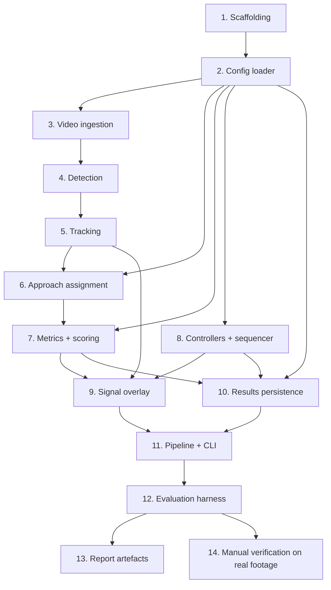

# Implementation Plan

## Overview

Task order follows the staged milestones of Requirement 15 and the 6-week course timeline: each numbered top-level task ends with something runnable and demonstrable. Pure-logic modules (config, metrics, scoring, control) are built and property-tested before the video-dependent stages, so the controller can be verified without weights, GPU, or footage.

Mapping to the course schedule:

| Week | Tasks | Deliverable |
|---|---|---|
| 1 | 1, 2, 3 | Video plays in OpenCV; config loads and validates |
| 2 | 4 | Reliable detection demo with annotated output video |
| 3 | 5, 6 | Tracked vehicles with persistent IDs and approach assignment |
| 4 | 7 | Live per-approach counts, density, queue length, and score |
| 5 | 8, 9, 10, 11 | Complete demo: both controllers with simulated signal overlay |
| 6 | 12, 13, 14 | Measured evaluation, graphs, tables, and report artefacts |

## Task Dependency Graph



Task 8 depends only on task 2, not on any video stage, which is what lets the controller and all its property tests be completed in parallel with the vision work if needed.

Execution waves over leaf tasks, where every task in a wave has all its dependencies satisfied by earlier waves:

```json
{
  "waves": [
    { "wave": 1, "tasks": ["1"] },
    { "wave": 2, "tasks": ["2.1"] },
    { "wave": 3, "tasks": ["2.2"] },
    { "wave": 4, "tasks": ["2.3", "3.1"] },
    { "wave": 5, "tasks": ["3.2", "3.3", "4.1"] },
    { "wave": 6, "tasks": ["4.2", "5.1", "8.1"] },
    { "wave": 7, "tasks": ["4.3", "5.2", "8.2", "8.3"] },
    { "wave": 8, "tasks": ["5.3", "6.1", "8.4"] },
    { "wave": 9, "tasks": ["6.2", "7.1", "8.5"] },
    { "wave": 10, "tasks": ["7.2", "7.3"] },
    { "wave": 11, "tasks": ["7.4", "9.1"] },
    { "wave": 12, "tasks": ["7.5", "9.2", "10.1"] },
    { "wave": 13, "tasks": ["10.2", "11"] },
    { "wave": 14, "tasks": ["12.1", "12.2"] },
    { "wave": 15, "tasks": ["12.3"] },
    { "wave": 16, "tasks": ["12.4"] },
    { "wave": 17, "tasks": ["13", "14"] }
  ]
}
```

## Tasks

- [x] 1. Project scaffolding and test harness
  - Create the directory tree from the design: `config/`, `data/{raw,processed,annotations}/`, `videos/`, `models/`, `src/`, `tests/`, `notebooks/`, `report/`, `results/{videos,graphs,tables,run_logs}/`
  - Add `src/__init__.py` and `tests/__init__.py`; add `.gitkeep` files so empty output directories are tracked
  - Create `requirements.txt` pinning only opencv-python, ultralytics, numpy, and matplotlib at exact versions, and `requirements-dev.txt` pinning pytest and hypothesis
  - Create `src/errors.py` with a `TrafficSignalError` base plus `ConfigError`, `VideoError`, `ModelError`, and `EvaluationError` subclasses
  - Write a placeholder `README.md` naming the project and its fixed stack
  - Verify `pytest` runs and collects zero tests without error
  - _Requirements: 15.7, 15.8_

- [x] 2. Configuration loading and validation
- [x] 2.1 Implement config dataclasses and JSON load
  - In `src/config.py` define frozen dataclasses `ApproachConfig`, `GreenTimeBand`, and `Config` with the fields listed in the design
  - Implement `load_config(path)`, `to_json_obj(config)`, and `from_json_obj(obj)` using the standard-library `json` module only
  - Write `config/default.json` with four approach entries, `alpha` 0.5, green-time bands `[(0.0, 30), (0.3, 45), (0.6, 60)]`, `min_green_time` 30, `max_green_time` 60, `yellow_duration` 3, `starvation_limit` 3, and placeholder ROI and queue-region polygons
  - _Requirements: 14.1, 14.5_

- [x] 2.2 Implement total configuration validation
  - Reject a missing required key, naming the absent key
  - Reject an approach set that is not exactly North, East, South, West
  - Reject an ROI polygon with fewer than 3 vertices or any vertex outside `frame_size`, naming the approach
  - Reject a queue-region vertex outside its parent ROI polygon, naming the approach and the vertex
  - Reject `saturation_count <= 0` or `queue_capacity <= 0`, naming the approach and the parameter
  - Reject `alpha` outside 0..1 and `starvation_limit` below 1 or non-integer, naming the supplied value
  - Reject green-time bands that are not strictly increasing in `min_score`, are decreasing in `green_time`, do not start at `min_score` 0, or fall outside `[min_green_time, max_green_time]`
  - Raise `ConfigError` for every case; write unit tests asserting each rejection message names the offending field
  - _Requirements: 4.1, 4.7, 4.8, 5.10, 6.7, 6.8, 8.8, 8.9, 9.7, 14.1, 14.2_

- [x] 2.3 Property test: configuration round-trip
  - Generate valid `Config` values with hypothesis, including boundary `alpha` values 0 and 1 and `starvation_limit` 1
  - Assert `from_json_obj(to_json_obj(c)) == c` for all generated configurations
  - _Requirements: 14.5_
  - _Properties: Property 20_

- [x] 3. Video ingestion (Milestone 1: video plays)
- [x] 3.1 Implement VideoIngestor
  - In `src/video_io.py` implement `VideoInfo` and `VideoIngestor` with `info`, `frames()`, and `close()`
  - Open with `cv2.VideoCapture`; raise `VideoError` naming the path when the file is missing, unopenable, or the first frame fails to decode, and have the caller exit with status 1
  - Substitute `config.default_frame_rate` and set `frame_rate_substituted` when reported FPS is non-positive or NaN
  - Yield `(index, frame)` pairs with strictly consecutive indices from 0; release the capture and destroy windows in `close()` from a `finally` block
  - _Requirements: 1.1, 1.2, 1.4, 1.5_

- [x] 3.2 Implement display mode and the play entry point
  - Implement `play(path, config)` rendering each frame in an OpenCV window, closing the window after the final frame, and stopping early on the configured quit key with full resource release
  - Wire `python -m src.main play --video V` in `src/main.py` to report frame count and frame rate
  - _Requirements: 1.3, 1.6, 15.1_

- [x] 3.3 Add synthetic clip fixture and frame-index property test
  - Add a `tests/fixtures.py` helper generating a short synthetic clip with NumPy (moving rectangles on a static background) written via `cv2.VideoWriter`
  - Property test: for generated clip lengths, the indices yielded by `frames()` are consecutive from 0 with none skipped or repeated
  - _Requirements: 1.2_
  - _Properties: Property 18_

- [x] 4. Vehicle detection (Milestone 2: detection demo)
- [x] 4.1 Implement the Detector protocol and a scripted fake
  - In `src/detection.py` define `VEHICLE_CLASSES`, the `Detection` dataclass, and the `Detector` protocol
  - Implement `FakeDetector` in `tests/fixtures.py` returning a scripted per-frame detection list, so downstream stages run with no weights or GPU
  - _Requirements: 2.1_

- [x] 4.2 Implement YoloDetector
  - Load the Ultralytics model from `config.model_path` with no training call; raise `ModelError` naming the path on failure and exit with status 1
  - Map COCO class ids to car, motorcycle, bus, and truck, discarding all other classes
  - Drop detections below `config.confidence_threshold`
  - Clip box coordinates to frame bounds and discard boxes that degenerate to zero width or height after clipping
  - Unit-test class filtering, threshold filtering, and clipping against a stubbed model result
  - _Requirements: 2.1, 2.2, 2.3, 2.4, 2.5, 2.6_

- [x] 4.3 Implement the annotated detection video entry point
  - Implement `run_detection_video(video_path, config, out_path)` drawing each detection as a labelled box and writing to `results/videos/` at the input frame rate
  - Wire `python -m src.main detect --video V`
  - Integration test: the output video contains exactly one frame per processed input frame
  - _Requirements: 2.7, 15.2_

- [x] 5. Vehicle tracking (Milestone 3: persistent IDs)
- [x] 5.1 Implement the Tracker protocol, Track model, and a fake
  - In `src/tracking.py` define the `Track` dataclass with a bounded `trajectory` deque and the `Tracker` protocol
  - Implement `FakeTracker` in `tests/fixtures.py` assigning deterministic ids, for use by downstream tests
  - _Requirements: 3.1_

- [x] 5.2 Implement ByteTrackTracker
  - Wrap Ultralytics persistent ByteTrack tracking, passing `config.track_buffer` through a generated tracker config
  - Maintain per-id trajectories in a `dict[int, deque]` with `maxlen=config.trajectory_length`, appending the reference point each frame
  - Record retired ids and assert no retired id is reissued; assert Track_IDs are distinct within a frame; delete trajectory entries on retirement so memory stays bounded by live tracks
  - Unit-test id persistence across consecutive frames, retirement after `track_buffer` absent frames, and trajectory truncation at `trajectory_length`
  - _Requirements: 3.1, 3.2, 3.3, 3.4, 3.5_

- [x] 5.3 Implement track visualization and the track entry point
  - In `src/overlay.py` implement drawing of each active track's box, Track_ID, Vehicle_Class, and trajectory polyline
  - Wire `python -m src.main track --video V` to write the tracked annotated video to `results/videos/`
  - _Requirements: 3.6, 15.3_

- [x] 6. Approach assignment
- [x] 6.1 Implement reference point and ApproachAssigner
  - In `src/lane_analysis.py` implement `reference_point` as the bottom-edge midpoint and the `AssignedTrack` dataclass
  - Precompute polygon `np.ndarray` representations and centroids in `ApproachAssigner.__init__`, not per frame
  - Assign via `cv2.pointPolygonTest(..., measureDist=False) >= 0` so boundary points count as inside
  - Handle exactly-one match, zero matches (unassigned, excluded from all measurement), and two-or-more matches (nearest-centroid tiebreak plus an `OverlapEvent` for the Run_Log)
  - Set `is_queueing` if and only if the reference point lies inside the assigned approach's queue region
  - Unit-test each branch, including a point on a polygon edge and a point in an overlap zone
  - _Requirements: 4.2, 4.3, 4.4, 4.5, 4.6_

- [x] 6.2 Implement ROI coverage check
  - Implement `check_roi_coverage(video_path, config)` returning the names of approaches whose ROI saw no assigned track across a sampled set of frames
  - Report the mismatch so the caller excludes that video from the evaluation input set
  - _Requirements: 16.5_

- [x] 7. Traffic measurement and queue-aware scoring (Milestone 4: live statistics)
- [x] 7.1 Implement MetricsEngine per-frame measures
  - In `src/traffic_metrics.py` implement `ApproachMetrics`, `FrameMeasurement`, a shared `clamp` helper, and `MetricsEngine.update`
  - Compute `vehicle_count` from a set of distinct assigned Track_IDs, and `queue_length` from the queueing subset
  - Compute `vehicle_density` as `clamp(numerator / saturation_count, 0, 1)` and `normalized_queue` as `clamp(queue_length / queue_capacity, 0, 1)`
  - Add PCE weighting: when enabled, the density numerator becomes the summed per-class weights of assigned tracks, using the identical divisor and clamp
  - Unit-test counts, both density modes, and clamping at and beyond saturation
  - _Requirements: 5.1, 5.2, 5.3, 5.4, 5.7, 5.9_

- [x] 7.2 Implement waiting time and vehicles served
  - Accumulate `waiting_times[track_id] += dt` with `dt = 1 / frame_rate` for each queueing track whose approach is not GREEN, and leave every track of a GREEN approach untouched
  - Track previous-frame queue membership in a `dict[str, set[int]]`; increment `vehicles_served` when a track queueing on the previous frame is no longer queueing or absent while its approach is GREEN
  - Unit-test that waiting time freezes during green, resumes on red, and never decreases
  - _Requirements: 5.5, 5.6, 13.2_

- [x] 7.3 Implement the Score_Calculator
  - Implement `compute_score(metrics, alpha)` as `alpha * vehicle_density + (1 - alpha) * normalized_queue` and `compute_scores` over all four approaches
  - Read `alpha` from `Config` with no numeric literal for any tunable in the module
  - Unit-test the α=0 and α=1 endpoints and a worked mixed case matching the design example
  - _Requirements: 6.1, 6.3, 6.4, 6.8_

- [x] 7.4 Property tests: measurement and scoring invariants
  - Generate arbitrary assigned-track sets and approach configurations; assert density and normalized queue stay in 0..1
  - Assert `0 <= queue_length <= vehicle_count` for every generated track set
  - Assert enabling PCE weighting preserves the 0..1 density range for arbitrary positive weights
  - Assert waiting time is non-decreasing and increases exactly when queueing and not green
  - Assert score stays in 0..1 for arbitrary metrics and any α in 0..1
  - Assert α=1 reduces score to density and α=0 reduces it to normalized queue
  - Assert score is non-decreasing in normalized queue when α<1 with density fixed, and non-decreasing in density when α>0 with queue fixed
  - _Requirements: 5.5, 5.6, 5.7, 5.8, 5.9, 6.2, 6.3, 6.4, 6.5, 6.6_
  - _Properties: Property 1, Property 2, Property 3, Property 4, Property 5, Property 6, Property 7_

- [x] 7.5 Wire the measurement entry point
  - Wire `python -m src.main measure --video V` to display live per-approach Vehicle_Count, Queue_Length, Vehicle_Density, and Score with ROI polygons and queue regions drawn
  - _Requirements: 15.4_

- [x] 8. Signal controllers and phase sequencing (Milestone 5: working demo)
- [x] 8.1 Implement the signal state model and PhaseSequencer
  - In `src/signal_controller.py` define `SignalState`, `APPROACH_ORDER`, `Selection`, `PhaseInfo`, and the `Controller` protocol
  - Implement `PhaseSequencer` holding exactly one `(active_approach, active_state, phase_end_frame)` triple and deriving the four-element signal vector from it
  - Convert durations with `green_frames = max(1, round(green_time * frame_rate))` and the same formula for yellow
  - Start every run with `active_approach is None` so all four approaches read RED
  - Restrict transitions to RED→GREEN, GREEN→YELLOW, YELLOW→RED, exposing no operation that produces another edge
  - Implement `finalize(last_frame_index)` marking an in-progress phase truncated and flagging it for exclusion from per-phase averages
  - _Requirements: 10.1, 10.2, 10.3, 10.4, 10.5, 10.6, 11.1, 11.2, 11.3, 11.4_

- [x] 8.2 Implement FixedTimeController
  - Serve North, East, South, West in repeating order, wrapping West back to North
  - Return a constant 30-second green time, ignoring the `scores` argument entirely
  - Unit-test the full four-cycle order including the West→North wrap, and that identical cycles result from differing score inputs
  - _Requirements: 7.1, 7.2, 7.3, 7.4, 7.5_

- [x] 8.3 Implement AdaptiveController selection and green-time bands
  - Select an approach whose score is maximal; break ties by greatest `cycles_waited`, then by `APPROACH_ORDER`
  - Look up green time as the band with the greatest `min_score` not exceeding the selected score
  - Unit-test selection at the exact 0.3 and 0.6 boundaries, every tiebreak path, and a sub-one-frame green time
  - _Requirements: 8.1, 8.2, 8.3, 8.4, 8.5, 8.6, 8.9, 8.10_

- [x] 8.4 Implement starvation prevention
  - Maintain `cycles_waited` per approach; on selection reset the chosen approach to 0 and increment the other three, at the end of `select`
  - When any approach reaches `starvation_limit`, select the one with the greatest counter irrespective of scores, ties broken by `APPROACH_ORDER`
  - Assign the green time matching that approach's current score even under override, and record the override for the Run_Log
  - Unit-test that an approach held at score 0 is served on the cycle after its counter reaches the limit, with a score-derived green time
  - _Requirements: 9.1, 9.2, 9.3, 9.6_

- [x] 8.5 Property tests: control and timing invariants
  - Drive both controllers with generated score sequences through `PhaseSequencer`
  - Assert exactly one approach is non-RED at every frame after the first cycle, with the other three RED
  - Assert every observed transition lies in the legal set, and that all four approaches are RED before the first cycle
  - Assert assigned green time stays within `[min_green_time, max_green_time]` and is non-decreasing in score
  - Assert `cycles_waited[a] <= starvation_limit` at every cycle end, and that every approach is selected within any `starvation_limit + 1` cycle window
  - Assert the fixed-time controller yields an identical selection and green-time sequence for two different score sequences of equal length
  - Assert the simulated clock is strictly increasing and every phase spans at least one frame
  - _Requirements: 7.3, 8.7, 8.8, 9.4, 9.5, 10.1, 10.2, 10.3, 10.4, 10.5, 11.2, 11.3_
  - _Properties: Property 8, Property 9, Property 10, Property 11, Property 12, Property 13, Property 14, Property 15, Property 16, Property 17_

- [x] 9. Signal overlay and demo visualization
- [x] 9.1 Implement the full SignalOverlay draw stack
  - Draw in back-to-front order: ROI polygons and queue regions with per-approach labels in distinct colours, then track boxes and trajectories, then a per-approach panel showing name, Vehicle_Count, Queue_Length, and Score at two decimals
  - Draw a simulated traffic-light glyph per approach coloured by its Signal_State
  - Draw a phase banner naming the GREEN approach with its assigned and remaining seconds, extended with the selecting score when the selected approach changes between cycles
  - Draw a header with the active controller name and the current Simulated_Clock
  - _Requirements: 12.1, 12.2, 12.3, 12.4, 12.5, 12.7_

- [x] 9.2 Implement AnnotatedVideoWriter
  - Open `cv2.VideoWriter` at the input frame rate, write every drawn frame under `results/videos/`, and release on completion or error
  - _Requirements: 12.6_

- [x] 10. Results persistence
- [x] 10.1 Implement RunLog and ResultsStore
  - In `src/results_store.py` implement the `RunLog` dataclass and `ResultsStore` with `start_run`, `append_frame_record`, `finish_run`, `write`, and `read`
  - Record the resolved configuration, video path, and controller name at run start
  - Record one frame entry per processed frame carrying Vehicle_Count, Queue_Length, Score, and Signal_State for each approach
  - Record warnings (frame-rate substitution), overlap events, starvation overrides, phases with their truncated flag, and the run `complete` flag
  - Write JSON to `results/run_logs/{video_stem}__{controller}__alpha{a}__{timestamp}.json` at full decimal precision
  - _Requirements: 1.5, 4.4, 9.6, 11.4, 13.8, 14.3, 14.6_

- [x] 10.2 Property test: Run_Log round-trip
  - Generate `RunLog` values including per-frame records and evaluation metrics
  - Assert reading back a written log reproduces configuration values and evaluation metrics within 0.001 for decimals
  - _Requirements: 14.4_
  - _Properties: Property 19_

- [x] 11. Pipeline assembly and controller entry point
  - In `src/main.py` implement the `Pipeline` class running the per-frame loop in the design's order: read frame, detect, track, assign, sequencer tick, metrics update, score, overlay draw, append frame record
  - Tick the sequencer before the metrics update so the Signal_State gating waiting time is the state in force on that frame; record `selection_score_frame` in the Run_Log since selection uses the previous frame's scores
  - Wire `python -m src.main control --video V --controller {fixed,adaptive}` rendering the simulated signal overlay
  - Add `--config` defaulting to `config/default.json` and `--no-display` for headless runs to every command
  - Add one top-level `except TrafficSignalError` that prints the message and exits with status 1
  - Integration test: the full loop runs over the synthetic clip with the fake detector and tracker for both controllers, producing a Run_Log with one frame record per frame covering all four approaches
  - _Requirements: 10.6, 11.1, 15.5, 15.6_

- [x] 12. Evaluation harness
- [x] 12.1 Implement metric computation from Run_Logs
  - In `src/evaluation.py` implement `EvaluationMetrics` and `compute_metrics(log)` returning per-approach and aggregate results
  - Compute average Waiting_Time over per-track accumulations, average and maximum Queue_Length over per-frame records, Vehicles_Served, and Throughput as vehicles per minute of simulated duration
  - Record Processing_FPS as frames divided by wall-clock seconds for adaptive runs
  - Exclude phases flagged truncated from per-phase averages
  - Derive every value from the Run_Log only, never from live pipeline state
  - Unit-test each metric against a hand-built Run_Log with known values
  - _Requirements: 11.4, 13.2, 13.3, 13.4, 13.5_

- [x] 12.2 Implement the video specification set
  - Implement `VideoSpec` and loading from `data/annotations/videos.json`
  - Validate the set holds 2 to 5 videos, raising `EvaluationError` naming the count otherwise
  - Record per-video frame rate, resolution, duration, and visible approaches, plus a development or final designation
  - _Requirements: 16.1, 16.2, 16.3_

- [x] 12.3 Implement the comparison run
  - Implement `run_evaluation(video_specs, config)` executing one fixed-time run and one adaptive run per configured alpha over each video, reusing the identical config for ROIs, queue regions, detector, and tracker
  - Support an alpha sweep producing one Run_Log per alpha value
  - Mark a run that ends before the final frame as incomplete, and exclude it from the controller comparison
  - _Requirements: 13.1, 13.8, 13.9_

- [x] 12.4 Implement table and graph generation
  - Implement `write_comparison_table` emitting CSV to `results/tables/` with one row per video, controller, and alpha, and one column per metric, reporting final-evaluation videos in a section separate from development videos and marking incomplete runs
  - Implement `write_comparison_graphs` emitting Matplotlib grouped bar charts to `results/graphs/` for average Waiting_Time, average Queue_Length, maximum Queue_Length, and Throughput
  - Read Run_Logs only, so generation never decodes video
  - Wire `python -m src.main evaluate [--alpha-sweep A,B,C] [--graphs-only]`
  - Integration test: `--graphs-only` regenerates every table and graph from an existing Run_Log with no video decode
  - _Requirements: 13.6, 13.7, 14.7, 15.6, 16.4_

- [x] 13. Report artefacts
  - Implement `build_report_artifacts(logs, report_dir)` copying comparison graphs and tables into `report/` and exporting demonstration screenshots from annotated output frames
  - Emit the architecture diagram source showing pipeline stages from video input through detection, tracking, approach assignment, measurement, scoring, control, and visualization to evaluation
  - Emit the literature-comparison table covering Raza 2025, Saraff 2025, YOLO-LIGHT 2026, Jin 2024, and Lamrabet 2026, with a column stating how this System differs from each work
  - Tag every numeric cell with the `run_id` it was measured from
  - Write the shared template text stating the contribution is a practical queue-aware extension and its measured evaluation rather than a globally novel algorithm, and listing the Out of Scope exclusions, into both `report/` and `README.md`
  - _Requirements: 17.1, 17.2, 17.3, 17.4, 17.5, 17.6_

- [x] 14. Manual verification on real footage
  - Placed three junction clips from the Bellevue Traffic Video Dataset under `videos/` (dev, final, and a higher-demand `busy` clip cut from the same fixed camera) with metadata and roles recorded in `data/annotations/videos.json`
  - Calibrated the four ROI polygons and stop-line queue regions from a real vehicle-position heatmap and verified coverage against the frame; **the calibrated values live in `config/bellevue_116th.json`**, while `config/default.json` is kept as the canonical placeholder/test configuration (the automated suite pins its values), so calibration was recorded in a dedicated per-camera config rather than overwriting `default.json`
  - Tuned `saturation_count` (4-5), `queue_capacity` (3-4), `alpha`, and the green-time bands from observed counts and recorded them in `config/bellevue_116th.json`
  - Verified that a congested approach is served and scored under the adaptive controller; on the busy clip the queue term serves a standing-queue approach that density-only control starves (West: 1.50s -> 0.42s waiting)
  - Ran the full evaluation and confirmed tables, graphs, screenshots (`report/screenshots/`), and Run_Logs are produced; results and the honest interpretation are written into `report/literature_review.md`
  - _Requirements: 16.1, 16.2, 16.3, 16.5, 17.1_
  - Note: an optional predictive/arrival-aware extension (Section 6 of the literature review) was added beyond the base spec, behind `use_predictive` in `config/bellevue_116th_predictive.json`; it does not alter base behaviour (off by default) and is covered by `tests/test_predictive.py`.

## Notes

**Runnable at every stage.** Tasks 3.2, 4.3, 5.3, 7.5, 11, and 12.4 each complete one of the six entry points of Requirement 15, so there is a demonstrable artefact at the end of every week rather than only at the end.

**Fakes before footage.** `FakeDetector` (task 4.1) and `FakeTracker` (task 5.1) let tasks 6 through 12 be built and tested with no YOLO weights, no GPU, and no real video. Combined with the synthetic clip fixture from task 3.3, the whole automated suite runs in seconds, which matters because it will be run on every change.

**Property tests are grouped, not scattered.** Tasks 2.3, 7.4, 8.5, and 10.2 cover all 21 correctness properties from the design. Grouping them per module keeps the hypothesis strategies in one place per data type instead of duplicated across example tests.

**Controller verification needs no video.** Task 8.5 drives both controllers through the `PhaseSequencer` with generated score sequences. The starvation window bound (Property 14) and the signal-integrity invariants (Properties 8 through 10) are the ones most worth having under generated inputs, since a hand-written example set will not find the ordering bug where counters are updated before rather than after selection.

**Deferred to real footage.** ROI and queue-region geometry, `saturation_count`, `queue_capacity`, `alpha`, and the green-time bands cannot be chosen sensibly before seeing the actual videos. Tasks 1 through 13 use placeholder values from `config/default.json`; task 14 calibrates them. This is deliberate — the code must not encode any assumption about a specific camera viewpoint.

**Do not invent results.** Task 12 writes only what `compute_metrics` derives from a completed Run_Log, and task 13 tags every reported number with its `run_id`. If a run is incomplete it is marked and excluded rather than patched.

**Out of scope stays out.** No task introduces reinforcement learning, GCN, SUMO, GA-SGD, custom detector training, emergency-vehicle detection, ANPR, or edge-hardware deployment. Task 1 pins runtime dependencies to OpenCV, Ultralytics, NumPy, and Matplotlib only; pytest and hypothesis are dev-only so Requirement 15.8 stays satisfied at runtime.
