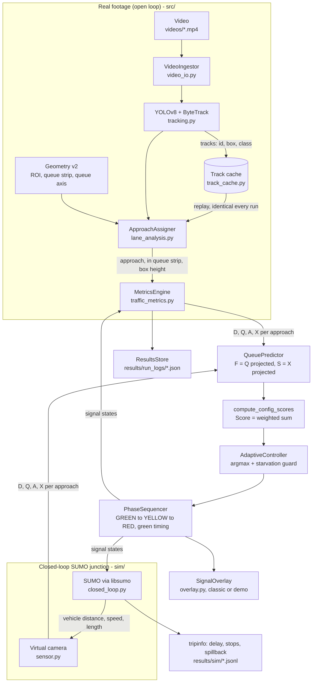

# Complete Project Document

**Vision-Measured Spatial Queue Reach for Adaptive Traffic Signal Control**

Every project document in one file: overview, final report, architecture, technical
guide, audit, experiment protocols, papers, glossary, viva answers and study plan.
After every part there is a short **💡 In simple terms** box that says what the
part means in plain language.

This file is generated by `python scripts/build_complete_doc.py` from the separate
documents, so it always matches them. Relative links (e.g. `report/...`) point to
files in the repository.

> 💡 **The whole project in simple terms:** A camera-based traffic light (Raza 2025) only
> counts the cars that are there now. Inspired by two newer papers (Li 2025: queue
> profiles; Wei 2025: predicting queues), I measured with the camera how far back each
> queue reaches and predicted it a few seconds ahead. I made that measurement work
> reliably, found and proved that an earlier "+21%" result was a mistake, and ran a fair
> simulation test (7,920 runs) where cars obey the light. The measurement works, but it
> does not change which road gets green, and I explain why. What really reduces waiting
> is ending each green once its queue has cleared. In a second test (study 2), using
> the measurement to protect each road's storage, as Mohajerpoor et al. (2023) do with a
> model, cut spillback by about a fifth near capacity at no extra waiting, but failed
> beyond capacity.

## Contents

1. [Overview](#part-1) — from `README.md`
2. [Research Presentation (department format)](#part-2) — from `report/RESEARCH_PRESENTATION.md`
3. [Final Report](#part-3) — from `report/FINAL_REPORT.md`
4. [System Architecture](#part-4) — from `docs/architecture.md`
5. [Technical Guide](#part-5) — from `docs/TECHNICAL_GUIDE.md`
6. [Audit Report](#part-6) — from `AUDIT_REPORT.md`
7. [Closed-Loop Experiment Protocol](#part-7) — from `sim/PROTOCOL.md`
8. [Study 2 Protocol (storage-aware control)](#part-8) — from `sim/PROTOCOL_STUDY2.md`
9. [The Papers (verified facts)](#part-9) — from `docs/papers/README.md`
10. [Additional Recent T-ITS Papers](#part-10) — from `docs/research/additional_tits_papers.md`
11. [Glossary of Concepts and Terms](#part-11) — from `PROJECT_EXPLAINED.md`
12. [Viva Questions and Answers](#part-12) — from `docs/VIVA_QA.md`
13. [Study Guide and Presentation Plan](#part-13) — from `docs/STUDY_GUIDE.md`

---

<a id="part-1"></a>
# Part 1 — Overview

*Source: `README.md`*

### The result in five points

1. **The measurement works.** After three CV corrections (a perspective-normalised
   stopped test, a contiguous queue tail, and recalibrated geometry with drawn stop-line
   axes), the measured queue tail matches the visible queue wherever the detector sees the
   vehicles (`report/queue_tail_validation.png`).
2. **The earlier "+21% throughput" result was an artefact.** A weight-matched null control
   reproduces it exactly. On recorded video, "vehicles served" measures overlap with the
   *real* filmed signal, not control quality (`AUDIT_REPORT.md`).
3. **In a pre-registered closed-loop test** (10 controllers × 9 scenarios × 20 paired
   seeds), adding X or S to the score never measurably reduces delay or spillback. It
   changed which approach got green in 1 of 40 inspected runs. The reason: X also saturates
   at the edge of the view, and at decision time it ranks approaches the way density
   already does.
4. **What does matter is the green-time rule.** Actuated timing roughly halves delay
   against fixed-time, and cuts it about 9× under unequal over-saturated demand. Raza-style
   score bands are worse than fixed-time in most scenarios.
5. **Used in the green timing instead, the measurement helps near capacity.** Study 2
   (pre-registered, `sim/PROTOCOL_STUDY2.md`) adds a Mohajerpoor-style storage barrier and
   storage protection. At 3000 veh/h it cuts local spillback by 20–26% against actuated
   control at no delay cost; on a junction with a 60 m side street the camera's spatial
   measure beats a stopped-vehicle count. Beyond capacity the protection rule fails
   (delay roughly doubles). `report/RESEARCH_PRESENTATION.md` has the full results.


> 💡 **In simple terms:** The camera measurement now works. The old "+21%" result was a measurement mistake. In a fair test, adding queue reach to the decision did not reduce delay. What reduced delay was ending each green once its queue has cleared. Used instead to protect each road's storage, the measurement cut spillback by about a fifth near capacity, but made things worse when traffic exceeded capacity.

### Read in this order

| Document | What it is for |
|---|---|
| [`report/RESEARCH_PRESENTATION.md`](report/RESEARCH_PRESENTATION.md) | **The project in the department's research-presentation format:** problem formulation, literature table with limitations, gaps, objectives, workflow, contributions C1–C3 with result tables, takeaways |
| [`COMPLETE_PROJECT_DOCUMENT.md`](COMPLETE_PROJECT_DOCUMENT.md) | **Everything in one file:** report, architecture, technical guide, audit, protocol, papers, glossary, viva answers and study plan, with an "In simple terms" box after every part |
| [`PROJECT_EXPLAINED.md`](PROJECT_EXPLAINED.md) | Every concept, term and abbreviation (SUMO, YOLO, ByteTrack, PCE, MPC, CI, ...) with its full form, meaning and role in this project |
| [`report/FINAL_REPORT.md`](report/FINAL_REPORT.md) | The research report: problem → Raza → Li/Wei → enhancement → experiments → results → limitations |
| [`docs/TECHNICAL_GUIDE.md`](docs/TECHNICAL_GUIDE.md) | How every stage works: formulas, code locations, design reasons, worked examples |
| [`docs/STUDY_GUIDE.md`](docs/STUDY_GUIDE.md) | How to learn the project in depth: derivations, exercises, presentation and demo plan |
| [`docs/VIVA_QA.md`](docs/VIVA_QA.md) | Exact answers to the 32 expected questions and the hard follow-ups |
| [`AUDIT_REPORT.md`](AUDIT_REPORT.md) | What was wrong with the earlier results, how it was found, how it was fixed |
| [`sim/PROTOCOL.md`](sim/PROTOCOL.md) | The closed-loop experiment, frozen before the test runs |
| [`sim/PROTOCOL_STUDY2.md`](sim/PROTOCOL_STUDY2.md) | Study 2 (storage-aware control), its validation history and selection rule |
| [`docs/architecture.md`](docs/architecture.md) | System diagram and module map |
| [`docs/research/`](docs/research/) | Literature review and limitation analysis of the papers |
| [`docs/papers/`](docs/papers/) | The papers and their verified facts |
| [`docs/archive/`](docs/archive/) | Pre-audit documents, kept for the record; their headline results are superseded |


> 💡 **In simple terms:** A reading list. This combined document already contains all of these files.

### Repository map

```
src/                 the system (vision pipeline + controller)
  video_io.py          constant-fps frame reader and simulated clock
  tracking.py          YOLOv8 + ByteTrack (Ultralytics)
  track_cache.py       record tracker output once, replay it for every experiment
  lane_analysis.py     ROI / queue strip / drawn queue axis; assignment of vehicles
  traffic_metrics.py   D, Q, A, X; windowed stopped test; queue tail; F and S; the score
  signal_controller.py fixed-time and adaptive controllers; signal state machine; timing
  overlay.py           classic overlay and the research demo dashboard
  main.py              command line (play, detect, track, measure, control, cache-tracks, ...)
sim/                 closed-loop SUMO evaluation using the controller code from src/
audit/               scripts that reproduce every audit finding
config/              bellevue_116th_v2.json (final geometry) and final/ (one file per ablation arm)
results/             track_cache/, sim/ (closed-loop results), run_logs_legacy/ (pre-audit)
report/              FINAL_REPORT.md, figures, validation images
tests/               790+ unit and property tests (no GPU or video needed)
```


> 💡 **In simple terms:** Where things live: `src/` is the system, `sim/` is the simulation test, `config/` holds settings, `results/` holds outputs, `report/` holds the report and figures, `tests/` holds the automatic checks.

### Setup

```bash
pip install -r requirements-dev.txt     # OpenCV, Ultralytics (YOLOv8 + ByteTrack), NumPy, Matplotlib, pytest
pip install -r requirements-sim.txt     # SUMO, only for the closed-loop evaluation
git lfs pull                            # the videos
python -m pytest -q                     # ~30 s
```


> 💡 **In simple terms:** Install the Python libraries, download the videos, and run the tests to confirm everything works.

### Run it

```bash
# 1. Detect + track once per clip (YOLOv8m), then everything replays the cache
python -m src.main cache-tracks --video videos/bellevue_116th_busy.mp4 --config config/bellevue_116th_v2.json --no-display

# 2. Demo video: boxes, IDs, approaches, queue axes, measured queue tail, D Q X S F, score, signal
python -m src.main control --video videos/bellevue_116th_busy.mp4 --config config/final/S4.json \
    --track-cache results/track_cache/bellevue_116th_busy__yolov8m__c0p30.json.gz --overlay demo

# 3. Measurement checks on real footage
python audit/measurement_compare.py
python audit/render_queue_tail.py --clip busy

# 4. Closed-loop ablation (about 2 h on 4 cores), tables, figures, decision analysis
python -m sim.experiment run --seeds 100-119 --out results/sim/test_exact.jsonl
python -m sim.experiment table --results results/sim/test_exact.jsonl
python -m sim.figures
python -m sim.decision_analysis

# 5. Study 2: storage-aware control (about 1.5 h on 4 cores), tables and figures
python -m sim.study2 run --seeds 200-219 --out results/sim/study2/test_exact.jsonl
python -m sim.study2 run --seeds 200-219 --methods PROP --noise vision --out results/sim/study2/test_vision.jsonl
python -m sim.study2_figures
```


> 💡 **In simple terms:** The commands to detect and track vehicles once, make the demo video, check the measurement, and rerun the simulation experiment.

### Data

City of Bellevue Traffic Video Dataset (camera at 116th Ave NE / NE 12th St, released for
research), three clips of 107 s, 240 s and 240 s re-encoded to a constant 30 fps
(`data/annotations/videos.json`).


> 💡 **In simple terms:** Three real traffic-camera videos from the City of Bellevue (USA), from one junction, converted to exactly 30 frames per second.

### What this project does not claim

* It does not claim to reproduce Raza, Li or Wei. S1 is a *Raza-style* baseline.
* It does not claim that recorded video shows a real-world reduction in delay. Recorded
  vehicles cannot react to a simulated signal.
* It does not claim to detect downstream spillback. S is the local risk of an approach
  filling its *visible* storage.
* It does not claim that the spatial score terms improve control. The closed-loop test
  shows they do not, and explains why.
* It does not claim that storage protection helps in general. It helps near capacity and
  fails beyond it; both are reported.

> 💡 **In simple terms:** Things you must not say: that you reproduced the papers exactly, that the video proves real-world improvement, that you detect downstream spillback, or that queue reach improves control.


---

<a id="part-2"></a>
# Part 2 — Research Presentation (department format)

*Source: `report/RESEARCH_PRESENTATION.md`*

*Computer Vision course project. Laid out in the department's research-presentation order:
introduction → challenges → applications → problem formulation → related literature and
gaps → motivation → objectives → workflow → datasets and metrics → contributions with
results → summary and takeaways → references. Every number is produced by a script in this
repository; the command is given next to it.*

---

### Table of contents

1. Introduction to vision-based signal control
2. Challenges
3. Applications in smart cities
4. Problem formulation
5. Related literature and research gaps
6. Research motivation
7. Objectives
8. Proposed workflow
9. Data, simulation testbed and evaluation measures
10. Research contributions and results
    * C1: robust spatial queue measurement from video
    * C2: spatial terms in the selection score (study 1)
    * C3: storage-aware score and storage protection (study 2)
11. Summary and key takeaways
12. References

---

### 1. Introduction

**What is vision-based adaptive signal control?** A signalised junction repeatedly
decides *which approach gets green next and for how long*. Fixed-time plans repeat the
same timings whatever traffic is present. Adaptive control measures the traffic and
decides from the measurement. Vision-based adaptive control uses a camera as the sensor:
a detector (YOLO) finds vehicles, a tracker (ByteTrack) follows each one across frames,
and the per-approach measurements drive the controller.

**Why a camera, not loop detectors?** A loop detector is a wire coil in the road that
reports whether a vehicle is over it. It sees one spot. A camera sees the whole approach,
so it can measure *where the queue ends*, not only whether a vehicle is at the stop line.

**Example.** On the Bellevue camera (116th Ave NE / NE 12th St), the queue on the South
approach backs up past the stop-line area during red. A count of vehicles in the stop-line
zone saturates at the zone's capacity; the queue tail measured along the road keeps moving
back (`report/queue_tail_validation.png`).

### 2. Challenges

* **Perspective.** Vehicles far from the camera are small; a fixed pixel threshold for
  "stopped" is wrong for near and far vehicles alike.
* **Detection recall at distance.** Small, distant, occluded vehicles are missed; on a
  test frame YOLOv8m found 4 of about 9 queued cars on the far North leg.
* **Tracking noise.** Bounding boxes jitter frame to frame; a parked-looking jitter can
  read as motion, and an ID switch breaks a vehicle's history.
* **Closed-loop evaluation.** Recorded video cannot answer "what if the signal had been
  different?": the filmed vehicles obey the real signal, not ours.
* **Over-saturation.** When demand exceeds capacity, queues reach the end of the road
  (spillback). Counting sensors saturate exactly there.

### 3. Applications in smart cities

* **Adaptive junction control** from existing traffic cameras, without cutting loops
  into the road.
* **Spillback monitoring:** knowing when an approach is about to run out of storage,
  which in a network blocks the junction upstream.
* **Traffic analytics:** queue lengths, stops per vehicle and approach demand for
  planning (the demand shares used in the calibrated simulation scenario come from the
  video counts).

### 4. Problem formulation

Each approach `i` of the junction has visible storage of length `L_i` (metres along the
road). At time `t` its queue tail is at distance `x_i(t)` from the stop line. The camera
image `I_t` is the only sensor:

```
measurement:   X̂_i(t) = h(I_t, I_{t-1}, ...; θ) ≈ x_i(t) / L_i          (1)
```

where `h` is the vision pipeline (detection, tracking, stopped test, queue-tail search)
with parameters `θ`. A controller `π` turns the measurements into a decision:

```
control:       (p_k, g_k) = π( X̂(t), D̂(t), ... )                        (2)
```

`p_k` is the approach served in green `k` and `g_k` its green time. The goal is

```
minimise   total delay  Σ_v ( t_v,actual − t_v,free )
subject to x_i(t) ≤ β_i · L_i          (spillback avoidance, Mohajerpoor et al. 2023, Eq. 9)
           g_min ≤ g_k ≤ g_max
```

`β_i ≥ 1` relaxes the constraint for low-priority movements (Mohajerpoor et al. set
β = 1 for the major and 5 for the minor road). The question this project answers is
whether a camera-measured `X̂_i` can serve this constraint, and whether doing so lowers
delay or spillback.

**The base controller (Raza et al. 2025).** Density is a PCE-weighted count,

```
D_i = Σ_c n_i,c · PCE_c                                                  (3)
p_k = argmax_i D_i  (with a starvation guard),   g_k = band(D_{p_k}) ∈ {low, medium, high}
```

(their Eq. 1, Algorithm 1; 40/60/120 s in the paper, 30/45/60 s here). Its state is a
count. It does not know how long the road is, or where the queue ends.


> 💡 **In simple terms:** The camera estimates where each queue ends; the controller must choose who goes next and for how long, keeping total waiting low and keeping each queue from reaching the start of its road.

### 5. Related literature and research gaps

#### Taxonomy


#### Table 1: summary of signal-control methods relevant to this project

| S.No. | Method | Contribution | Salient features | Limitation |
|---|---|---|---|---|
| 1 | 1958, Webster fixed-time [1] | Optimal cycle length and splits from average flows | Simple, no sensors | Cannot react to fluctuating demand; wastes green on empty approaches |
| 2 | Actuated control (gap-out / max-out) [2] | Green ends when the detector sees no vehicle for a passage time | Responds to presence; industry standard | Sees only the detector zone; cannot tell how far back the queue reaches |
| 3 | 2013, Max pressure [3] | Throughput-optimal decentralised feedback | Serves the phase with the largest queue difference | Assumes unlimited link storage, so ignores spillback |
| 4 | 2015, Capacity-aware backpressure [4] | Normalises pressure by link capacity | Accounts for finite storage | Needs vehicle counts on every link; frequent switching |
| 5 | 2023, FASC, Mohajerpoor et al. [5] | Optimal dynamic cycles and splits for over-saturated isolated junctions | Shockwave (kinematic-wave) queue model; spillback-avoidance constraint; mixed delay + spillback-probability objective; 63/55/40% less delay than fixed/actuated/capacity-aware MP | Needs demand prediction; queue position is *estimated* from a model and loop detectors; non-convex optimisation |
| 6 | 2025, Li et al. [6] | Multi-objective corridor coordination with queue-profile estimation | Under/over-saturation test from queue discharge time | Offline fixed-time; needs connected-vehicle trajectories and a MILP solver |
| 7 | 2025, Wei et al. [7] | Hierarchical MPC with link-transmission queue dynamics | Predicts queue growth, acts before spillback | State estimation is assumed, not built; network-scale solver |
| 8 | 2025, Raza et al. [8] (base paper) | Edge-deployed YOLO + PCE density controller | PCE weighting, lane priority, green-denial counter; SUMO and real footage | State is a count: storage-blind; fixed green bands |

#### Relevant methods, with their equations and limitations

**Raza et al. (base).** Eq. (3) above. *Limitation:* the count `D_i` treats 10 vehicles
on a 60 m road and 10 on a 150 m road alike, though the first is nearly full; the green
time is a fixed band, so a green never ends early when its queue has cleared.

**Capacity-aware max pressure (Gregoire et al.).** For an isolated junction, serve

```
p = argmax_i  n_i / C_i                                                   (4)
```

with `n_i` the vehicles on approach `i` and `C_i` its storage capacity, re-decided every
few seconds. *Limitation:* it re-decides on every small change in the ratio, so under
heavy demand it switches often and loses time to yellow phases (seen in §10.3).

**FASC (Mohajerpoor et al.).** Minimises delay subject to the spillback-avoidance
constraint `x_p ≤ β_p Λ_p`, and in the queue-formation period adds a penalty

```
0.5 ω₂ Σ_k Σ_p  Λ_p / (α_p Λ_p − δ_p(k))                                 (5)
```

that grows without bound as the queue `δ_p` approaches the scaled link length `α_p Λ_p`.
*Limitation:* `δ_p` comes from a shockwave model fed by predicted demand and loop
detectors, because the detectors cannot see the queue position.

#### Research gaps

* Vision-based controllers (Raza) measure **counts**. They are blind to *where* the queue
  is relative to the end of the road, which is exactly what spillback avoidance needs.
* Spillback-aware methods (FASC, Wei) need the queue position but **estimate** it from
  models, predicted demand or assumed state estimators. None measures it directly.
* Counting sensors **saturate** at the stop-line zone's capacity: once it is full, a
  count forecast reads "steady" however fast the queue grows (§10.1).


> 💡 **In simple terms:** Each earlier method and what it cannot do. The gap: camera controllers count cars but do not know where the queue ends; spillback-aware methods need that but have to guess it from models.

### 6. Research motivation

* A camera already sees the whole approach. If the queue position can be measured
  robustly from detections and tracks, it supplies the quantity that FASC and Wei must
  model.
* If a controller uses that measured position *in the way the literature says it matters*
  (as a storage constraint, not just one more term in a ranking), it may reduce spillback
  on short approaches without costing delay.
* Whether it does is an empirical question, and recorded video cannot answer it (§2), so
  it needs a closed-loop testbed and a pre-registered comparison.

### 7. Objectives

1. Design a robust **spatial queue measurement** from YOLO + ByteTrack: the queue tail `X`
   along the road and its 5-second projection `S` (local spillback risk).
2. Test whether `X`/`S` improve a Raza-style controller when added to the **selection
   score** (study 1).
3. Design a **storage-aware** extension in the spirit of Mohajerpoor et al.: a reciprocal
   storage barrier on `S` in the score and **storage protection** in the green timing,
   and test it against standard and literature baselines over graded demand (study 2).
4. Measure **robustness** to camera errors (missed far vehicles, position jitter).


> 💡 **In simple terms:** Four goals: measure the queue from video, test it in the ranking, test it as a storage limit on green time, and check it still works with camera errors.

### 8. Proposed workflow


### 9. Data, simulation testbed and evaluation measures

**Video.** City of Bellevue Traffic Video Dataset (released for research), camera at
116th Ave NE / NE 12th St, three clips of 107 s, 240 s and 240 s, constant 30 fps. Used for
measurement (Objective 1) and to calibrate the demand shares of one simulation scenario.

**Closed-loop testbed.** SUMO (Simulation of Urban MObility, an open-source traffic
simulator) through `libsumo`. A four-arm junction, two lanes per approach, one approach
served per phase, 3 s yellow. A *virtual camera* measures `D`, `Q`, `X`, `S` from the
simulated vehicles with the same definitions as the video pipeline (`sim/sensor.py`), and
a *vision noise* mode drops up to 30% of far vehicles and jitters positions by 2 m.

**Measures.**
* **Mean delay per vehicle** (s): SUMO time loss plus the time a vehicle waited to enter
  a full road. Primary metric.
* **Blocked-entry seconds** (local spillback): seconds, summed over approaches, during
  which arriving vehicles could not enter because the queue reached the upstream end of
  the approach.
* 95% confidence intervals from paired seeds (the same random demand for every method).
* **Pre-registration.** Every free choice is made on validation seeds; the protocol is
  committed before the test seeds run (`sim/PROTOCOL.md`, `sim/PROTOCOL_STUDY2.md`).


### 10. Research contributions and results


*Flow of the proposed method. Dashed red boxes are this project's contribution; steps 1 and
4 use existing tools (YOLOv8, ByteTrack, a standard signal state machine).*

---

#### C1 — Robust spatial queue measurement from video

**Method.** For each approach a polyline (the *queue axis*) is drawn from the stop line
back along the inbound lanes; a point's position is its arc length along it, 0 at the
stop line and 1 at the far edge of the view. Then, per frame:

```
stopped_v   ⇔  displacement of v over the last 1 s  <  0.2 × (v's box extent along the road)     (6)
X_i         =  position of the last vehicle in the contiguous chain of stopped vehicles
               that starts at the stop line (consecutive members ≤ 2 vehicle lengths apart)   (7)
S_i         =  clamp( X_i + (dX_i/dt) · 5 s ),  slope by least squares over 2.5 s             (8)
```

Eq. (6) is scaled by each vehicle's own size, so it works the same for near (large) and far
(small) vehicles: this is the perspective correction. Eq. (7) needs tracking: "stopped"
compares the *same* vehicle across frames.

**Result (real footage, busy clip;** `python audit/measurement_compare.py`**).**

| | original pipeline | + robust stopped test | + robust test, redrawn geometry |
|---|---|---|---|
| stops per vehicle (lower = less false stopping) | 4.28 | 0.46 | **0.76** (0.74 with YOLOv8m) |
| North: frames with a queue / with a jump > 0.3 | 99% / 7.3% | 0.2% / 0.06% | 71% / 0.06% |
| South: frames with a queue / with a jump > 0.3 | 58% / 3.0% | 0% / 0% | 48% / 1.1% |
| West: frames with a queue / with a jump > 0.3 | 59% / 4.8% | 0.2% / 0% | 58% / 0.5% |


**Contributions**
* A calibration-free, perspective-normalised measurement of where the queue ends, from
  standard detections and tracks.
* The measured tail sits at the back of the visible queue wherever the detector sees the
  vehicles. Its limit is detector recall at distance (YOLOv8m found 4 of about 9 queued
  cars on the far North leg), not the queue logic.

---

#### C2 — Spatial terms in the selection score (study 1)

**Method.** Raza-style score with the spatial terms added as weights:
`Score_i = 0.4·(α D_i + (1−α) Q_i) + 0.3·F_i + 0.3·S_i`, compared against the same score
without them, a weight-matched null control, and variants (10 controllers × 9 scenarios ×
20 paired test seeds, protocol `sim/PROTOCOL.md`).

**Result.** Adding X or S never changed mean delay by more than ±0.5 s, in any scenario.
It changed which approach got the green in **1 of 40** inspected runs. What did matter was
the green-time rule: actuated timing roughly halved delay against fixed-time and cut it
about 9× under unequal over-saturated demand (300.6 → 33.8 s), while Raza-style bands were
worse than fixed-time in most scenarios.

**Why (the finding that shaped C3).** At the moment a green ends, every other approach has
been red and is building a queue; the longest queue is also the one with most vehicles, so
X ranks approaches exactly as density does, and an argmax cannot change. Spatial
information can only matter where the count does *not* already say the same thing: in the
*timing*, and relative to *how much road each approach has*. That is Mohajerpoor et al.'s
formulation, and it is what C3 tests.

---

#### C3 — Storage-aware score and storage protection (study 2)

**Method.** The proposed objective is almost the same as Eq. (3), except for one storage
term and one timing rule:

```
Raza:      score_i = D_i                                                                   (3)
Proposed:  score_i = D_i + λ · ( 1 / (α − S_i)  −  1 / α )        λ = 1, α = 1.1            (9)

Timing:    actuated green, 10–60 s, ends after the stop-line zone is empty for 2 s;
           and, after 20 s of green, ends when a waiting approach j has
           S_j ≥ β (= 0.85) and S_j > S_active                                             (10)
```

`D_i` is Raza's PCE count with one common normaliser, so it is storage-blind, as in the
paper. `S_i` is the camera's queue tail as a share of **that approach's own** visible
storage, so Eq. (9) is storage-aware by construction. The reciprocal term is Mohajerpoor
et al.'s penalty (Eq. 5): near zero for a short queue, very large as the queue nears the end
of its road. Eq. (10) is their spillback-avoidance constraint applied online.

**Testbed.** Two storage geometries (all approaches 150 m; minor street shortened to 60 m),
five demand levels from well under to beyond capacity (the analogue of the noise densities
in a super-resolution table), eight methods, 20 paired test seeds (200–219). Settings
(λ, α, β, the 20 s guard) were chosen on validation seeds 0–9 by a rule written before the
guard results were seen; the protocol was committed before any test seed ran
(`sim/PROTOCOL_STUDY2.md`). `python -m sim.study2_figures` produces every number below.

**Table 2: mean delay per vehicle (s), lower is better. \* = proposed; best per column in bold.**

*All approaches 150 m*

| Method | 1200 veh/h | 1800 | 2400 | 3000 | 3600 |
|---|---|---|---|---|---|
| Fixed-time [1] | 46.2 | 48.0 | 56.7 | 133.5 | 283.6 |
| Actuated [2] | 20.9 | 24.5 | 30.5 | 45.5 | 99.9 |
| Capacity-aware MP [4] | **16.9** | **19.9** | **26.3** | 157.4 | 397.8 |
| Raza-style [8] | 53.6 | 71.9 | 85.6 | 131.2 | 253.5 |
| Raza + actuated (ablation) | 21.7 | 24.5 | 30.5 | 45.6 | 100.6 |
| + storage barrier, Eq. (9) (ablation) | 19.2 | 23.5 | 29.3 | 45.1 | **97.1** |
| **Proposed\*, Eqs. (9)+(10)** | 19.2 | 23.5 | 29.3 | **44.2** | 190.8 |
| Proposed, S from a stopped count (control) | 19.2 | 23.1 | 29.3 | 44.4 | 142.8 |
| Proposed, with camera errors | 19.8 | 23.3 | 29.1 | 44.1 | 189.2 |

*Minor street 60 m, major street 150 m*

| Method | 1200 veh/h | 1800 | 2400 | 3000 | 3600 |
|---|---|---|---|---|---|
| Fixed-time [1] | 45.9 | 47.7 | 56.3 | 133.4 | 283.7 |
| Actuated [2] | 20.4 | 24.0 | 30.0 | **45.6** | 105.5 |
| Capacity-aware MP [4] | **17.7** | **22.1** | 37.3 | 167.6 | 389.5 |
| Raza-style [8] | 53.2 | 69.0 | 77.8 | 91.9 | 165.2 |
| Raza + actuated (ablation) | 21.5 | 24.0 | 30.0 | 46.1 | 108.5 |
| + storage barrier, Eq. (9) (ablation) | 19.2 | 23.0 | 29.4 | 46.1 | **103.7** |
| **Proposed\*, Eqs. (9)+(10)** | 19.2 | 23.0 | 29.1 | 46.4 | 186.2 |
| Proposed, S from a stopped count (control) | 18.9 | 22.7 | **28.9** | 46.5 | 156.3 |
| Proposed, with camera errors | 20.0 | 23.9 | 29.3 | 53.7 | 196.7 |

**Table 3: local spillback, blocked-entry seconds (lower is better).**

| Method | uniform 2400 | uniform 3000 | uniform 3600 | short-minor 2400 | short-minor 3000 | short-minor 3600 |
|---|---|---|---|---|---|---|
| Fixed-time | 163.6 | 2171.9 | 4135.2 | 652.1 | 3093.2 | 5441.2 |
| Actuated | 6.7 | 120.5 | 2136.4 | 96.5 | 945.0 | **4097.2** |
| Capacity-aware MP | **6.6** | 2442.3 | 6163.9 | **14.2** | 3343.2 | 6495.0 |
| Raza-style | 784.8 | 2365.9 | 4194.5 | 1957.2 | 3346.8 | 5360.8 |
| + storage barrier (ablation) | 6.7 | 113.9 | **2105.1** | 92.2 | 982.4 | 4161.2 |
| **Proposed\*** | 6.7 | **88.6** | 3193.3 | 79.0 | **753.2** | 4326.1 |
| Proposed, count-based S | **6.6** | 103.7 | 2718.2 | 81.2 | 868.6 | 4364.7 |
| Proposed, camera errors | 6.6 | 80.8 | 3142.8 | 92.1 | 922.1 | 4339.9 |

(Below 2400 veh/h every actuated method has under 10 blocked seconds; full tables in
`results/sim/study2/tables.md`.)


**Paired comparisons (proposed − reference, mean ± 95% CI over 20 seeds; negative = proposed better).**

| Question | Condition | Δ delay (s) | Δ blocked-entry (s) |
|---|---|---|---|
| Better than the base paper? | 9 of 10 conditions | −34 to −87, all significant | lower or equal |
| | short-minor 3600 | **+21.0 ± 10.5 (worse)** | −1035 ± 149 |
| Better than standard actuated? | ≤ 2400 veh/h (6 conditions) | −0.9 to −1.7, all significant | no difference, except short-minor 2400: −17.6 ± 14.9 |
| | uniform 3000 | −1.3 ± 0.9 | **−31.9 ± 20.6 (−26%)** |
| | short-minor 3000 | +0.8 ± 1.6 (n.s.) | **−191.8 ± 73.3 (−20%)** |
| | 3600 (both geometries) | **+90.9 ± 9.8, +80.7 ± 8.1 (worse)** | +1057, +229 (worse) |
| Does storage protection, Eq. (10), help? (vs barrier only) | uniform 3000 | −0.9 ± 0.9 (n.s.) | **−25.3 ± 19.1** |
| | short-minor 3000 | +0.3 ± 1.6 (n.s.) | **−229.2 ± 70.3** |
| | 3600 | **+93.7, +82.6 (worse)** | +1088, +165 (worse) |
| Does the camera's spatial measure beat a count? | short-minor 3000 | −0.1 ± 1.9 (n.s.) | **−115.4 ± 81.2** |
| | other conditions ≤ 3000 | within ±0.4 (one cell, uniform 1800, +0.4 ± 0.3, excludes 0) | n.s. |
| | 3600 | **+48.0, +29.9 (worse)** | mixed |

**Visual comparison.** True queue tail on the major (North, 150 m) and short minor (East,
60 m) approach, one test seed fixed in advance, short-minor 3000 veh/h:


Raza-style holds every green for its band, so queues sit near the end of storage for long
stretches. Capacity-aware max pressure re-decides every 5 s and switches constantly; the
yellow time it loses makes its queues longer, not shorter. Actuated and the proposed
method serve in short, queue-driven greens. On this particular seed the proposed method is
slightly worse than actuated; across the 20 seeds it has 20% less spillback at the same
delay (Table 3).

**Contributions**
* A storage-aware extension of a vision controller that is a one-term change to the base
  equation (Eq. 9) plus one timing rule (Eq. 10), both taken from Mohajerpoor et al.'s
  formulation and driven by a camera measurement instead of a shockwave model.
* Near capacity it **reduces local spillback by 20–26% against actuated control without
  increasing delay**. On the junction with a short minor street, the camera's spatial
  measurement does this better than a stopped-vehicle count (−115 s blocked entry): the one
  place in this project where measuring *where* the queue is beats counting it.
* Against the base paper it reduces mean delay by 34–87 s (63–67% under capacity) in 9 of 10
  conditions. The ablation shows most of this comes from actuated timing (Raza + actuated
  is within 1–2 s), not from the spatial terms.
* **Beyond capacity, storage protection fails:** it cuts greens so often that delay
  roughly doubles against actuated control. This is the regime Mohajerpoor et al. warn
  about, where spillback cannot be avoided and the constraint must be relaxed; our guard
  (protect only after 20 s of green) reduced the damage on validation but did not remove it.
* With camera errors (30% far misses, 2 m jitter) results hold up to 2400 veh/h and on
  the uniform junction at 3000 veh/h. Near capacity on the short-road junction the
  benefit mostly disappears: 922 blocked seconds (753 with an exact sensor, 945 for
  actuated) and delay rises from 46.4 to 53.7 s.


> 💡 **In simple terms:** One extra term in Raza's formula and one rule for ending green early. It helps near capacity (about 20-26% less spillback, same waiting time), loses badly beyond capacity, and most of the gain over Raza comes from ending greens when queues clear.

### 11. Summary and key takeaways

#### Summary
* A robust, calibration-free measurement of the queue tail from YOLO + ByteTrack works on
  real footage wherever the detector sees the vehicles (C1).
* Used only to *rank* approaches, the spatial measure adds nothing: it ranks them as the
  count already does (C2, pre-registered, 20 seeds).
* Used as Mohajerpoor et al. use spatial queue information (a storage barrier and a
  storage constraint on the green), it reduces local spillback by 20–26% near capacity at
  no delay cost, and on short roads the camera's spatial measure beats a count (C3).
* It cuts delay against the Raza-style base by 34–87 s, mostly through actuated timing.

#### Key takeaways
* **Where the information enters matters more than what is measured.** The same X was
  useless in the score (C2) and useful in the green-time constraint (C3).
* **Storage protection needs a regime switch.** In the queue-formation regime beyond
  capacity, spillback cannot be avoided and protection makes things worse. A natural next
  step, following FASC, is to detect that regime from the camera (all approaches near full
  at once) and relax β automatically.
* **An isolated junction under-values spillback.** Here a blocked vehicle only waits; in a
  network it blocks the junction upstream. A two-junction corridor in SUMO would measure the
  benefit Mohajerpoor et al. and Wei et al. target.
* **Detector recall at distance is the binding limit** of the measurement, and camera
  errors erode the near-capacity benefit on short roads. A higher-resolution model or
  tiling on the far approaches is the first thing to improve.
* **Capacity-aware max pressure is the strongest method at light demand** (about 2 s less
  delay); a fair comparison should report that.


> 💡 **In simple terms:** Where the camera information is used matters more than what is measured. It was useless for choosing the next road and useful as a storage limit near capacity.

### 12. References

1. F. V. Webster, "Traffic Signal Settings," Road Research Technical Paper No. 39, HMSO, London, 1958.
2. T. Urbanik et al., *Signal Timing Manual*, 2nd ed., NCHRP Report 812, Transportation Research Board, 2015.
3. P. Varaiya, "Max pressure control of a network of signalized intersections," *Transportation Research Part C*, vol. 36, pp. 177–195, 2013.
4. J. Gregoire, X. Qian, E. Frazzoli, A. de La Fortelle, T. Wongpiromsarn, "Capacity-Aware Backpressure Traffic Signal Control," *IEEE Trans. Control of Network Systems*, vol. 2, no. 2, pp. 164–173, 2015.
5. R. Mohajerpoor, C. Cai, M. Ramezani, "Optimal Traffic Signal Control of Isolated Oversaturated Intersections Using Predicted Demand," *IEEE Trans. Intell. Transp. Syst.*, vol. 24, no. 1, pp. 815–826, 2023, doi:10.1109/TITS.2022.3209606.
6. C. Li, Y. Lu, H. Wang, "A Multi-Objective Model for Traffic Signal Coordination Control With Queue Profile Estimation," *IEEE Trans. Intell. Transp. Syst.*, vol. 26, no. 12, pp. 23389–23406, 2025, doi:10.1109/TITS.2025.3616119.
7. Wei, Ampountolas, Hirrle, Wang, "Hierarchical Predictive Control of Network Traffic Signals Using Link Transmission Model With Queue Dynamics," *IEEE Trans. Intell. Transp. Syst.*, vol. 26, no. 10, pp. 16391–16404, 2025, doi:10.1109/TITS.2025.3568869.
8. M. Raza et al., "An Edge-Deployed Real-Time Adaptive Traffic Light Control System Using YOLO-Based Vehicle Detection and PCE-Aware Density Estimation," *IEEE Access*, vol. 13, 2025, doi:10.1109/ACCESS.2025.3602844.
9. G. Jocher et al., Ultralytics YOLOv8, 2023, https://github.com/ultralytics/ultralytics.
10. Y. Zhang et al., "ByteTrack: Multi-Object Tracking by Associating Every Detection Box," *ECCV*, 2022.
11. P. A. Lopez et al., "Microscopic Traffic Simulation using SUMO," *IEEE ITSC*, 2018.
12. City of Bellevue, Traffic Video Dataset, https://github.com/City-of-Bellevue/TrafficVideoDataset.

---

<a id="part-3"></a>
# Part 3 — Final Report

*Source: `report/FINAL_REPORT.md`*

*Computer Vision course project — final report*

---

### Abstract

Raza et al. (2025) control a traffic signal from YOLO detections weighted into a
Passenger-Car-Equivalent (PCE) density. Their control is *reactive*: it reads only the
current state. Two 2025 IEEE T-ITS papers motivate looking further: Li et al. model the
queue profile and over-saturation, and Wei et al. predict queue dynamics and spillback.
Their solvers (MILP, MPC with a link-transmission model) are out of reach for a single
camera, so this project transfers the *idea* and leaves the machinery. We measure, from
YOLOv8 + ByteTrack tracks, how far the stopped queue physically reaches back along each
approach (**spatial queue reach X**), and project it forward (**local spillback risk S**).
The motivation is a blind spot that we prove from the formulas: a vehicle count inside a
fixed stop-line region (Q) saturates once the region is full, so a forecast of that count
(F) cannot signal further growth, whereas X keeps changing.

The measurement works. After three corrections found during this project — a windowed,
perspective-normalised stopped test; a contiguous queue tail; and recalibrated geometry
with drawn stop-line axes — the measured queue tail matches the visible queue where the
detector sees the vehicles. Stop counts fall from an unphysical 4.3 to 0.74 per vehicle,
and frame-to-frame jumps in X drop from 7% to ≤ 1% of frames.

The control benefit is **not** demonstrated. An audit showed that the earlier headline
(+21% throughput on a 107 s clip) came from re-weighting the score, not from S: a
weight-matched null control reproduced it exactly. It also showed that open-loop
"throughput" on recorded video measures overlap with the *real* recorded signal, so it
cannot rank controllers. In a pre-registered closed-loop SUMO experiment (10 controllers,
9 demand scenarios up to beyond capacity, 20 paired seeds, two timing rules, two density
normalisers, exact and vision-like sensors), adding X or S changes mean delay by no more
than about ±0.5 s in all but one scenario, with no significant improvement anywhere. Adding S
changed which approach got the green in only 1 of 40 inspected runs. The decisive factor
is the green-time rule: actuated timing roughly halves delay against fixed-time, and
cuts it nine-fold in unequal over-saturated demand. Raza-style score bands perform worse
than fixed-time in most scenarios. We explain the null result, and it is the main finding:
when X matters most, X saturates too, at the edge of the camera's view, and at decision
time it ranks the approaches the same way density already does.

A second pre-registered study then uses the measurement where Mohajerpoor et al. (IEEE
T-ITS 2023) say spatial queue information matters: in the green timing, relative to each
approach's own storage. A one-term change to the Raza-style score (a reciprocal storage
barrier on S) plus one timing rule (after 20 s of green, end it when a waiting approach's
S reaches 0.85 of its storage) was tested on junctions with equal and unequal storage over
five demand levels, against fixed-time, actuated, capacity-aware max pressure and the
Raza-style base (20 paired test seeds). Near capacity it **reduces local spillback by
20–26% against actuated control at no delay cost**, and on the short-road junction the
camera's spatial measure beats a stopped-vehicle count (−115 s of blocked entry). Beyond
capacity the protection rule fails and roughly doubles delay, the regime in which
Mohajerpoor et al. note that spillback avoidance must be relaxed (§6.6).

---


> 💡 **In simple terms:** The whole project in one paragraph: what was built, what was fixed, how it was tested, what was found and why.

### 1. Problem

A signalised junction repeatedly decides *which approach gets green next and for how
long*. Fixed-time plans ignore the traffic that is actually present. Vision-based
adaptive control replaces loop detectors with a camera: detect and count vehicles per
approach, turn the counts into a priority score, and serve the highest score. The open
question this project studies is **what state the camera should measure**. Is "how
many vehicles" enough, or does "how far back the queue reaches, and where it is heading"
make better decisions?


> 💡 **In simple terms:** A traffic light must decide which road goes next and for how long. The question here is what a camera should measure to make that decision well.

### 2. Base paper: Raza et al. (2025)

Raza et al., *IEEE Access* 13, 2025, doi:10.1109/ACCESS.2025.3602844. Their system uses
a lightweight YOLO detector (YOLOv7-tiny / YOLOv8-nano, up to 90 mAP, 74 FPS) on Jetson
edge nodes and converts detections into a **PCE-weighted traffic density**,
`density = Σ count × PCE` (their Eq. 1). That density is then multiplied by a lane-priority
weight (left 3, right 2, through 1; Eq. 2). The controller (their Algorithm 1) first checks
a **Green Denial Counter**, the number of consecutive cycles an approach has been denied
green: one over a threshold is served immediately. Otherwise it serves the highest
weighted density, with green time from **three bands**: 120 / 60 / 40 s for high /
moderate / low density. They evaluate the controller in **SUMO via TraCI** and with real
footage, reporting up to 33% less congestion and 23% lower waiting time than fixed-time
control. The limitations they state (§VI) are power-aware edge hardware, online/continual
learning, label noise, and multimodal sensor fusion.

**What we reproduce.** Our S1 baseline is *Raza-style*, not a reproduction. It uses the
same rule: a green-denial (starvation) counter first, then argmax of PCE density with three
score bands. But the bands are scaled to 30 / 45 / 60 s, there is no lane-priority weight
(our camera's approaches are not split by turning lane), and the geometry, detector (stock
YOLOv8) and camera are our own. Raza's detector, hardware and dataset are not reproduced.
Like Raza, we evaluate the controller closed-loop in SUMO.

**The limitation we study.** This is *our* analysis of the method; it is not among the
limitations Raza et al. list, which concern hardware and detection. Selection and green time
depend on *current* density only.
Density counts vehicles in view. It does not say whether the queue is growing, how far
back it reaches, or whether the approach is about to run out of storage.


> 💡 **In simple terms:** Raza's system counts vehicles with a camera, weights big vehicles more, gives green to the busiest road, and sets the green length from how busy it is. A counter makes sure no road is skipped forever. My S1 copies this logic but is not an exact copy. Its weakness, which I identified myself, is that it only looks at the current count.

### 3. Newer research: the two IEEE T-ITS papers

**Li, Lu & Wang (2025)**, *A Multi-Objective Model for Traffic Signal Coordination
Control With Queue Profile Estimation*, IEEE T-ITS 26(12), doi:10.1109/TITS.2025.3616119.
They estimate the **queue profile** from connected-vehicle trajectories and solve corridor
coordination as a MILP. Their criterion: a phase is *under-saturated* when its green
covers the time its queue needs to discharge, and the shortfall measures
**over-saturation**. Limitations that matter here:
* it is fixed-time and offline (adaptive control is stated as future work);
* it needs connected-vehicle trajectories and a commercial solver;
* it assumes uniform arrivals and a single vehicle class;
* its queue/stops identity breaks under over-saturation.

**Wei, Ampountolas, Hirrle & Wang (2025)**, *Hierarchical Predictive Control of Network
Traffic Signals Using Link Transmission Model With Queue Dynamics*, IEEE T-ITS 26(10),
doi:10.1109/TITS.2025.3568869. They use **MPC over a link-transmission model with explicit
queue dynamics**: predict how queues will evolve and allocate green *before* a queue
spills back. Limitations that matter here:
* the state estimation and prediction module is *assumed*, not built;
* multimodal traffic is ignored;
* robustness to prediction error is only lightly tested;
* it needs a QP/NLP solver at network scale, with coarse 10 s steps.

A detailed limitation table for both is in `docs/research/paper_limitations_analysis.md`.

**What transfers, and what does not.** The *ideas* transfer to a single camera: measure
the queue as a profile in space (Li), and act on where it is heading rather than where it
is (Wei). The *machinery* does not: corridor MILP, network MPC, connected-vehicle data.
Wei's own limitation (state estimation is assumed) is exactly what a camera can supply.


> 💡 **In simple terms:** Li looks at how the queue builds and whether a green is long enough to clear it. Wei predicts how queues will grow to stop them blocking other roads. Both need equipment and solvers a single camera project does not have, so I used their ideas, not their machinery.

### 4. Our enhancement

#### 4.1 The blind spot (proved from the implementation)

The natural first step is a queue count `Q = clamp(count in stop-line strip / capacity)`,
then a forecast `F = clamp(Q + dQ/dt · H)`. But a strip of fixed size holds a bounded
number of vehicles. Once it is full, more queueing vehicles stand *behind* it, `Q = 1`,
and its slope is 0, so `F = 1`, which reads as "steady" no matter how fast the queue
grows. F can signal clearing, never further growth.


> 💡 **In simple terms:** Counting cars in a small box at the stop line stops working once the box is full. Extra cars wait behind it, so the count stays at "full", and a prediction based on that count also stays stuck.

#### 4.2 Spatial queue reach X and spillback risk S

* **Queue axis.** For each approach, a polyline is drawn from the stop line back along the
  inbound lanes to the far edge of the view. A point's position is its arc length along
  the polyline divided by the total length, from 0 at the stop line to 1 at the far edge.
  No camera calibration is needed.
* **Stopped.** A tracked vehicle is stopped if it moved less than 0.2 of its own box
  height per second over the last second. Tracking (ByteTrack) is what makes this
  possible: it compares the *same* vehicle across frames.
* **X**, the queue tail: the position of the last vehicle in the contiguous chain of
  stopped vehicles that starts at the stop line. Consecutive members may be at most two vehicle lengths apart, a length being the box's
  extent along the local road direction.
* **S**, local spillback risk: `S = clamp(X + dX/dt · 5 s)`, with the slope fitted by least
  squares over 2.5 s. S rises above X for a growing queue, equals X for a steady one, and
  falls below X for a clearing one. It does this even while Q = 1.

S is **local storage-exhaustion risk**: the queue is projected to fill the visible approach.
It is not downstream spillback, which would need to see the road vehicles drive *into*.


> 💡 **In simple terms:** X is how far back along the road the line of stopped cars reaches (0 = at the stop line, 1 = the end of what the camera sees). S is X projected 5 seconds ahead. If the line is growing, S is bigger than X.

#### 4.3 The score

```
Score_i = (1 − ω − ρ − ψ)·(α·D_i + (1 − α)·Q_i) + ω·F_i + ψ·X_i + ρ·S_i
```

The proposed controller **S4** uses α = 0.5, ω = 0.3, ρ = 0.3. All terms are in [0, 1].


> 💡 **In simple terms:** Each road gets a priority number between 0 and 1 made from several measurements. The highest number usually gets green.

#### 4.4 What is genuinely ours, and what is not

Not ours: YOLO-based signal control, PCE density, queue-aware control,
waiting-time-based optimisation, predictive queue control. These all exist in the
literature.

Ours:
* the image-space queue axis and the contiguous, perspective-scaled queue-tail
  measurement of X from tracked vehicles;
* its forward projection as local spillback risk S;
* the analysis showing that count forecasts are blind at saturation while X is not;
* the controlled evaluation of whether any of it helps.

We call this "our practical enhancement", not a globally novel method.


> 💡 **In simple terms:** Detection, tracking, density and the traffic-control ideas come from others and are cited. The queue-reach measurement, its prediction, the analysis and the fair test are mine.


> 💡 **In simple terms:** My idea: measure how far back the line of stopped cars reaches, and predict it a few seconds ahead.

### 5. System

YOLOv8m (COCO weights; car, motorcycle, bus, truck; confidence 0.3) → ByteTrack (Track_IDs,
1 s buffer) → bottom-centre point-in-polygon assignment to four inbound approaches → D, Q,
X → QueuePredictor (F, S) → score → AdaptiveController (argmax with a starvation guard) →
PhaseSequencer (GREEN → 3 s YELLOW → RED) → overlay and JSON run log. Architecture:
`docs/architecture.md`. Every formula with worked examples: `docs/TECHNICAL_GUIDE.md`.
Data: three clips (107 s, 240 s, 240 s) from the City of Bellevue Traffic Video Dataset,
camera at 116th Ave NE / NE 12th St, re-encoded to a constant 30 fps.


> 💡 **In simple terms:** The pipeline: video → find vehicles → follow each vehicle → decide which road it is on → measure → score → choose the green → draw the overlay and save logs.

### 6. Experiments and results

#### 6.1 Audit of the earlier results (what did *not* hold up)

The project's earlier evaluation ran each controller over the recorded clips. It reported
that S4 raised throughput by 21% over S3 on the 107 s busy clip, at a waiting-time cost.
An audit (`AUDIT_REPORT.md`, scripts in `audit/`) found:

| # | finding | evidence |
|---|---|---|
| W1 | Open-loop "vehicles served" = recorded departures that fall inside our *simulated* green. The recorded cars move when the *real* light turns green, so this metric measures agreement with the real signal. | exact for every run: S0 132 = N48+E8+S71+W5; S4 158 = North only (North green for the whole clip) |
| W2 | The S3 → S4 gain is a re-weighting artefact. S4 drops the base weight 0.7 → 0.4 *and* adds S; with S forced to 0 (NULL) the result is identical. | replay of the real controller: NULL = 158 served, same as S4 |
| W3 | The count queue almost never saturated on this footage. | Q = 1 in 0.0–0.6% of frames, on every clip and approach |
| W4 | The gain rested on one decision, in a truncated last phase. On both 240 s clips S3 ≡ S4. | green sequences N30 N45 W45* vs N30 N45 N45* |
| W5 | X was dominated by noise: a per-frame 2 px stopped test, perspective bias, and a 0.5 s slope extrapolated 5 s. | 4.3 stops per vehicle; X jumped > 0.3 in up to 8% of frames |
| W7 | The geometry did not define queues: ROIs mixed legs and directions, there was no stop line, and two calibrated axes pointed the wrong way. | `report/geometry_v2.png` |

Those findings shaped the rest of the work: fix the measurement, then test the control
claim where vehicles respond to the signal.


> 💡 **In simple terms:** The old "+21%" was wrong for two reasons. The recorded cars obey the real light that was filmed, not my simulated one, so "cars served" measures luck. And a hidden weight change, not my new measure, caused the difference. Several other measurement problems were also found.

#### 6.2 Measurement on real footage (after the fixes)

`python audit/measurement_compare.py` → `report/measurement_compare.json`; busy clip, YOLOv8n track cache (the final YOLOv8m numbers are in §6.4):

| | legacy | robust test, old geometry | v2 geometry + robust test |
|---|---|---|---|
| stops per vehicle | 4.28 | 0.46 | 0.76 (0.74 with YOLOv8m, §6.4) |
| North: X > 0 / X jump > 0.3 | 99% / 7.3% | 0.2% / 0.06% | 71% / 0.06% |
| South: X > 0 / X jump > 0.3 | 58% / 3.0% | 0% / 0% | 48% / 1.1% |
| West: X > 0 / X jump > 0.3 | 59% / 4.8% | 0.2% / 0% | 58% / 0.5% |

The middle column is instructive. Removing the noise on the *old* geometry made X almost
always zero. That is how finding W7 was discovered: the old geometry never defined a
queue in the first place. `report/queue_tail_validation.png` shows the measured tail on
real frames. It sits at the back of the visible queue on South and West. On the far North
and East legs it stops short wherever queued cars are not detected. Detector recall at
distance is therefore the binding limit: on a test frame YOLOv8m found 4 of about 9 queued
North cars and 3 of about 10 East cars, where YOLOv8n found 2 and 0.


> 💡 **In simple terms:** After the fixes the numbers became sensible (far fewer false "stops", stable queue reach), and the measured end of the queue matches the real queue in the pictures.

#### 6.3 Closed-loop evaluation (SUMO)

Protocol frozen before the test seeds were run: `sim/PROTOCOL.md`. The controller is this
project's own code. The simulated vehicles stop and go because of it, so delay,
queues and spillback depend on the controller. A virtual camera measures D, Q, X with the
same definitions as the video pipeline (§4.2). All results are means over 20 paired
seeds ± 95% CI. Delay = SUMO time loss + insertion delay, so vehicles blocked by a full
approach count too.

**Result 1 — the green-time rule dominates.** Mean delay per vehicle (s), physical normaliser:

| scenario | S0 fixed 30 s | S1 Raza-style, bands | S4 proposed, bands | A0 actuated round-robin | S1 actuated | S4 actuated |
|---|---|---|---|---|---|---|
| light | 43.5 ± 0.9 | 45.5 ± 1.0 | 76.9 ± 2.0 | 20.3 ± 0.3 | 20.3 ± 0.3 | 20.2 ± 0.3 |
| medium | 47.3 ± 0.6 | 77.5 ± 1.6 | 86.0 ± 1.1 | 23.1 ± 0.4 | 23.0 ± 0.4 | 23.0 ± 0.3 |
| heavy | 52.4 ± 0.8 | 92.2 ± 0.9 | 92.8 ± 1.0 | 36.3 ± 1.6 | 36.3 ± 0.9 | 36.5 ± 1.1 |
| calibrated (video shares) | 57.3 ± 2.9 | 90.7 ± 2.3 | 93.1 ± 2.6 | 31.8 ± 0.8 | 32.1 ± 0.9 | 31.9 ± 0.9 |
| unequal | 77.7 ± 8.9 | 73.3 ± 1.5 | 98.9 ± 5.2 | 27.0 ± 0.5 | 26.8 ± 0.7 | 27.0 ± 0.6 |
| surge | 68.1 ± 2.6 | 87.7 ± 2.9 | 100.1 ± 2.3 | 29.4 ± 0.9 | 27.8 ± 0.5 | 27.7 ± 0.4 |
| growing | 103.5 ± 5.1 | 100.9 ± 5.4 | 128.0 ± 4.8 | 28.2 ± 1.1 | 27.5 ± 0.7 | 27.3 ± 0.7 |
| unequal_oversat | 300.6 ± 16.5 | 147.4 ± 14.0 | 254.0 ± 12.9 | 40.0 ± 4.2 | 33.8 ± 0.7 | 33.7 ± 0.6 |
| oversat | 147.6 ± 10.7 | 148.2 ± 9.2 | 149.6 ± 9.6 | 140.0 ± 12.4 | 116.8 ± 9.4 | 120.1 ± 10.1 |

(`report/figures/fig_timing_vs_score.png`.) Three observations:

* **Raza-style band timing is worse than fixed-time in most scenarios.** Every green is at
  least 30 s, it never ends when the queue has cleared, and higher scores make greens even
  longer. It only beats fixed-time under unequal over-saturated demand.
* **Actuated timing, which ends the green once the queue strip has been empty for 2 s,
  halves delay or better** in every under-capacity scenario.
* **Choosing the approach by score beats round-robin only beyond capacity:** 140 → 117 s
  oversat, 40 → 34 s unequal-oversat.

**Result 2 — the score composition does not matter.** Paired differences in mean delay (s)
under actuated timing. These are the pre-registered comparisons, saturating normaliser
(the video-like one, where count terms saturate):

| scenario | S4 − S3 | S4 − NULL | S3S − S3 (S instead of F) | S3X − S3 (X instead of F) |
|---|---|---|---|---|
| light | +0.0 ± 0.0 | +0.0 ± 0.0 | +0.0 ± 0.1 | +0.1 ± 0.1 |
| medium | +0.0 ± 0.0 | +0.0 ± 0.1 | +0.1 ± 0.2 | +0.1 ± 0.2 |
| heavy | +0.0 ± 0.0 | −0.1 ± 0.1 | +0.0 ± 0.2 | +0.0 ± 0.2 |
| calibrated | +0.0 ± 0.0 | +0.0 ± 0.0 | −0.2 ± 0.2 | −0.2 ± 0.2 |
| unequal | −0.0 ± 0.0 | +0.0 ± 0.0 | −0.1 ± 0.1 | −0.1 ± 0.1 |
| surge | +0.0 ± 0.1 | −0.1 ± 0.3 | +0.1 ± 0.1 | +0.0 ± 0.1 |
| growing | +0.1 ± 0.2 | +0.1 ± 0.2 | +0.0 ± 0.2 | +0.0 ± 0.2 |
| unequal_oversat | −0.0 ± 0.0 | +0.0 ± 0.0 | +0.0 ± 0.3 | +0.0 ± 0.3 |
| oversat | +1.5 ± 3.1 | +0.5 ± 2.1 | −1.3 ± 2.4 | −1.6 ± 2.3 |

(`report/figures/fig_paired_actuated_saturating.png`; the physical normaliser gives the
same picture.) No interval excludes zero in an improving direction. The same holds for
spillback: in `oversat`, S0 4143 blocked-entry seconds, A0 3677, S1 3138, S4 3251 ± 317;
S does not reduce spillback.

With the **vision-like sensor** (up to 30% of far vehicles missed, 2 m jitter), the
conclusions are unchanged. One cell, S3S − S3 in `oversat` (−2.3 ± 2.2 s), excludes zero
by a hair. With about 36 comparisons per table, one or two such cells are expected by
chance at the 5% level, so we do not report it as an effect.

**Result 3 — why.** `python -m sim.decision_analysis` compares the green sequences of two
arms, decision by decision, on identical random traffic. Adding S (S3 → S4) changed which
approach got the green in **1 of 40** runs (heavy, oversat, unequal_oversat and growing, 5
seeds each, both normalisers). Replacing F by S (S2 vs S3S) changed it in 2 of 40. Two
mechanisms explain this:

1. **X saturates too.** It extends the measurable range from the ~4 vehicles of the stop-line
   strip to the whole visible approach, but when an approach's queue fills its storage,
   X = 1 and S = 1. In over-saturation every queued approach reaches that state together,
   so S ties exactly where it was meant to discriminate.
2. **At decision time, X ranks approaches the way density already does.** A decision is
   made when a green ends. The other approaches have all been red and are all building
   queues, and the longest queue (largest X) is also the most vehicles (largest D). A term
   that is monotone with the existing ranking cannot change an argmax.

**Result 4 — under band timing, the score composition changes *timing*, not *choice*.**
Under bands, NULL (61.9 s, light) and S3S (61.8 s) look much better than S4 (76.9 s). That
is not because they choose better: their scores are smaller, so they earn shorter greens.
This is the same artefact as W2, and it is why the actuated rule is the valid test of
the state measure.


> 💡 **In simple terms:** In the simulator the cars obey my light, so it is a fair test. Ending a green once the queue has cleared cut delay a lot. Adding queue reach or its prediction made no real difference, and that is explained: it almost never changes which road is chosen.

#### 6.4 Open-loop decision analysis on the footage

Final configuration: v2 geometry, YOLOv8m track cache, robust measurement. Every arm
replays identical tracks (`python scripts/run_final_video.py`, `results/final_video/summary.json`).
On recorded footage this supports two things only: **is the measurement sane**, and
**what does each controller decide** (§6.1 W1 explains why served/waiting cannot rank arms).

*Measurement (S4 run, per approach N / E / S / W):*

| clip | X > 0 (share of frames) | mean X | X jump > 0.3 | Q = 1 | stops per vehicle |
|---|---|---|---|---|---|
| busy (107 s) | 76% / 12% / 79% / 65% | 0.25 / 0.04 / 0.68 / 0.37 | ≤ 0.9% | ≤ 2.8% | 0.74 |
| dev (240 s) | 34% / 45% / 66% / 46% | 0.13 / 0.18 / 0.53 / 0.23 | ≤ 1.0% | ≤ 5.9% | 0.57 |
| final (240 s) | 57% / 44% / 53% / 52% | 0.20 / 0.17 / 0.39 / 0.28 | ≤ 0.8% | ≤ 3.5% | 0.56 |

Compare the legacy measurement: up to 8% jumps, 2.1–4.3 stops per vehicle. Even with the
better detector the count queue is rarely saturated on this lightly loaded footage
(Q = 1 in ≤ 6% of frames). The saturation regime the method targets is therefore
mainly exercised in the simulation, not in these clips.

*Decisions (order of approaches served; `*` = the green truncated by the end of the clip):*

| clip | S0 fixed | S1 Raza-style | S3 +F | S4 proposed | NULL |
|---|---|---|---|---|---|
| busy | N E S W* | N S W* | N N W* | N N W* | N N W* |
| dev | N E S W N E S W* | N W E S N W E* | N E E S W N E* | N E E S W N* | N E S W N E S W* |
| final | N E S W N E S W* | N E N S W E* | N E N S W E* | N E N S W E* | N E N S W E* |

On all three clips **S4 serves exactly the same approach as S3 at every green that starts**.
The only differences are green *lengths* under band timing (e.g. dev: E45 vs E30), so S4
fits one phase fewer before the clip ends. This is the real-footage counterpart of the
closed-loop decision analysis (1 changed choice in 40 runs). On the dev clip S4 also
differs from NULL: removing S while keeping the 0.4 base weight changes the order,
and adding S back restores S3's order. That is consistent with S being nearly
rank-equivalent to the existing terms rather than adding new ranking information.


> 💡 **In simple terms:** On the real videos, my controller picks the same road as the version without the new measure at every green. Only green lengths differ.

#### 6.5 Earlier negative results (kept; detail in `docs/archive/`)

| # | extension | outcome |
|---|---|---|
| E1 | PCE-weighted queue | no effect: the footage is almost all cars |
| E2 | spillback (stopped beyond the strip) as a score term | no consistent effect |
| E3 | discharge-limited green (Wei Eq. 16, Li Eq. 7) | hurt at this short ROI scale |
| E4 | switching margin and green-rate limit | mixed |
| E5 | over-saturation measurement (Li Eqs. 7–10) | diagnostic only |
| E6 | gap-out/extension | mixed open-loop. In closed loop, with the 2 s passage-time fix, actuated timing is the largest improvement in the study |
| E7 | stop counting | identical across controllers on recorded video (open loop) |
| E8 | count forecast F | inert on the busy clip, active on the dev clip; no closed-loop effect |
| E9/S | spatial reach X and risk S | measurement works after the fixes; no closed-loop control effect |


> 💡 **In simple terms:** Earlier experiments that did not help are kept on purpose. Honest research reports what failed.

#### 6.6 Study 2: storage-aware score and storage protection

Protocol `sim/PROTOCOL_STUDY2.md` (validation seeds 0–9, selection rule written before the
guard results were seen, committed before test seeds 200–219 ran). Code `sim/study2.py`,
tables `results/sim/study2/tables.md`, figures `report/figures/study2/`.

Method, as a change to Raza's selection rule `argmax D_i`:

```
score_i = D_i + λ (1/(α − S_i) − 1/α)      λ = 1, α = 1.1     (Mohajerpoor et al.'s reciprocal penalty)
green:  actuated 10–60 s, 2 s passage; after 20 s, end if a waiting j has S_j ≥ 0.85 and S_j > S_active
```

`D_i` is storage-blind (one common normaliser); `S_i` is relative to each approach's own
storage. Junctions: all approaches 150 m, or minor street 60 m. Demand 1200–3600 veh/h.

| Paired comparison (20 seeds, 95% CI) | Result |
|---|---|
| vs Raza-style | delay −34 to −87 s in 9 of 10 conditions; +21.0 ± 10.5 s at short-minor 3600 |
| vs actuated, ≤ 2400 veh/h | delay −0.9 to −1.7 s (significant, small) |
| vs actuated, 3000 veh/h | blocked entry −31.9 ± 20.6 s (−26%, uniform), −191.8 ± 73.3 s (−20%, short minor); delay n.s. |
| protection alone (vs barrier only), 3000 veh/h | blocked entry −25.3 ± 19.1 s and −229.2 ± 70.3 s; delay n.s. |
| camera reach vs stopped count, short minor 3000 | blocked entry −115.4 ± 81.2 s |
| vs actuated, 3600 veh/h | delay +90.9 ± 9.8 s and +80.7 ± 8.1 s (protection fails beyond capacity) |
| camera errors | holds to 2400 veh/h; short-minor 3000 benefit mostly lost (922 vs 753 blocked s; actuated 945) |
| capacity-aware max pressure | best delay at ≤ 1800 veh/h (about 2 s better); collapses at ≥ 3000 (switches every 5 s) |

So the same measurement that was useless in the selection score (§6.3) is useful as a
storage constraint on the green, near capacity. Most of the delay gain over Raza still
comes from actuated timing. Full write-up in the department presentation format:
`report/RESEARCH_PRESENTATION.md`.


> 💡 **In simple terms:** Three kinds of evidence: checking the old results, checking the measurement on real video, and a fair simulation test.

### 7. Discussion

The research chain held up as a *question* and failed as a *claim*, and the reason is
informative. The saturation argument is correct: a count in a fixed region is blind to
growth beyond it, and a forecast of that count inherits the blindness. Spatial reach does
recover that information. But a camera's view is itself a fixed region, so X inherits the
same ceiling one level up. And in a one-approach-at-a-time junction the decision is a
ranking that density already gets right in these scenarios. This agrees with Mohajerpoor, Cai & Ramezani
(IEEE T-ITS 24(1), 2023), whose single-intersection controller for over-saturation uses
*predicted* demand and spillback probability to set the **cycle length and splits**, i.e. the
timing, not a selection score. The predictive idea of Wei et al. pays off in their setting
because the network model sees *downstream* storage. Local
storage risk measured on the inbound leg carries little information that inbound density
does not. What *does* matter is timing: serving a queue until it has cleared and no longer
(actuated), instead of fixed or score-banded durations. That points future work at
timing and at downstream visibility, not at more score terms.


> 💡 **In simple terms:** Why it turned out this way: the camera's view also fills up, so queue reach gets stuck too; and the longest queue is usually also the busiest road. Timing is where prediction helps, which matches newer research.

### 8. Limitations

1. **Simulated junction, not a field test.** The closed loop is causal but synthetic: one
   junction, straight-through movements, Poisson demand. Only the calibrated scenario's
   per-approach shares come from the footage.
2. **One camera, one junction, three short clips** (587 s in total). The recorded footage is
   open-loop, so it supports measurement and decision analysis only.
3. **Detection recall at distance.** YOLOv8m misses about half of the most distant queued
   cars, so X is underestimated on the far legs. No fine-tuning was done.
4. **Hand-drawn geometry.** The v2 polygons and axes were drawn on two frames and validated
   visually. A different camera needs re-drawing.
5. **Local, not downstream, spillback.** Outbound roads are not in any ROI.
6. **Raza-style, not Raza.** Bands are scaled (30/45/60 s rather than 40/60/120 s), and
   detector and hardware differ.
7. **Fixed weights.** α = 0.5 and the 0.3 weights are a-priori and were not tuned. Given the
   decision analysis (S almost never changes a decision), tuning them is unlikely to change
   the conclusion.


> 💡 **In simple terms:** What the project cannot show: real-street results, far-away cars (often missed), roads beyond the junction, and an exact copy of Raza.

### 9. Future work

* **Downstream visibility.** A second camera, or the receiving link's ROI, so that S
  measures true spillback, which is what Wei et al.'s results depend on.
* **Use X for timing, not ranking.** For example, hold a green while the served approach's
  X is still shrinking at saturation flow. This is where the measurement could actually
  enter the decision.
* **Better far-field detection, or estimation beyond it.** Higher input resolution or tiling,
  and fine-tuning on this camera. Alternatively, treat the tracks as *spatially sparse
  trajectories* and infer the queue tail beyond the last detected car, as in trajectory-based
  queue estimation (Zhu et al., IEEE T-ITS, doi:10.1109/TITS.2024.3498012). Then repeat the
  queue-tail validation with hand-labelled ground truth.
* **Field-calibrated simulation.** Turning movements and arrival rates per approach from
  longer footage; more than one junction.


> 💡 **In simple terms:** Next steps: see the downstream road, use queue reach to set green length, detect far cars better, and test more junctions.

### 10. Reproducibility

Every number above comes from a file in the repository and a command in
`docs/TECHNICAL_GUIDE.md` §19. The closed-loop protocol was committed before the test
seeds ran. Validation-seed explorations are kept in `results/sim/validation/` with the
design decision each one led to.


> 💡 **In simple terms:** Every number can be regenerated from files and commands in the repository.

### References

1. M. Raza et al., "An Edge-Deployed Real-Time Adaptive Traffic Light Control System Using YOLO-Based Vehicle Detection and PCE-Aware Density Estimation," *IEEE Access*, vol. 13, 2025, doi:10.1109/ACCESS.2025.3602844.
2. C. Li, Y. Lu, H. Wang, "A Multi-Objective Model for Traffic Signal Coordination Control With Queue Profile Estimation," *IEEE Trans. Intell. Transp. Syst.*, vol. 26, no. 12, pp. 23389–23406, 2025, doi:10.1109/TITS.2025.3616119.
3. Wei, Ampountolas, Hirrle, Wang, "Hierarchical Predictive Control of Network Traffic Signals Using Link Transmission Model With Queue Dynamics," *IEEE Trans. Intell. Transp. Syst.*, vol. 26, no. 10, pp. 16391–16404, 2025, doi:10.1109/TITS.2025.3568869.
4. Y. Zhang et al., "ByteTrack: Multi-Object Tracking by Associating Every Detection Box," *ECCV*, 2022.
5. G. Jocher et al., Ultralytics YOLOv8, 2023, https://github.com/ultralytics/ultralytics.
6. P. A. Lopez et al., "Microscopic Traffic Simulation using SUMO," *IEEE ITSC*, 2018.
7. City of Bellevue, Traffic Video Dataset, https://github.com/City-of-Bellevue/TrafficVideoDataset.
8. R. Mohajerpoor, C. Cai, M. Ramezani, "Optimal Traffic Signal Control of Isolated Oversaturated Intersections Using Predicted Demand," *IEEE Trans. Intell. Transp. Syst.*, vol. 24, no. 1, pp. 815–826, 2023.
9. J. Zhu et al., "Cycle-by-Cycle Estimation of Queue Length at Signalized Intersections Using Spatially Sparse Connected Vehicle Trajectories," *IEEE Trans. Intell. Transp. Syst.*, doi:10.1109/TITS.2024.3498012.

> 💡 **In simple terms:** The papers and tools the project relies on.


---

<a id="part-4"></a>
# Part 4 — System Architecture

*Source: `docs/architecture.md`*

The project has **two front ends that feed one controller**. On real video, the
measurements come from the computer-vision pipeline. In the closed-loop evaluation
they come from a simulated junction. The controller code in between is the same file
in both cases, which is what makes the simulation a test of *this* project's controller
rather than of a re-implementation.



### The two feedback loops

* **Video (open loop).** The phase sequencer's signal state flows back into the
  `MetricsEngine` only to *book-keep* waiting time and vehicles served. The recorded
  vehicles never see this simulated signal; they move when the real light that was
  filmed lets them. That is why video runs can demonstrate measurement and decisions,
  but cannot rank controllers (`AUDIT_REPORT.md`, W1).
* **Simulation (closed loop).** The signal state is written into SUMO every 0.5 s, so the
  simulated vehicles stop and go because of *our* controller. Queues, delay and spillback
  then depend on the controller. This is the loop the ablation is measured in.


> 💡 **In simple terms:** On recorded video, cars cannot react to my light (open loop). In the simulator they do (closed loop). Only the second can show which controller is better.

### Order of operations per frame (identical in both front ends)

```
sequencer.tick(scores from previous frame)   -> decides a new phase only at a phase boundary
signal states applied                        -> video: book-keeping; sim: traffic lights in SUMO
measure this frame                           -> MetricsEngine (video) / virtual camera (sim)
QueuePredictor.predict                       -> fills F (count forecast) and S (spillback risk)
compute_config_scores                        -> the scores the next decision will read
```

A decision therefore uses the scores measured on the frame before it, and the run log
records that frame as `selection_score_frame`.


> 💡 **In simple terms:** Every frame: update the light, measure the roads, predict ahead, compute scores. The next decision uses these scores.

### Where each module lives

| Stage | File | Notes |
|---|---|---|
| Video input, constant 30 fps clock | `src/video_io.py` | |
| Detection + tracking | `src/tracking.py` | Ultralytics YOLOv8 + built-in ByteTrack (`persist=True`) |
| Track cache | `src/track_cache.py` | records tracker output once; every ablation arm replays it |
| Geometry, assignment, queue axis | `src/lane_analysis.py` | bottom-centre point in polygon; drawn polyline axis |
| Measurements D, Q, A, X; waiting, served | `src/traffic_metrics.py` (`MetricsEngine`) | windowed stopped test, contiguous queue tail |
| Forecasts F and S | `src/traffic_metrics.py` (`QueuePredictor`) | least-squares slope over 2.5 s |
| Score | `src/traffic_metrics.py` (`compute_score_weighted`) | convex combination, all terms in [0, 1] |
| Controllers | `src/signal_controller.py` | `FixedTimeController`, `AdaptiveController` |
| Signal state machine and green timing | `src/signal_controller.py` (`PhaseSequencer`) | bands or actuated gap-out |
| Overlay | `src/overlay.py` | `--overlay demo` = research dashboard |
| Run logs, tables, graphs | `src/results_store.py`, `src/evaluation.py` | |
| Closed-loop junction, demand | `sim/scenario.py` | SUMO network, 9 scenarios |
| Virtual camera | `sim/sensor.py` | same definitions as the video measurements |
| Closed-loop runner, ablation arms | `sim/closed_loop.py` | |
| Experiment grid and statistics | `sim/experiment.py`, `sim/PROTOCOL.md` | paired 95% CIs over 20 seeds |

> 💡 **In simple terms:** Which file does which job.


---

<a id="part-5"></a>
# Part 5 — Technical Guide

*Source: `docs/TECHNICAL_GUIDE.md`*

### 1. The problem in one paragraph

A signalised junction must decide, again and again, *which approach gets green next and
for how long*. A fixed-time plan ignores traffic. Raza et al. (2025) count vehicles with
YOLO, weight them by Passenger Car Equivalent (PCE), and give green in proportion to
density. That is *reactive*: it uses only the state right now. Li et al. (2025, T-ITS)
model the *queue profile* and over-saturation. Wei et al. (2025, T-ITS) *predict* queue
dynamics and spillback with MPC. This project asks a narrow question that a single
camera can address: **can a vision-measured, forward-looking measure of how far a queue
reaches back along the road (X, S) improve the Raza-style controller, compared with
counting vehicles in a stop-line region (Q) and forecasting that count (F)?**


> 💡 **In simple terms:** Can measuring how far a queue reaches, and where it is heading, make better green decisions than just counting cars?

### 2. Video input and the simulated clock

`src/video_io.py`. Frames are read in order; frame *n* happens at simulated time
`t = n / fps`. The Bellevue clips were re-encoded to a **constant 30 fps**: the original
hourly recordings drop frames, and their container rate (27.6 fps for one hour) is wrong.
This matters because every duration in the system (waiting time, green time, the 1 s
stopped window, the 2.5 s trend window) is counted in frames. A wrong frame rate would
silently rescale all of them. Details are in `data/annotations/videos.json`.


> 💡 **In simple terms:** Time is counted in video frames, so the video must have a steady 30 frames per second, or every time measurement would be wrong.

### 3. Detection: YOLOv8

`src/tracking.py` (ByteTrackTracker._track, ~line 618), `src/detection.py:144`.

* A pretrained COCO YOLOv8 is used without fine-tuning. Only the four vehicle classes are
  kept: COCO ids 2 = car, 3 = motorcycle, 5 = bus, 7 = truck. Confidence threshold 0.3.
* The final configuration uses **YOLOv8m** (`config/bellevue_116th_v2.json`). The
  evidence for that choice, on frame 600 of the busy clip (by eye: about 9 cars queued
  on North, 10 on East, 3 on South):

| detector | North | East | South | CPU s/frame |
|---|---|---|---|---|
| YOLOv8n @ 640 px (original) | 2 | 0 | 0 | 0.60 |
| YOLOv8m @ 640 px (final) | 4 | 3 | 3 | 0.77 |
| YOLOv8m @ 1280 px | 5 | 4 | 3 | 2.26 |

  The far end of an approach is exactly where queue reach lives, and distant cars are
  small. So detector recall at distance limits the spatial measurement directly. Even
  YOLOv8m misses about half of the most distant cars; this is stated as a limitation.


> 💡 **In simple terms:** YOLO draws a box around every vehicle in each frame. The bigger model (v8m) finds many more distant cars, which matters because the end of a queue is far away.

### 4. Tracking: ByteTrack and the track cache

**ByteTrack** (`src/tracking.py`, `ByteTrackTracker`) links detections across frames so
each vehicle keeps a **Track_ID**. Its key idea is to use low-confidence detections
(here down to 0.1) to *continue* existing tracks, so a vehicle that is briefly occluded
or blurred keeps its identity instead of starting a new one. `track_buffer = 30` frames
(1 s) is how long a lost track is kept before it is retired.

**Why tracking is essential here, not optional.** Every temporal measurement needs to know
that the box in this frame is the *same vehicle* as a box in earlier frames:
"is it stopped?" compares its position now with its position one second ago; waiting time
accumulates per vehicle; "served" means a specific vehicle left the queue strip. Detection
alone gives counts, and counts cannot do any of these.

**Track cache** (`src/track_cache.py`, `python -m src.main cache-tracks`). The tracker runs
once per clip and its output (id, box, class per frame) is saved. Every ablation arm then
replays it (`control --track-cache ...`). Two reasons:

1. **Fairness by construction.** All arms see byte-identical vision input, so a
   difference between arms cannot come from the detector or tracker.
2. **Speed.** A replay takes ~12 s instead of ~8 min. Replaying the cached busy clip under
   the original S4 configuration reproduced the logged run *exactly* (158 served, 2.14 s,
   1066 stops), which verifies the cache.

The cache stores the detector settings (model, confidence, buffer) and refuses to replay
under different settings.


> 💡 **In simple terms:** ByteTrack gives each vehicle an ID that stays the same across frames, which is needed to know if a vehicle has stopped. The tracking result is saved once and replayed, so every controller sees exactly the same vehicles.

### 5. Geometry: ROI, queue strip, queue axis

`config/bellevue_116th_v2.json`, drawn on `report/geometry_v2.png`.

Each approach has three hand-drawn objects, in image pixels:

| object | meaning | used for |
|---|---|---|
| **ROI polygon Ω** | the *inbound lanes* of that leg that the camera can see | which approach a vehicle belongs to; D |
| **Queue strip Θ** | a strip directly behind the stop line | Q ("queueing" = in Θ); anchors a queue |
| **Queue axis** | a polyline from the stop line back along the road to the far edge of Ω | X, the spatial queue reach |

**Why v2 exists (audit finding W7).** The original geometry had ROIs spanning two legs or
both travel directions. Its queue regions were inset copies of the ROIs, so nothing marked
a stop line. Its motion-calibrated axes for North and West pointed the wrong way, because
outbound and cross traffic dominated the votes. Measured reach was therefore "where in the
box some stopped car is", not a queue length. v2 fixes this by drawing the stop line and
the road direction explicitly. On this rotated fisheye view the labels are: North =
top-left leg, East = top-right, South = bottom-right, West = bottom-left.

**Why a polyline, not a straight line.** The camera is a fisheye, so roads curve in the
image. A point is projected onto the nearest polyline segment, and its position is the
*arc length* from the stop line (`ApproachAxis._polyline_fraction`,
`src/lane_analysis.py:292`), divided by the total length:

```
fraction(p) = (arc length from stop line to the projection of p) / (total polyline length)   in [0, 1]
```

0 = at the stop line, 1 = at the far visible end. Being a *fraction of the visible
storage*, it needs no camera calibration and no metres.


> 💡 **In simple terms:** On the image I drew, for each road: an area covering its incoming lanes, a strip at the stop line, and a line from the stop line backwards along the road to measure along. The first drawing was wrong and was redrawn.

### 6. Assigning a vehicle to an approach

`ApproachAssigner.assign`, `src/lane_analysis.py:815`.

1. Reduce each box to its **bottom-centre point** `((x1+x2)/2, y2)`. This is roughly where
   the vehicle touches the road. A tall box whose roof overlaps a neighbouring polygon is
   still assigned by where it stands.
2. `cv2.pointPolygonTest(Ω, p) >= 0` decides membership (the boundary counts as inside).
3. If a point lies in two ROIs (a calibration fault), the nearest ROI centroid wins and the
   event is logged.
4. `is_queueing = p` lies in that approach's queue strip Θ.
5. The box height and width are carried along. The stopped test divides by the height; the queue-tail gap uses the box's extent along the road.


> 💡 **In simple terms:** Each vehicle is placed by the middle of the bottom of its box (where it touches the road) and assigned to the area that contains that point.

### 7. Measurements D, Q, A

`MetricsEngine._measure`, `src/traffic_metrics.py:544`. For approach *i* on one frame:

```
D_i = clamp( Σ PCE(vehicles in Ω_i) / saturation_count_i )     PCE: car 1, motorcycle 0.5, bus 3, truck 3
Q_i = clamp( count(vehicles in Θ_i) / queue_capacity_i )
A_i = clamp( (count in Ω_i − count in Θ_i) / saturation_count_i )   (arriving, not yet queued)
clamp(v) = min(max(v, 0), 1)
```

Counts are sizes of *sets of Track_IDs*, so a duplicated box cannot be counted twice.

**Why Q saturates.** Θ is a fixed strip that physically holds about `queue_capacity`
vehicles (4 on North). Once the strip is full, adding cars to the back of the queue adds
them *behind* Θ, so the count inside Θ cannot grow: `Q = 1` and stays there. That is a
property of counting in a fixed region, not of the normaliser; raising `queue_capacity`
only changes where the ceiling sits. *Worked example:* North, capacity 4. Queues of 4, 8 and
15 cars all give 4 cars in Θ, so `Q = 1.0` for all three.


> 💡 **In simple terms:** D = how crowded the road is. Q = how full the stop-line strip is. A = vehicles on the road but not yet at the strip. Q gets stuck at full once the strip is full.

### 8. Is a vehicle stopped? (the windowed test)

`MetricsEngine._is_stopped_windowed`, `src/traffic_metrics.py:624`.

```
speed = | p(now) − p(1 s ago) | / 1 s / box_height        (in box heights per second)
stopped  ⇔  speed < 0.2                                    (needs ≥ 0.5 s of track history)
```

**Why not the original test?** The original test called a vehicle stopped if its point
moved < 2 px since the *previous frame*. That has two flaws:

* **Jitter.** Box edges wobble by a few pixels every frame, so a standing car flickered
  between stopped and moving. On the busy clip this produced 1066 "stops" from 249
  vehicles in 107 s (4.3 stops per vehicle, which is not physical).
* **Perspective.** A distant car is small and moves few pixels per frame even at speed.
  *Worked example:* a far car with a 20 px box moving 1.5 px/frame (45 px/s). Old test:
  1.5 < 2, so "stopped". New test: 45 / 20 = 2.25 box heights/s ≥ 0.2, so moving. A near
  car with a 40 px box that drifts 5 px in one second: 5 / 40 = 0.125 < 0.2, so stopped.

Dividing by box height makes the threshold "a fifth of the vehicle's own length per
second". For a 5 m car that is about 1 m/s, which matches the traffic-engineering notion
of stopped. Measured effect: stops per vehicle on the busy clip fell from 4.28 to 0.74.


> 💡 **In simple terms:** A vehicle counts as stopped if, over the last second, it moved less than a fifth of its own size per second. Using one second removes box wobble, and using its own size treats near and far vehicles fairly.

### 9. Spatial queue reach X

`queue_tail_reach_scaled`, `src/traffic_metrics.py:95`; collected in `MetricsEngine.update`.

**Definition.** A queue is a chain of stopped vehicles that starts at the stop line. For
each stopped vehicle on approach *i*, take its axis fraction `f`, its gap allowance
`g = 2 × L / axis_length`, where `L = |w·ux| + |h·uy|` is the box's extent along the local road direction `(ux, uy)` (i.e. the vehicle's length on the road), and whether it is in Θ. Sort by `f`, then walk upstream:

```
start the chain at the first stopped vehicle that is in Θ (or within its g of the line)
extend while  f_next − f_prev ≤ g_next
X_i = f of the last vehicle in the chain   (0 if there is no chain)
```

**Why contiguous, and why scaled by box height.**

* *Contiguous:* the original reach took the *furthest stopped vehicle anywhere*. One parked
  car, or one slow car misread as stopped, far up the road set X near 1 with no queue at
  all.
* *Scaled:* on a fisheye view one car near the camera spans about half the axis, and one
  far away a few percent. A fixed gap either breaks every near queue or bridges every far
  gap. "Two vehicle lengths" is the same physical rule everywhere in the image.
* *Length along the road, not box height:* the first version used box height. On the West
  leg cars are seen side-on (box about 110 px wide, 55 px tall), so two box heights were
  shorter than one car plus its gap, and the chain broke after the first row: X = 0.25
  where the visible queue reached 0.95. Projecting the box onto the road direction fixed
  it (`MetricsEngine._extent_along`; test
  `test_gap_scales_with_extent_along_the_road_not_box_height`).

*Worked example:* stopped cars at f = 0.10 (in Θ), 0.30 and 0.48, then a lone stopped car
at 0.95, each with g = 0.25. The chain runs 0.10 → 0.30 (gap 0.20) → 0.48 (gap 0.18).
0.95 is 0.47 past 0.48, so the chain stops and **X = 0.48**. The legacy rule would have
said 0.95.

**Why X does not saturate like Q.** As cars join the back of a queue, the chain gets longer
and X increases, even after Θ is full and Q is pinned at 1. X *does* saturate at 1.0 when the
queue reaches the end of the visible road, because the camera cannot see further. Spatial
reach therefore extends the measurable range from about 4 vehicles (Θ) to the whole visible
approach. It does not remove saturation. That fact explains the closed-loop result (§16).

**Validation.** `report/queue_tail_validation.png` draws the measured tail (red bar) on real
frames: it sits at the back of the visible queue on South and West. On North and East it
falls short wherever distant queued cars are not detected (§3). Statistics are in
`report/measurement_compare.json` (`python audit/measurement_compare.py`). On the busy clip,
frames with a > 0.3 jump in X between consecutive frames fell from 7.3% (legacy) to ≤ 1.1%.


> 💡 **In simple terms:** Start at the stop line and follow stopped vehicles backwards while they are close behind each other. Where the chain ends is X. A lonely stopped car far away does not count.

### 10. Forecasts: count forecast F and spillback risk S

`QueuePredictor`, `src/traffic_metrics.py:731`. Both forecasts use the same machinery: keep
the last N = 75 samples (2.5 s at 30 fps), fit a least-squares slope per second, and
project it forward.

```
slope = Σ (t_k − t̄)(y_k − ȳ) / Σ (t_k − t̄)²          t_k = k / fps
F_i = clamp( Q_i + slope(Q_i) × 3 s )      count forecast  (E8, from Wei's predictive idea)
S_i = clamp( X_i + slope(X_i) × 5 s )      spillback risk  (this project's enhancement)
```

**The saturation blind spot, proven from the formulas.** If Θ is full for the whole window,
every Q sample is 1.0. Then `y_k = ȳ`, the slope is 0, and `F = 1 + 0 = 1`: F says "steady"
however fast the real queue is growing behind Θ. F can only ever drop below 1 (a clearing
queue), never signal further growth. X keeps moving, so S keeps its information.

*Worked example*, with Q = 1 throughout:

| case | X over 2.5 s | slope(X) | S = X + slope × 5 |
|---|---|---|---|
| growing | 0.30 → 0.40 | +0.04 / s | 0.40 + 0.20 = **0.60** |
| steady | 0.40 → 0.40 | 0 | **0.40** |
| clearing | 0.40 → 0.30 | −0.04 / s | 0.30 − 0.20 = **0.10** |

F = 1.0 in all three rows; S separates them. This is executable in
`tests/test_tits_extensions.py::test_risk_works_where_the_count_based_projection_is_blind`.

**What S is and is not.** S → 1 means the queue is *projected to fill this approach's
visible storage*. It is **local** storage-exhaustion risk. The camera sees only inbound
legs, so it cannot see whether the road a vehicle drives *into* is full. That would be true
downstream spillback, which Wei et al. model with a network and which this project does
**not** claim.

**Why the window is 2.5 s, not 0.5 s.** The original window was 15 frames (0.5 s), with a
5 s horizon, so any noise in the slope was multiplied by 10. A 2.5 s window averages the
noise down before the projection.


> 💡 **In simple terms:** Both forecasts fit a trend over the last 2.5 seconds and extend it forward. The count forecast F gets stuck when the strip is full; S, based on X, keeps showing whether the queue is growing, steady or shrinking.

### 11. The score

`compute_score_weighted`, `src/traffic_metrics.py:918`.

```
base_i  = α·D_i + (1 − α)·Q_i
Score_i = (1 − γ − δ − ω − ψ − ρ)·base_i + γ·A_i + δ·B_i + ω·F_i + ψ·X_i + ρ·S_i
```

All terms are in [0, 1] and the weights are non-negative and sum to at most 1, so the score
is a convex combination and stays in [0, 1]. Setting all extra weights to 0 gives the base
score exactly. The arms used in the final ablation are:

| arm | weights | meaning |
|---|---|---|
| S1 | α = 1 | Raza-style: density only |
| S2 | α = 0.5 | + queue |
| S3 | 0.7·base + 0.3·F | + count forecast |
| **S4** | 0.4·base + 0.3·F + 0.3·S | **proposed: + spillback risk** |
| NULL | as S4 but S forced to 0 | does S itself matter, or only the re-weighting? |
| S4X | 0.4·base + 0.3·F + 0.3·X | does *projecting* X matter? |
| S3S | 0.7·base + 0.3·S | spatial S *instead of* count F, at equal weight |
| S3X | 0.7·base + 0.3·X | spatial X instead of F, at equal weight |

*Worked example:* D = 0.5, Q = 1.0, F = 1.0, S = 0.8. Then base = 0.75,
S3 = 0.7·0.75 + 0.3·1.0 = 0.825, and S4 = 0.4·0.75 + 0.3·1.0 + 0.3·0.8 = 0.84.

**Why NULL is needed.** Going from S3 to S4 changes *two* things: S is added, *and* base drops
from 0.7 to 0.4. Any effect could come from either. NULL keeps the 0.4 weighting but feeds
S = 0. On the busy video clip NULL reproduced the original "+21%" S4 result exactly, so that
result came from the re-weighting, not from S (audit W2).


> 💡 **In simple terms:** The priority number is a weighted mix of the measurements. The NULL version exists to check whether my new measure really caused any change.

### 12. Choosing the approach: the adaptive controller

`AdaptiveController.select`, `src/signal_controller.py:408`.

1. **Starvation guard first** (`_starved_approach`, line 598). Each approach counts the
   cycles since it was last served. If any count reaches `starvation_limit = 3`, the
   longest-waiting approach is served regardless of score. This guarantees every approach
   is served within 4 cycles.
2. Otherwise **argmax of the score**. Ties go to the longer wait, then the fixed order
   N, E, S, W.
3. Counters update *after* the decision.

**The fixed-time baseline** (`FixedTimeController`) serves N → E → S → W with 30 s each and
reads no score.


> 💡 **In simple terms:** First, any road skipped 3 times in a row goes next. Otherwise, the highest score goes next.

### 13. Timing the green: bands vs actuated

Choosing *which* approach and *how long* are separate decisions. The project has two rules
for *how long*:

* **Bands (Raza-style).** `green_time_for`, line 505. The score picks the green length:
  below 0.3 gives 30 s, 0.3–0.6 gives 45 s, 0.6 and above gives 60 s.
  **Consequence:** any added positive term raises the score and *lengthens greens*, so a
  score term changes timing as well as ordering. In closed loop this confound dominates:
  under band timing, arms with smaller scores look "better" only because their greens are
  shorter.
* **Actuated (common to all arms).** `_apply_gap_out`, line 970. The green lasts at least
  10 s and at most 60 s, and ends once the queue strip has stayed *empty for a 2 s passage
  time*. The score then only chooses *which* approach goes next, so it is the clean test of
  the state measure.
  *Why the passage time:* without it the green ended on the first empty frame. During
  discharge, moving cars leave momentary gaps in the strip, so greens were cut short while
  a long queue was still flowing. In one validation scenario that gave a 75 ± 43 s mean
  delay. With the 2 s passage time it was about 25 s. Real actuated controllers use exactly
  this rule.


> 💡 **In simple terms:** Two ways to set green length: from the score (Raza-style), or "stay green until the queue has cleared" (actuated). The score-based rule mixes up two decisions, which is why the fair test uses actuated timing.

### 14. The signal state machine

`PhaseSequencer`, `src/signal_controller.py:630`. It stores one triple (active approach,
its state, the frame the phase ends) and *derives* all four lights from it. "Exactly one
approach is non-red" is therefore true by construction, not by checking. The only legal
edges are RED → GREEN, GREEN → YELLOW and YELLOW → RED, all routed through one function
(`_transition`, line 1047) that rejects anything else. Yellow is 3 s. Durations are whole
frames: `max(1, round(seconds × fps))`. A phase still running when the video ends is marked
*truncated* and excluded from per-phase averages.


> 💡 **In simple terms:** The light can only go green → yellow → red, and only one road is green at a time. The code makes any other change impossible.

### 15. Open-loop metrics, and why they cannot rank controllers

On recorded video the system reports waiting time, vehicles served and throughput
(`MetricsEngine._accumulate`, line 514):

```
waiting(v) += 1/fps   for every frame v is in Θ while its approach is not GREEN (simulated)
served     += 1       when v leaves Θ while its approach is GREEN (simulated)
```

The recorded cars move when the **real** light that was filmed turns green, not ours. So
"served" = (departures recorded in the footage) ∩ (our simulated green). The audit verified
this exactly for every busy-clip run:

```
S0 132 = N48 + E8 + S71 + W5      S1 189 = N122 + S67      S4 158 = N158 (East, South, West never green)
```

S4's "best throughput" came from keeping North green for the whole clip, which happened to
coincide with the real signal. **Queue length and stop counts are identical for every
controller** on the same clip, because the vehicles do not react. Recorded footage can
therefore show that the *measurements* are right and *what each controller decides*, but it
cannot show which controller reduces delay. That needs vehicles that respond to the signal
(§16).


> 💡 **In simple terms:** Recorded cars move when the real filmed light allows. Counting them during my simulated green measures coincidence, not control quality.

### 16. The closed-loop simulation

`sim/`. Protocol frozen before test runs: `sim/PROTOCOL.md`.

* **Junction** (`sim/scenario.py`): four arms, 2 lanes, 150 m of inbound storage each, all
  straight-through, one approach served per phase. This is the same phase structure as the
  video controller. A queue that fills the 150 m blocks new arrivals, which wait upstream:
  that is local spillback, measured as *blocked-entry seconds* and included in delay.
* **Demand:** Poisson arrivals, 5% heavy vehicles, 9 scenarios from light to beyond
  capacity. One scenario, *calibrated*, uses the per-approach shares measured by the vision
  pipeline on the three clips (22% / 30% / 17% / 31%; `sim/calibrate_demand.py`).
* **Virtual camera** (`sim/sensor.py`): computes D, Q, A and X from simulated vehicles with
  the *same definitions*. The ROI is the 150 m approach, Θ is the last 20 m, "stopped" means
  below 0.2 vehicle lengths per second, and X is the contiguous queue tail. F and S come from
  the *same* `QueuePredictor` class. The controller is the *same* `AdaptiveController` and
  `PhaseSequencer`.
* **Factors:** 10 arms × 2 timing rules × 2 density normalisers (*physical* = jam capacity,
  never saturates; *saturating* = 10 vehicles, like the video configs) × 9 scenarios ×
  20 test seeds. A vision-noise sensor (up to 30% of far vehicles missed, 2 m jitter)
  repeats the actuated/saturating cell.
* **Metric:** mean delay per vehicle = SUMO time loss + insertion delay, so vehicles blocked
  by spillback count too. Also blocked-entry seconds, throughput and stops.


> 💡 **In simple terms:** A simulated junction where cars obey my controller, measured by a pretend camera using the same rules as the real one. It is tested in many traffic situations, many times each.

### 17. Statistics: how a difference is judged real

Every arm in a scenario runs the *same* 20 seeds, i.e. the same random arrivals (common
random numbers). For each seed we take the difference between two arms, then report the
mean difference ± a 95% t-interval (`sim/experiment.py`). A difference counts as real only
if the interval excludes 0. Pairing removes the large seed-to-seed variation in demand, so
small effects become detectable. That makes the "no effect" result for S a strong negative:
the intervals are typically ±0.1–0.5 s.


> 💡 **In simple terms:** Every controller faces the same random traffic, and we look at the difference per run. A difference is real only if its 95% range does not include zero.

### 18. Testing

`python -m pytest -q` runs 790+ tests in about 30 s, with no GPU, weights or video needed
(detector and tracker are replaced by fakes). They include property-based tests
(Hypothesis) for the invariants: exactly one non-red approach, legal transitions only,
starvation bound, score in [0, 1], Q ≤ count. Tests specific to this project's measurements:

* `tests/test_robust_queue_measure.py`: windowed stopped test (jitter, distant mover),
  contiguous and scaled queue tail, drawn polyline axis, v2 geometry.
* `tests/test_tits_extensions.py`: forecast and risk behaviour, including the saturation
  blind spot.
* `tests/test_sim_sensor.py`: the virtual camera, plus one end-to-end SUMO run.


> 💡 **In simple terms:** 793 automatic tests check that every part behaves as intended.

### 19. Reproducing every number

```bash
pip install -r requirements-dev.txt -r requirements-sim.txt
git lfs pull                                              # the videos

# audit evidence (reads the pre-audit logs in results/run_logs_legacy/)
python audit/summarise_logs.py "results/run_logs_legacy/bellevue_116th_busy*"
python audit/replay_ablation.py            # NULL control reproduces S4
python audit/signal_statistics.py          # Q saturation share, X noise

# measurement on real footage
python -m src.main cache-tracks --video videos/bellevue_116th_busy.mp4 --config config/bellevue_116th_v2.json --no-display
python audit/measurement_compare.py        # legacy vs robust vs v2
python audit/render_queue_tail.py --clip busy

# demo video
python -m src.main control --video videos/bellevue_116th_busy.mp4 --config config/final/S4.json \
       --track-cache results/track_cache/bellevue_116th_busy__yolov8m__c0p30.json.gz --overlay demo --no-display

# closed loop (about 2 h on 4 cores)
python -m sim.experiment run --seeds 100-119 --out results/sim/test_exact.jsonl
python -m sim.experiment table --results results/sim/test_exact.jsonl
python -m sim.figures
python -m sim.decision_analysis
```

> 💡 **In simple terms:** Copy-paste commands to regenerate all results.


---

<a id="part-6"></a>
# Part 6 — Audit Report

*Source: `AUDIT_REPORT.md`*

**Date:** 2026-10-07 · **Scope:** all of `src/`, `tests/`, `config/`, `results/run_logs/`, `report/`, top-level docs.
**Method:** read the source, re-ran the test suite, recomputed every headline number from the raw
run logs, and replayed the real controller code offline over the logged measurements to test
alternative explanations. No file in `src/` was modified for this audit.

Every claim below can be reproduced with the scripts in `audit/`:

| Script | What it shows |
|---|---|
| `python audit/summarise_logs.py "results/run_logs/bellevue_116th_busy*"` | one line per run: stage, metrics, the actual green sequence |
| `python audit/signal_statistics.py` | how often `Q` really saturates; how noisy `X` and `S` are |
| `python audit/replay_ablation.py` | replays the real `AdaptiveController`/`PhaseSequencer` over logged metrics, incl. a **null control** |

---

### 0. Verdict in one paragraph

The engineering is good: the pipeline is clean, well-tested (**762 tests pass**, not 721 as the README
says), deterministic, and honest about many limitations. The **research story is well motivated**
(Raza → Li → Wei → spatial queue reach), and the saturation argument is mathematically correct.
**But the enhancement is not demonstrated by the current evidence.** Four independent findings
(§2) show that the headline S3 → S4 result (+21% throughput) is produced by (a) one controller
decision in a truncated final phase, (b) a weight-renormalisation side-effect that a null control
reproduces exactly, and (c) an evaluation metric that, on recorded footage, measures agreement with
the *real* traffic light rather than control quality. Separately, the claimed mechanism (count queue
saturates → forecast is blind) **almost never occurs on the real footage** (Q = 1 in ≤ 0.6% of
frames). A strict professor who asks the right two questions will find this. It is fixable in the
remaining time, and §8 is the plan.

#### Final outcome (after the fixes, October 2026)

* **Measurement:** fixed (W5, W7). Stops per vehicle 4.28 → 0.74; frames with X jumps > 0.3
  fell from 7.3% to ≤ 1.1%; the measured queue tail matches the visible queue where vehicles
  are detected. Remaining limit: detection recall on distant cars (YOLOv8m used in final runs).
* **Control claim:** tested properly (W1–W4) in a pre-registered closed-loop SUMO experiment.
  **Adding X or S does not measurably improve delay, spillback or throughput** in any of 9
  scenarios. Adding S changed the green choice in 1 of 40 inspected runs. The actuated
  green-time rule is the largest effect in the study.
* Full write-up: `report/FINAL_REPORT.md`. Viva answers: `docs/VIVA_QA.md`.

---


> 💡 **In simple terms:** After the fixes the measurement works. The control benefit was tested fairly and not found.


> 💡 **In simple terms:** The code was solid, but the main result did not hold up. It was fixable, and it was fixed.

### 1. What is correct

| Area | Status | Evidence |
|---|---|---|
| Video ingestion, fixed 30 fps, simulated clock | ✅ | `src/video_io.py`; clip prep documented in `data/annotations/videos.json` |
| YOLOv8 detection → 4 vehicle classes | ✅ works | `src/detection.py`; stock COCO weights, conf 0.3 |
| ByteTrack via Ultralytics `persist=True` | ✅ deterministic | repeated runs give byte-identical metrics (e.g. three S0 logs all 132 served / 1066 stops) |
| ROI / queue assignment (bottom-centre point, boundary-inclusive, nearest-centroid tiebreak) | ✅ | `src/lane_analysis.py:72-80, 759-813` |
| PCE density `D = clamp(ΣPCE / saturation_count)` | ✅ | `src/traffic_metrics.py:459-494` |
| Signal state machine (one triple, only legal edges, yellow, truncation) | ✅ very solid | `src/signal_controller.py:630-1112` |
| Starvation guarantee (served within `limit+1` cycles) | ✅ | `_starved_approach`, property tests |
| Score is a convex combination, all terms in [0,1], α=1 → density, α=0 → queue, all extra weights 0 → baseline | ✅ | `compute_score_weighted`, `traffic_metrics.py:777-831` |
| `ApproachAxis` geometry + measured-direction calibration | ✅ well-reasoned | `lane_analysis.py:100-308, 345-595` |
| Unit tests | ✅ **762 passed in 28 s** | `python -m pytest -q` |
| Run logs are complete & reproducible | ✅ | every number in the docs traces to a `run_id` |
| Honesty of docs on open-loop, local-vs-downstream spillback, 1-of-3-clips | ✅ mostly | `README.md:228`, `report/multiclip_reproducibility.md` |

#### 1.1 The mathematical check you asked for (§23 of your brief) — verified from source

* `Q_i = clamp(queue_pce / queue_capacity)` (`traffic_metrics.py:496`). `queue_pce ≥ queue_capacity ⇒ Q_i = 1`. ✔ can saturate.
* `F_i = clamp(Q_i + slope(Q)·H)` with least-squares slope over 15 frames (`traffic_metrics.py:692-716`).
  If `Q` has been 1.0 over the window, slope = 0 ⇒ `F = 1`. If it is about to *fall*, slope < 0 ⇒ `F < 1`.
  **So at saturation F can signal "clearing" but can never signal "still growing".** ✔ blind to growth.
* `X_i = max over STOPPED vehicles of ApproachAxis.fraction(p)` (`traffic_metrics.py:382-390`). It is
  not a count and is not inside the queue region, so it keeps increasing as stopped vehicles appear
  further upstream. ✔
* `S_i = clamp(X_i + slope(X)·H_risk)` (`traffic_metrics.py:667-690`): growing X ⇒ S > X; steady ⇒ S = X;
  clearing ⇒ S < X — independent of Q. ✔
* Executable proof: `tests/test_tits_extensions.py::test_risk_works_where_the_count_based_projection_is_blind`
  holds Q = 1.0 and shows growing vs clearing are separated by S. ✔ passes.

**The theory is right.** The problems are all in whether the real data and the evaluation exercise it.

---


> 💡 **In simple terms:** The "count gets stuck at full" argument is correct and is proven by a test.


> 💡 **In simple terms:** What was already right: detection, tracking, the light's safety logic, the tests and the maths.

### 2. What is wrong (critical — these break the headline claim)

#### W1. Open-loop "throughput / vehicles served" measures agreement with the REAL signal  ★ most important

`vehicles_served` counts a track leaving a Queue_Region while the *simulated* approach is GREEN
(`traffic_metrics.py:430-435`). In a recording, vehicles leave the queue only when the **real**
traffic light lets them. So served = (recorded departures) ∩ (simulated green). Verified exactly:

```
departures per approach are fixed by the footage; served = departures that fall in simulated green
S0 served 132 = N48 + E8 + S71 + W5        S1 served 189 = N122 + S67
S3 served 131 = N122 + W9                  S4 served 158 = N158   (East/South/West never green)
```

S4 "wins" by keeping **North green for the entire clip** (`N30 N45 N45*`) because North is where the
real signal happened to discharge traffic. A controller that ignored the score and always served North
would beat it. Waiting time has the mirror problem (vehicles held by the real red accrue no waiting if
the simulator shows green). The README's open-loop paragraph says "no real-world claim", but it still
treats throughput as a measure of *allocation quality* — it isn't one. **This metric cannot rank
controllers on recorded footage.** This is not a wording issue; it is a validity issue.


> 💡 **In simple terms:** The cars in the video obey the real past light. "Cars served" only measures overlap with that light, not control quality.

#### W2. The S3 → S4 gain is a weight-renormalisation artefact, not the risk signal

S3 = `0.7·base + 0.3·F`; S4 = `0.4·base + 0.3·F + 0.3·S`. Two things changed: S was added **and** the
base (D+Q) weight dropped 0.7 → 0.4. Replaying the real controller with **S replaced by zeros**:

| busy clip (replay of the real controller) | served | green sequence |
|---|---|---|
| S3 `0.7B + 0.3F` | 131 | N30 N45 W45* |
| **S4** `0.4B + 0.3F + 0.3S` | **158** | N30 N45 N45* |
| **NULL** `0.4B + 0.3F + 0.3·0` | **158** | N30 N45 N30* |
| S3 with F weight 0.4 | 158 | N30 N45 N30* |

The null control reproduces S4 exactly. The spillback-risk value contributes nothing to the busy-clip
result. (The replay reproduces every logged result exactly, so it is faithful.)


> 💡 **In simple terms:** Switching the new measure off gave the identical result, so the new measure did not cause it.

#### W3. The real footage almost never enters the saturation regime the story depends on

From `audit/signal_statistics.py` (all clips, all approaches): **Q = 1.0 in 0.00–0.6% of frames**, and
`queue_length` never exceeds `queue_capacity`. So "S3 was inert *because Q saturated*" is **not** what
happened on this footage. It is also contradicted by the dev clip, where S3 *did* change decisions
(S2 199 → S3 206 served). The saturation argument is correct but **untested by the data**.


> 💡 **In simple terms:** The "box gets full" situation almost never happens in these videos.

#### W4. One decision, one clip

On busy (107 s) S3 and S4 differ in **one** decision, in a **truncated** final phase. On dev and final
(240 s each) S3 ≡ S4 to every decimal (the docs already admit this). With n = 1 decision there is no
statistical evidence of any effect.


> 💡 **In simple terms:** The old improvement came from one single decision in one short video. That is too little evidence.

#### W5. `X` and `S` are dominated by measurement noise

* "Stopped" = moved < 2 px **since the previous frame** (`traffic_metrics.py:503-518`). At 30 fps this
  flags slow-moving and **distant** vehicles as stopped (perspective: far vehicles move few px/frame),
  and box jitter flips it constantly. Evidence: **1066 "stops" for 249 vehicles in 107 s (4.3/vehicle)**.
* `X` jumps by > 30% of the approach length between consecutive frames in up to **8%** of frames;
  North-busy `X > 0` in 99.3% of frames.
* The slope window is 15 frames (0.5 s) but the risk horizon is 5 s — noise is **amplified ×10**.
* The controller reads the score on **one frame** per cycle, so the decision samples this noise.
* Detector recall is poor for distant vehicles (see `report/screenshots/*frame2.png`: North ROI shows
  10+ cars, panel says n = 3) — and the far end of the approach is exactly where queue reach lives.


> 💡 **In simple terms:** The old queue-reach numbers jumped around because of box wobble and far-away cars looking slow.

#### W6. Raza fidelity is a "Raza-style" baseline, and the base paper PDF is corrupt

* S1 = PCE density with 30/45/60 s bands, against Raza's 40/60/120 s. Call S1 "Raza-style", never "reproduction".
* *Corrected after reading a clean copy of the paper:* Raza's starvation guard is a **Green Denial
  Counter** (consecutive cycles denied green, with a threshold), the same mechanism as this
  project's `cycles_waited`, not a queue trigger as an earlier note claimed. Raza also multiplies
  density by a lane-priority weight (left 3, right 2, through 1), which S1 does not, because the
  camera's approaches are not split by turning lane. Raza evaluated the controller in SUMO via TraCI.
* `An_Edge-Deployed_...(1).pdf` in the repo **did not render** (broken flate streams; every page blank),
  and the Li et al. paper was missing. Both are now replaced with clean copies in `docs/papers/`.


> 💡 **In simple terms:** The baseline is Raza-like, not an exact copy, and the paper file was broken. It has been replaced and the facts checked.

#### W7. The camera geometry does not define queues (found during the fixes)

When the measurement noise of W5 was removed, queue reach on the original geometry fell to
~0 on every approach. Investigation (`python audit/measurement_compare.py`, frames in
`report/geometry_v2.png`) showed why:

* The ROIs do not correspond to single inbound approaches: "North" is a strip spanning two
  different legs of the (fisheye) junction, and West/South cover both travel directions.
* The queue regions are inset copies of the ROIs, not strips at a stop line, so nothing in
  the configuration says where a queue starts; queued vehicles sit at axis fractions 0.2-0.9.
* The motion-calibrated axes for **North and West point the wrong way** (outbound and cross
  traffic dominate the entry/exit votes on an ROI that covers both directions).

So legacy queue-reach values were largely "where in the ROI some stopped vehicle is", not a
queue extent measured from a stop line. Fixed by `config/bellevue_116th_v2.json`
(inbound-lane ROIs, stop-line strips, drawn `queue_axis` polylines) and a box-height-scaled
contiguous queue tail; validated visually in `report/queue_tail_validation.png`.

---


> 💡 **In simple terms:** The road shapes on the image were drawn wrongly, so "queue reach" was not really measuring queues. They were redrawn.


> 💡 **In simple terms:** The problems that made the old headline result invalid.

### Status of fixes (updated as work proceeds)

| Finding | Fix | Where |
|---|---|---|
| W1 open-loop metric invalid | Closed-loop SUMO evaluation; open-loop video kept for measurement and decision analysis only | `sim/`, `sim/PROTOCOL.md` |
| W2 renormalisation confound | NULL, S4X, S3S, S3X control arms; common actuated timing so score scale cannot set green length | `sim/closed_loop.py` |
| W3 saturation regime absent | Scenarios up to and beyond capacity; saturating vs physical density normaliser as a factor | `sim/scenario.py` |
| W4 n = 1 decision | 20 test seeds × 9 scenarios, paired CIs, protocol frozen before test runs | `sim/experiment.py` |
| W5 noisy X/S | Windowed, box-height-normalised stopped test; contiguous queue tail; 2.5 s trend window | `src/traffic_metrics.py` |
| W6 Raza fidelity / PDFs | S1 labelled "Raza-style"; Raza facts checked against the paper; clean PDFs of all three papers added | `docs/papers/` |
| W7 geometry | v2 geometry with drawn stop-line axes | `config/bellevue_116th_v2.json` |
| Reproducibility | YOLO+ByteTrack track cache (exact replay), `lap` pinned, bytecode untracked | `src/track_cache.py` |
| Clutter | legacy scripts/docs/logs archived with explanations | `scripts/legacy`, `docs/archive` |

---


> 💡 **In simple terms:** Each problem and where it was fixed.

### 3. What is missing

1. **A valid causal evaluation** (closed loop) — W1 makes this necessary, not optional.
2. A **null/weight-matched control** and an **X-without-projection** arm in the ablation (W2).
3. **Repeated trials** with variance (seeds/clips) and a paired comparison — currently n = 1.
4. Scenarios that actually **reach saturation / storage exhaustion** (W3) — growing queues, unequal
   demand, platoons. The current clips are lightly loaded (on dev/final, 4 of 7 greens are starvation-forced to empty roads).
5. A robust **stopped-vehicle** test and a **contiguous queue-tail** definition of X (W5).
6. A small **measurement validation** of X against hand-labelled frames (is the CV measurement right?).
7. Demo overlay showing X, S, F, score, selected approach (current panel shows only n, q, d, s).
8. Train/validation/test separation for weight choice (weights are a-priori; fine if stated, better if tuned on validation only).


> 💡 **In simple terms:** What was missing before the fixes: a fair test, controls, repetition, heavy traffic, a robust measurement and a better demo.

### 4. What should be removed / cleaned

* Root scratch scripts: `_coverage.py _cut2.py _demo_screens.py _democlip.py _get1708.py _heatmap.py
  _probe_hours.py _static.py` (move to `scripts/` or delete), `scripts_variance_analysis.py`.
* 50 committed `__pycache__` files; `.kiro/` spec folder (tool artefact).
* Five overlapping top-level docs (`README.md`, `readme_final.md`, `COMPLETE_TECHNICAL_README.md` 115 KB,
  `MASTER_GUIDE_FOR_PROFESSOR.md`, `CODE_TOUR.md`) + 10 files in `report/` that repeat each other and
  currently contain the claims W1–W4 invalidate. Consolidate to: README, final report, viva Q&A.
* Stale run logs produced by older code versions (e.g. `stops = 0`, no over-saturation fields) — archive,
  don't mix with final results. Duplicate `comparison__*.csv` in `results/tables` and `report/`.
* The E1–E7 extensions can stay in code (they are switched off by default) but should move to an
  appendix "explored and rejected", not the main story.


> 💡 **In simple terms:** The clutter that was cleaned up and archived.

### 5. What should be improved

| Priority | Item | Why |
|---|---|---|
| P0 | Closed-loop evaluation of S0–S4 + null + X-only, multiple seeds/scenarios | only valid way to rank controllers (W1, W2, W4) |
| P0 | Correct every doc that states the S4 +21% result as evidence | academic honesty (W1–W3) |
| P1 | Robust stopped test (displacement over ~1 s, normalised by box height) + contiguous queue tail for X + 2–3 s slope window | makes the *CV contribution* real (W5) |
| P1 | Validate X on ~30 hand-labelled frames | proves the measurement, which is the CV part the professor grades |
| P2 | Demo overlay: per-approach D, Q, X, S, F, score, chosen approach, green countdown, queue-tail marker | demo requirements |
| P2 | Detector: try `imgsz=1280` or YOLOv8s for distant vehicles; report recall difference | X depends on far vehicles |
| P3 | Repo cleanup, one README, one report, one Q&A sheet | professor-readiness |


> 💡 **In simple terms:** The improvements, in priority order.

### 6. Is the enhancement genuinely demonstrated?

*Final answer after the closed-loop experiment:* the **measurement** is demonstrated; a
**control benefit is tested and not found**, with the mechanism explained
(`report/FINAL_REPORT.md` §6.3). The original pre-fix assessment follows.


**No — not yet.** The *measurement* idea (spatial queue reach + forward-projected storage risk) is
sound, original in its construction, well tested in synthetic unit tests, and correctly motivated by
Li & Wei. But on the current evidence: the reported gain is reproduced without the risk signal (W2),
measured with a metric that cannot rank controllers on recorded video (W1), rests on one decision (W4),
and the saturation regime it is designed for barely occurs in the footage (W3).


> 💡 **In simple terms:** The measurement: yes. Better control: tested, and not found.

### 7. Is the research story defensible?

**The chain is defensible; the conclusion is not (yet).**
Raza (reactive PCE density) → Li (queue profile, over-saturation) → Wei (predictive queue dynamics,
spillback) → "a count inside a fixed region saturates, so predict *spatial* extent instead" is a clean,
narrow, honest research question that fits the professor's workflow exactly. What must change is the
**evidence**: the answer has to come from an experiment in which (i) vehicles respond to the signal,
(ii) queues actually exceed the queue region, and (iii) the risk term is tested against a null control
over many trials. If that experiment shows no benefit, that is still a legitimate, gradeable result —
but it must be reported as such.

---


> 💡 **In simple terms:** Yes. The chain of reasoning is sound, and the conclusion is now honest.

### 8. Build plan (executed — see the status table above for where each item landed) (≈ 5 weeks of student time, ≈ 6 phases)

**Phase A — Measurement fix (CV core, week 1).**
A1 stopped test over a 1 s window, normalised by bounding-box height (perspective-invariant), with
hysteresis. A2 X = tail of the **contiguous** stopped chain starting at the stop line (gap ≤ k vehicle
lengths), so isolated far "stopped" boxes cannot set the reach. A3 slope window 2–3 s.
A4 tests for each. A5 re-run `signal_statistics.py` to show the noise reduction (before/after table).

**Phase B — Measurement validation (week 1–2).** Hand-label the queue tail on ~30 frames across the
three clips; report X error (mean abs error in axis fraction) before/after Phase A, and detector recall
on the far half of each ROI for n/s/imgsz-1280.

**Phase C — Closed-loop evaluation (weeks 2–3).** Single 4-arm junction with finite approach storage,
in which vehicles respond to the signal. Demand per approach **calibrated from the CV counts** of the
real clips, plus stress scenarios (balanced-light, heavy, unequal, platoon surge, ramp to over-saturation).
Same `AdaptiveController`, `PhaseSequencer` and `compute_config_scores` code; D, Q, X, S computed from
simulated vehicle positions with the **same definitions**. ≥ 10 seeds per scenario; metrics: mean delay,
throughput, max queue, **storage-exhaustion events** (real spillback in the sim), stops.
*Decision needed — see below: SUMO vs. a small pure-Python simulator.*

**Phase D — Fair ablation (week 3).** S0, S1, S2, S3, S4, **NULL (weight-matched)**, **S4-X (reach,
no projection)**. Weights fixed before looking at test seeds (tune on validation seeds only). Paired
differences with 95% CI. Key questions: does S beat NULL? does projection (S) beat reach alone (X)?
does the gain appear specifically in the over-saturation scenarios, as the theory predicts?

**Phase E — Open-loop footage, reframed (week 4).** Keep the real-video runs as (1) measurement
demonstration, (2) "decision analysis": when does each controller choose differently and why. Stop
presenting open-loop throughput as a performance ranking. Upgrade the overlay for the demo video.

**Phase F — Report, slides, viva sheet, cleanup (weeks 4–5).** One README, one report with the
Raza → Li → Wei → contribution chain, the negative results kept, the corrected open-loop analysis (W1),
the closed-loop result whatever it is, and exact answers to the 32 viva questions.

> 💡 **In simple terms:** The plan that was followed to fix the project.


---

<a id="part-7"></a>
# Part 7 — Closed-Loop Experiment Protocol

*Source: `sim/PROTOCOL.md`*

Committed before `python -m sim.experiment run --seeds 100-119` so that no design
choice can have been tuned on the reported numbers. Design choices were made on
validation seeds 0-3 only (`results/sim/validation/`).

### Question
Does adding the vision-derived **spatial** queue measures (queue reach X, forward-looking
spillback risk S) to the Raza-style score improve signal control **when vehicles respond
to the signal**, compared with the count-based queue (Q) and the count-based forecast (F)?


> 💡 **In simple terms:** Does adding queue reach help when cars actually obey the light?

### Fixed design
* Junction: 4 arms, 2 lanes, 150 m visible storage per approach, straight-through,
  one approach served per phase, 3 s yellow (`sim/scenario.py`).
* Demand: Poisson, 5% heavy vehicles. 9 scenarios: light, medium, heavy, oversat, unequal,
  unequal_oversat, surge, growing, calibrated (per-approach shares measured by the vision
  pipeline, `results/sim/video_demand.json`). 1800 s of demand, first 300 s excluded.
* Controller: the project's own code from `src/`, unchanged across arms except the Score weights.
* Sensor: virtual camera with the video definitions (`sim/sensor.py`); stopped < 0.2 vehicle
  lengths/s; contiguous queue tail with gap 0.25; trend window 2.5 s; F horizon 3 s; S horizon 5 s.


> 💡 **In simple terms:** The simulated junction, traffic and camera rules were fixed in advance.

### Factors
| Factor | Levels |
|---|---|
| Arm | S0 fixed 30 s · A0 actuated round-robin · S1 Raza-style (α=1) · S2 +Q (α=0.5) · S3 +F (0.7B+0.3F) · **S4 proposed (0.4B+0.3F+0.3S)** · NULL (S4 with S≡0) · S4X (S4 with X for S) · S3S (0.7B+0.3S) · S3X (0.7B+0.3X) |
| Timing | `bands` (Raza-style 30/45/60 s from the Score) · `actuated` (Score selects only; 10-60 s, 2 s passage-time gap-out) |
| Density normaliser | `physical` (jam capacity, 40 veh) · `saturating` (10 veh, video-like) |
| Sensor | `exact` · `vision` (≤30% far misses, 2 m jitter) — vision only for actuated/saturating |
| Seeds | **100-119 (20 test seeds)**, common random numbers across arms |


> 💡 **In simple terms:** What was varied: controller, timing rule, how density is scaled, camera noise, and 20 random traffic patterns.

### Analysis (pre-specified)
* Primary metric: mean delay per vehicle (time loss + insertion delay, so spillback counts).
* Secondary: blocked-entry seconds (local spillback), throughput, stops, p95 delay, worst-approach delay.
* Comparisons, paired over seeds, 95% t-interval: **S4 − S3**, **S4 − NULL**, **S3S − S3**, **S3X − S3**,
  and S1 − S0, A0 − S0 for context. An effect is reported as present only if the interval excludes 0.
* No arm, weight, horizon or scenario is changed after this file is committed. Any later
  exploration is reported separately and labelled as such.

> 💡 **In simple terms:** How the results would be judged was decided before running the test, so it could not be adjusted afterwards.


---

<a id="part-8"></a>
# Part 8 — Study 2 Protocol (storage-aware control)

*Source: `sim/PROTOCOL_STUDY2.md`*

Study 1 (`sim/PROTOCOL.md`) found that the spatial measures X and S change nothing when
they only enter the *selection* score. Mohajerpoor et al. (IEEE T-ITS 24(1), 2023,
doi:10.1109/TITS.2022.3209606) use spatial queue information differently: as a
spillback-avoidance constraint on queue length relative to link length, and as a
reciprocal penalty that grows as a queue approaches the end of its link. They estimate
queue position with a shockwave model because loop detectors cannot observe it. Study 2
asks whether the camera's *measured* queue position, used that way, helps.

### Question
On a junction whose approaches have unequal storage, over graded demand, does a
Raza-style controller extended with (a) a storage barrier on the camera-measured
spillback risk S and (b) storage protection in the green timing reduce delay or local
spillback compared with the Raza-style baseline, standard actuated control and
capacity-aware max pressure? And is the *camera's spatial measurement* what matters, or
would a stopped-vehicle count do the same?


> 💡 **In simple terms:** The rules for the second experiment, written down before the final test, including how the settings were chosen on separate practice runs.

### Fixed design (`sim/study2.py`)
* Junction: 4 arms, 2 lanes, straight-through, one approach per phase, 3 s yellow,
  min green 10 s, max green 60 s for every actuated method.
* Geometries: `uniform` (all 150 m) and `short_minor` (North/South 150 m, East/West 60 m).
* Demand: Poisson, 5% heavy vehicles, shares N 35% / S 30% / E 20% / W 15%, total
  1200, 1800, 2400, 3000, 3600 veh/h (well under to beyond capacity). 1800 s of demand,
  first 300 s excluded.
* Sensor: the virtual camera of study 1; `exact`, and `vision` (≤30% far misses, 2 m jitter)
  for the proposed method.
* Methods: FT, ACT, CMP (Gregoire et al. 2015; 5 s decisions as in Mohajerpoor et al.),
  RAZA (bands), RAZA_A, PROP_B, **PROP**, PROP_CNT (see the table in `sim/study2.py`).

### Validation (seeds 0-9) and how the free choices were made
Recorded in `results/sim/study2/val_*.jsonl`.

1. All methods with λ = 1, α = 1.1, β = 0.85 (`val_main.jsonl`). Finding: protection
   halves blocked-entry time near capacity (uniform 3000: 88 → 43 s) but, beyond
   capacity, cuts greens so often that delay rises about fourfold (uniform 3600: 90 → 353 s).
2. λ ∈ {0.5, 2}, β = 0.95 (`val_l05_b95.jsonl`, `val_l2_b95.jsonl`): no material change
   to either finding. λ = 1, β = 0.85 kept.
3. Guards, in line with Mohajerpoor et al.'s remark that spillback avoidance must be
   relaxed when it is unavoidable: `slack` (protection may only cut a green whose own
   approach has S < 0.5), `after20` (only after 20 s of green), and both.
   Heavy conditions only (2400, 3000, 3600 veh/h, both geometries).

**Selection rule, written before the guard results were seen:** among the three guarded
variants, choose the one with the lowest mean blocked-entry seconds over the six heavy
validation conditions, among those whose mean delay is no more than 5% above PROP_B's in
*every* heavy condition. If none qualifies, PROP is frozen as the variant with the
smallest worst-case delay increase, and reported as failing the criterion.

**Outcome of the rule (validation, heavy conditions, delay relative to PROP_B):**

| variant | worst delay increase | mean blocked-entry s | qualifies |
|---|---|---|---|
| slack (S_active < 0.5) | +293% | 2193 | no (the guard never fired: an approach that is discharging always has S < 0.5) |
| after20 | +94% | 1365 | no |
| slack + after20 | +94% | 1365 | no (identical to after20) |

No variant qualifies. **PROP is frozen with `protect_after = 20 s`** (smallest worst-case
increase) and is reported as failing the criterion beyond capacity. On validation it
reduces blocked-entry time near capacity (short_minor 3000 veh/h: 861 → 650 s at +3%
delay) and increases delay beyond capacity (3600 veh/h: +94% uniform, +76% short_minor).

### Test (seeds 200-219, 20 seeds, run once after this file is committed)
* All 8 methods × 10 conditions, `exact`; PROP also under `vision`.
* Primary metric: mean delay per vehicle (time loss + insertion delay).
* Secondary: blocked-entry seconds (local spillback: the queue reaches the upstream end
  of the approach so arriving vehicles cannot enter), p95 delay, worst-approach delay.
* Pre-specified paired comparisons (95% t-interval over seeds): PROP − RAZA,
  PROP − ACT, PROP − CMP, PROP − PROP_B (effect of protection), PROP − PROP_CNT
  (effect of measuring the queue spatially rather than counting it).
* An effect is called present only if its interval excludes 0. Results are reported in
  full, including conditions where the proposed method is worse.

---

<a id="part-9"></a>
# Part 9 — The Papers (verified facts)

*Source: `docs/papers/README.md`*

| File | Paper | Role |
|---|---|---|
| `Raza2025_IEEEAccess_edge_ATLC_YOLO_PCE.pdf` | M. Raza et al., "An Edge-Deployed Real-Time Adaptive Traffic Light Control System Using YOLO-Based Vehicle Detection and PCE-Aware Density Estimation", *IEEE Access* 13, 2025, doi:10.1109/ACCESS.2025.3602844 | base paper |
| `Li2025_TITS_multiobjective_queue_profile.pdf` | C. Li, Y. Lu, H. Wang, "A Multi-Objective Model for Traffic Signal Coordination Control With Queue Profile Estimation", *IEEE T-ITS* 26(12), 2025, doi:10.1109/TITS.2025.3616119 | T-ITS paper 1 (selected for this project: queue profile, over-saturation) |
| `Wei2025_TITS_hierarchical_predictive_control.pdf` | Wei, Ampountolas, Hirrle, Wang, "Hierarchical Predictive Control of Network Traffic Signals Using Link Transmission Model With Queue Dynamics", *IEEE T-ITS* 26(10), 2025, doi:10.1109/TITS.2025.3568869 | T-ITS paper 2 (selected for this project: predictive queue dynamics, spillback) |

Facts about Raza used in the report, checked against the PDF (§III, Algorithm 1, §IV, §VI):

* density = Σ count × PCE (Eq. 1), then × lane-priority weight (left 3, right 2, through 1; Eq. 2);
* green time 120 / 60 / 40 s for high / moderate / low density;
* starvation prevention by a **Green Denial Counter** (consecutive cycles denied green, with a threshold),
  the same mechanism as this project's `cycles_waited` / `starvation_limit`;
* the controller was evaluated **in SUMO via TraCI** on a four-way intersection, as well as with real
  footage, against fixed-time control (up to 33% less congestion, 23% lower waiting time);
* the limitations the authors state (§VI) are power-aware edge nodes, online/continual learning,
  label noise, and multimodal sensor fusion. "Reactive, current-density-only allocation" is this
  project's own analysis of the method, not a limitation the authors list.

**Study 2 reference (not stored here: the copy we have is a licensed IEEE Xplore download):**
R. Mohajerpoor, C. Cai, M. Ramezani, "Optimal Traffic Signal Control of Isolated Oversaturated
Intersections Using Predicted Demand," *IEEE T-ITS* 24(1), 815–826, 2023,
doi:10.1109/TITS.2022.3209606. Facts used, checked against the PDF: the FASC algorithm sets
dynamic cycle lengths and splits from predicted demand and a shockwave queue model; the
spillback-avoidance constraint `x_p(k) ≤ β_p Λ_p` (Eq. 9, β = 1 major and 5 minor in their
experiment); the mixed delay + spillback-probability objective with the reciprocal term
`Λ_p / (α_p Λ_p − δ_p(k))` (Eq. 17); queue-formation and queue-discharging regimes; the remark
that spillback is often unavoidable in the queue-formation period; Aimsun experiment against
fixed, actuated and capacity-aware max pressure (5 s decisions), 63/55/40% less delay.

Further T-ITS work considered for this project: `docs/research/additional_tits_papers.md`.

---

<a id="part-10"></a>
# Part 10 — Additional Recent T-ITS Papers

*Source: `docs/research/additional_tits_papers.md`*

Searched October 2026. Each entry was confirmed by title and venue in search results
(full text was not accessible from the work environment, so read the paper itself before
quoting details beyond what is stated here). Neither replaces the two papers this project selected: Li
(queue profile) and Wei (predictive queue dynamics) remain the right pair for the research
chain. These two strengthen specific points.

### 1. Mohajerpoor, Cai & Ramezani (2023) — the closest match to this project's findings

R. Mohajerpoor, C. Cai, M. Ramezani, "Optimal Traffic Signal Control of Isolated
Oversaturated Intersections Using Predicted Demand," *IEEE Trans. Intell. Transp. Syst.*,
vol. 24, no. 1, pp. 815–826, 2023.

* **What it does:** an analytical controller for a *single, isolated* junction under
  over-saturation. It chooses dynamic cycle lengths and phase splits from *predicted demand*,
  with queue dynamics from kinematic-wave theory, and an objective that mixes delay with
  the *probability of spillback*. It reports large delay reductions against optimal
  fixed-time, actuated and capacity-aware max-pressure control.
* **Why it matters here:** it is the same setting as this project's closed-loop experiment
  (one junction, over-saturation, spillback). It differs from this project in exactly the
  place our results point to: it uses prediction to set **timing** (cycle length and splits),
  whereas we used it to **rank** approaches. Our decision analysis found that ranking almost
  never changes (S changed 1 of 40 runs), while timing dominated delay.
* **How to use it:** cite it in the discussion and future work as evidence that
  "prediction + spillback should enter the green-time decision, not the selection
  score". It also gives a fourth baseline idea: capacity-aware max pressure.


> 💡 **In simple terms:** A newer paper that uses prediction to set green timing, not to choose the road. That supports my finding that timing is what matters.

### 2. Zhu et al. (T-ITS, 2024/2025) — queue length from sparse vehicle trajectories

J. Zhu et al., "Cycle-by-Cycle Estimation of Queue Length at Signalized Intersections
Using Spatially Sparse Connected Vehicle Trajectories," *IEEE Trans. Intell. Transp. Syst.*,
doi:10.1109/TITS.2024.3498012 (vol. 26, no. 2, Feb. 2025).

* **What it does:** estimates queue length each cycle when only some vehicles report
  trajectories.
* **Why it matters here:** this project's camera produces per-vehicle trajectories
  (ByteTrack), and detection misses about half the distant cars, which makes them *spatially
  sparse* trajectories. That is the same problem this paper addresses. Its method is the
  natural next step for making X robust to missed far detections (limitation 3 in the
  report).
* **How to use it:** cite it in limitations and future work: "the vision trajectories are
  spatially sparse at distance; trajectory-based queue estimation (Zhu et al.) could
  infer the queue tail beyond the last detected stopped vehicle."


> 💡 **In simple terms:** A newer paper on estimating queues when only some vehicles are seen. That is my far-away detection problem.

### Background works that come up in the same searches (older or not T-ITS)

* Capacity-aware / finite-storage **max pressure** (e.g. Gregoire et al.; Xiao et al.,
  "Pressure releasing policy in traffic signal control with finite queue capacities",
  IEEE 2014). This is the standard way the literature handles finite storage, i.e. spillback,
  in selection. Useful if you are asked "is there an established alternative to your score?"
* Mohajerpoor, Saberi, Ramezani, "Analytical derivation of the optimal traffic signal
  timing: minimizing delay variability and spillback probability for undersaturated
  intersections", *Transportation Research Part B*, 2019. The under-saturated
  predecessor of entry 1.


> 💡 **In simple terms:** Older related methods, useful for background questions.

### Should the project be re-based on one of these?

No. The selected pair already gives the professor's chain
(Raza → limitation → Li & Wei → enhancement), and the project is complete on it. Adding
Mohajerpoor et al. (2023) as a *third* T-ITS reference strengthens the discussion of the
main finding, and Zhu et al. strengthens future work. Neither requires new experiments.

> 💡 **In simple terms:** No. Keep Li and Wei; use these two as supporting references.


---

<a id="part-11"></a>
# Part 11 — Glossary of Concepts and Terms

*Source: `PROJECT_EXPLAINED.md`*

### Part 2 — Traffic-engineering terms

| Term | Full form / meaning | Why it matters here |
|---|---|---|
| **Signalised intersection / junction** | A crossroads controlled by traffic lights | The system being controlled |
| **Approach** | One road entering the junction (here North, East, South, West) | Everything is measured per approach |
| **Phase** | A period in which one set of movements has green | Here one approach is green per phase |
| **Cycle** | One full round of phases | The fixed-time plan serves N→E→S→W in each cycle |
| **Green time / split** | How long a phase stays green | The second decision a controller makes |
| **Yellow / intergreen** | The safety period between one green and the next (3 s here) | Lost time on every change; frequent switching costs capacity |
| **Fixed-time control** | Every phase has a preset duration, whatever the traffic | Baseline **S0** (30 s each) |
| **Adaptive control** (ATSC, *Adaptive Traffic Signal Control*; Raza calls it ATLC, *Adaptive Traffic Light Control*) | Green is decided from measured traffic | What Raza and this project build |
| **Actuated control** | Green continues while vehicles are present and ends once the queue has cleared | The "actuated" timing rule; the largest gain in the study |
| **Gap-out** | Ending a green early because no vehicle is present | Part of actuated timing |
| **Passage time** | How long the detector must stay empty before gap-out (2 s here) | Without it, gaps between moving cars ended greens too early (a bug I found) |
| **Min / max green** | Bounds on green length (10–60 s actuated; 30–60 s bands) | Safety and fairness limits |
| **Green-time bands** | Green length chosen from the score: low → short, high → long (Raza: 40/60/120 s; here 30/45/60 s) | The Raza-style timing rule |
| **Starvation** | An approach never getting green because others always score higher | Prevented by a counter |
| **Green Denial Counter (GDC)** | Raza's name for counting how many consecutive cycles an approach was denied green; over a threshold it is served next | Same mechanism as `cycles_waited` / `starvation_limit = 3` here |
| **Queue** | The line of stopped vehicles waiting at the stop line | What the enhancement measures |
| **Stop line** | The white line where the first vehicle stops | The origin (0) of the queue axis |
| **Queue length** | How many vehicles are queued, or how far the queue extends | Count version = Q, spatial version = X |
| **Queue profile** | How queue length evolves over time and space within a cycle | Li et al.'s concept; X over time is a vision version of it |
| **Saturation flow** | The maximum rate a queue discharges on green (~1,800 veh/h/lane) | Sets capacity in the simulation |
| **Capacity** | The most vehicles an approach can serve per hour | Scenarios were set relative to it |
| **Under-/Over-saturation** | Demand below/above capacity; over-saturated = the green cannot clear the queue | Li's focus; the regime where X/S should matter |
| **Spillback** | A queue growing so long it blocks the upstream road or junction | Wei's focus |
| **Local spillback risk** | *This project's* term: the queue is projected to fill the approach's **visible** storage | What S measures. It is **not** downstream spillback, which the camera cannot see |
| **Storage** | How many vehicles a road segment can hold (≈ length ÷ 7.5 m per car per lane) | X = 1 means the visible storage is full |
| **Delay** | Extra travel time caused by the junction compared with free driving | Main closed-loop metric |
| **Waiting time** | Time spent (almost) stopped | Secondary metric |
| **Throughput** | Vehicles passing per hour | Secondary metric; invalid on recorded video (see Part 7) |
| **Stops** | Number of times a vehicle comes to a halt | Li's headline metric (MOE) |
| **MOE** (*Measure of Effectiveness*) | A performance metric in traffic engineering | Delay, stops, throughput |
| **PCE** (*Passenger Car Equivalent*) | How many cars one vehicle "counts as": car 1, motorcycle 0.5, bus/truck 3 | Raza's density weighting, kept here |
| **Density (D)** | Σ (vehicles × PCE) in the approach area ÷ a normaliser | Raza's measure; one term of the score |
| **Platoon / surge** | A bunch of vehicles arriving together | The "surge" scenario |
| **Demand** | Vehicles arriving per hour (veh/h) | Set per scenario; one scenario is calibrated from the video |
| **Turning movement** | Left/through/right flows | Not modelled; all straight through (a stated limitation) |
| **Kinematic wave theory** | A model of how traffic jams form and travel back as waves | Used by Li, Wei and Mohajerpoor; not implemented here |
| **Fundamental diagram** | The relation between flow, density and speed on a road | Background of Wei's model |
| **Max-pressure control** | A controller that serves the movement with the largest (upstream − downstream) queue difference | Established alternative that handles finite storage |
| **Connected vehicles (CVs)** | Vehicles that broadcast their position/speed | Li's data source. ⚠️ **"CV" here means Connected Vehicles, not Computer Vision** |
| **Penetration rate** | The share of vehicles that are connected | A limitation of Li's approach |

---


> 💡 **In simple terms:** The vocabulary of traffic lights: phases, green time, queues, saturation, spillback, PCE.

### Part 3 — Computer-vision terms

| Term | Full form / meaning | Why it matters here |
|---|---|---|
| **CV** | *Computer Vision*: extracting information from images or video | The course subject; every controller input comes from pixels |
| **OpenCV** | *Open Source Computer Vision Library* | Video reading, polygons (`pointPolygonTest`), drawing the overlay |
| **YOLO** | *You Only Look Once*: a one-pass deep-learning object detector | Detects vehicles in each frame |
| **YOLOv8n / YOLOv8m** | Version 8 of YOLO (by Ultralytics); **n** = nano (smallest, fastest), **m** = medium (more accurate) | Final system uses **v8m**: it finds 2–3× more distant cars |
| **Ultralytics** | The company and Python library that ships YOLOv8 and ByteTrack | Main dependency |
| **COCO** | *Common Objects in Context*: a public dataset with 80 classes that YOLO is pretrained on | Classes 2 = car, 3 = motorcycle, 5 = bus, 7 = truck are kept |
| **Pretrained / fine-tuned** | Pretrained = trained by others on a generic dataset; fine-tuned = retrained on your own data | Pretrained only, no fine-tuning (a limitation) |
| **Bounding box** | The rectangle around a detected object (x1, y1, x2, y2) | Basis of all positions |
| **Confidence threshold** | Minimum detector certainty for a box to be kept (0.3 here) | Trades missed vehicles against false ones |
| **mAP** (*mean Average Precision*) | The standard detection-accuracy score | Raza reports ~90 mAP; not measured here |
| **IoU** (*Intersection over Union*) | Overlap of two boxes ÷ their union | How trackers match boxes between frames |
| **Recall / false positive** | Recall = the share of real objects found; false positive = a box on something that isn't a vehicle | Far-field recall is the main limit; false positives fall outside the ROIs and are ignored |
| **Multi-object tracking (MOT)** | Following many objects across frames with persistent IDs | Needed for any temporal measure |
| **ByteTrack** | A MOT method (Zhang et al., ECCV 2022) that also uses *low-confidence* boxes to continue existing tracks | Keeps vehicle IDs through brief occlusions |
| **Track / Track ID** | One vehicle's sequence of boxes, and its ID number | "Is it stopped?" compares the same ID across 1 s |
| **Kalman filter** | A predictor of the next position from past motion | Used inside ByteTrack to match boxes |
| **Occlusion** | One object hiding another | Causes missed detections and ID switches |
| **ID switch** | The tracker accidentally gives a vehicle a new ID | Inflates vehicle counts; why only *shares* of counts were used for demand |
| **Track buffer** | How long a lost track is kept before deletion (30 frames = 1 s) | Tracking parameter |
| **Track cache** | *This project's* tool: tracker output saved once and replayed in every experiment | Guarantees every controller sees identical vision input |
| **ROI** (*Region of Interest*) | A polygon on the image covering one approach's inbound lanes | Which approach a vehicle belongs to; D |
| **Queue region / queue strip (Θ)** | A small polygon directly behind the stop line | Q = vehicles in it ÷ its capacity |
| **Queue axis** | A drawn polyline from the stop line back along the road | X is measured along it |
| **Polyline** | A line made of connected straight segments | Follows curved roads in the fisheye image |
| **Arc length** | Distance measured along a curved line | Position along the queue axis |
| **Bottom-centre point** | The middle of the box's bottom edge, where wheels meet road | The single point used to locate each vehicle |
| **Point-in-polygon test** | Checks whether a point lies inside a polygon (`cv2.pointPolygonTest`) | Assigns vehicles to ROIs |
| **Perspective** | Far objects look smaller and move fewer pixels | Why speed is divided by vehicle size |
| **Fisheye camera** | A very wide-angle lens that bends straight lines | Why ROIs and axes had to be redrawn carefully |
| **Box jitter** | Boxes wobble a few pixels between frames even for a still car | Caused 4.3 false "stops" per vehicle in the old version |
| **Calibration (camera)** | Mapping pixels to real-world metres | Not needed: X is a fraction of the visible road |
| **FPS** (*frames per second*) | Video frame rate (30 here) or processing speed | All durations are counted in frames, so a constant 30 fps matters |
| **Overlay** | Information drawn on top of the video | The demo dashboard (D, Q, X, S, F, score, signal) |

---


> 💡 **In simple terms:** The vocabulary of the camera side: detection (YOLO), tracking (ByteTrack), regions, perspective, accuracy.

### Part 4 — This project's own measures and symbols

| Symbol | Name | Definition (short) | Range |
|---|---|---|---|
| **D** | density | Σ PCE in ROI ÷ saturation_count, clamped | 0–1 |
| **Q** | normalised queue | vehicles in queue strip ÷ queue_capacity, clamped | 0–1 |
| **A** | arrival | vehicles in ROI but not in the strip, normalised | 0–1 |
| **F** | count forecast | Q + slope(Q) × 3 s | 0–1 |
| **X** | queue reach | tail position of the contiguous chain of stopped vehicles along the queue axis | 0 = stop line, 1 = far end of view |
| **S** | spillback risk | X + slope(X) × 5 s | 0–1 |
| **α** (alpha) | density/queue balance | base = α·D + (1−α)·Q | 0–1 |
| **Score** | priority of an approach | weighted mix of base, F, X, S | 0–1 |
| **Stopped** | a vehicle is stopped if it moved < 0.2 of its own length per second over the last 1 s | | |
| **Clamp** | limit a value to [0, 1] | | |
| **Saturate** | a measure hits its maximum and stops responding | why Q (and then F) goes blind | |
| **Slope** | rate of change, fitted by *least squares* over the last 2.5 s | used by F and S | |

**Least squares** is the standard method for fitting the best straight line through
noisy points. Its slope is the trend, and fitting over 2.5 s averages out jitter.

**The blind-spot argument in one line:** if the strip is full, Q = 1 every frame, the slope
is 0, so F = 1 + 0 = 1. F cannot show the queue still growing; X can.

---


> 💡 **In simple terms:** The letters D, Q, A, F, X, S and what each one measures.

### Part 5 — Controllers (the "arms" of the experiment)

**Arm** = one version of the controller in the comparison. **Ablation** = removing or adding
one component at a time to see what each contributes.

| Arm | What it is |
|---|---|
| **S0** | Fixed-time, 30 s each, round robin |
| **A0** | Actuated round-robin: fixed order, but each green ends when the queue clears (no camera score) |
| **S1** | Raza-style: score = D only |
| **S2** | + queue: 0.5·D + 0.5·Q |
| **S3** | + count forecast: 0.7·base + 0.3·F |
| **S4** | **Proposed:** 0.4·base + 0.3·F + 0.3·S |
| **NULL** | S4 with S forced to 0: tests whether S itself matters, or only the re-weighting |
| **S4X** | S4 with X instead of S: does *predicting* X matter? |
| **S3S / S3X** | S or X *instead of* F, at the same weight: is the spatial measure better than the count? |

**Argmax** means "pick the option with the highest value": the approach with the highest
score gets green.

---


> 💡 **In simple terms:** The ten controller versions that were compared, and what each one tests.

### Part 6 — The research papers and publishing terms

| Term | Meaning |
|---|---|
| **IEEE** | *Institute of Electrical and Electronics Engineers*: the largest engineering publisher |
| **IEEE Access** | IEEE's broad, open-access journal (where Raza published) |
| **T-ITS** | *IEEE Transactions on Intelligent Transportation Systems*: the leading journal in this field (Li, Wei, Mohajerpoor, Zhu) |
| **ITS** | *Intelligent Transportation Systems*: using sensing, computing and communication in transport |
| **DOI** | *Digital Object Identifier*: a permanent link to a paper, e.g. 10.1109/TITS.2025.3616119 |
| **Raza et al. 2025** | Base paper: edge YOLO + PCE density + Algorithm 1 (GDC, density argmax, 120/60/40 s bands); evaluated in SUMO and on real footage |
| **Li et al. 2025 (T-ITS)** | Corridor signal coordination with queue-profile estimation; minimises over-saturation and stops |
| **Wei et al. 2025 (T-ITS)** | Hierarchical predictive control of a network with queue dynamics; prevents spillback |
| **Mohajerpoor, Cai & Ramezani 2023 (T-ITS)** | Single over-saturated junction; uses *predicted* demand and spillback probability to set *timing*; supports this project's finding |
| **Zhu et al. 2024/25 (T-ITS)** | Queue length from *sparse* vehicle trajectories; relevant to missed far-away detections |
| **"et al."** | "and others" (co-authors) |
| **Edge computing / edge node** | Running the AI on a small device next to the road instead of in the cloud |
| **Jetson (Nano / Xavier NX)** | NVIDIA's small AI computers; Raza's hardware |
| **Portenta H7** | A microcontroller board Raza used for signal logic |
| **RSEN** (*Road-Side Edge Node*) | Raza's term for a camera + edge computer unit per approach |

#### Optimisation and control terms used in Li and Wei

| Term | Full form / meaning |
|---|---|
| **MILP** | *Mixed-Integer Linear Programming*: optimisation with some whole-number variables and linear equations (Li) |
| **MINLP** | *Mixed-Integer Non-Linear Programming*: the same with non-linear equations; Li converts MINLP into MILP |
| **GUROBI / CPLEX** | Commercial optimisation solvers (Li uses GUROBI) |
| **MPC** | *Model Predictive Control*: repeatedly predict the future with a model, choose the best plan, apply the first step, repeat (Wei) |
| **LTM** | *Link Transmission Model*: a model of how traffic flows from road link to road link (Wei) |
| **QP / NLP** | *Quadratic Programming* / *Non-Linear Programming*: the solver types inside Wei's MPC |
| **Hierarchical control** | A network layer that sets targets and a local layer per junction (Wei) |
| **NEMA ring-barrier** | A standard US signal phase structure (*National Electrical Manufacturers Association*) assumed by Li |
| **Corridor / arterial coordination** | Timing consecutive junctions so vehicles meet "green waves" (Li) |
| **RL / DRL / DQN** | *Reinforcement Learning* / *Deep RL* / *Deep Q-Network*: learning a control policy by trial and error. Not used, because it would not isolate the effect of one measurement |

Why their machinery was not used: it needs connected-vehicle data, commercial solvers
and network models. A single camera at one junction provides none of those. The
*ideas* (queue profile, prediction) were transferred instead.

---


> 💡 **In simple terms:** The heavy maths machinery of the newer papers, and why it was not used here.


> 💡 **In simple terms:** Who wrote what, where it was published, and the maths terms used in those papers.

### Part 7 — Experiment and statistics terms

| Term | Meaning | Why it matters here |
|---|---|---|
| **SUMO** | *Simulation of Urban MObility*: free, open-source traffic simulator from the German Aerospace Center (DLR). It simulates every vehicle (*microscopic*), and the vehicles obey the signals | The fair test environment; Raza also used it |
| **TraCI** | *Traffic Control Interface*: lets a Python program read and control a running SUMO simulation | How the controller sets the lights each 0.5 s |
| **libsumo** | SUMO linked directly into Python (faster than TraCI over a network socket) | Made 7,920 runs feasible |
| **netconvert** | SUMO tool that builds the road network file | Builds the 4-arm junction |
| **tripinfo** | SUMO output per vehicle: delay, waiting, stops | Source of the metrics |
| **Time loss** | SUMO's delay: travel time minus free-flow time | Main metric |
| **Depart / insertion delay** | Time a vehicle waits to *enter* because the road is full | Counts spillback inside delay |
| **Blocked-entry seconds** | Time during which arriving vehicles cannot enter an approach | Direct spillback measure |
| **Open loop** | The system's output cannot affect its input: recorded cars cannot react to my simulated light | Why recorded-video "throughput" is invalid |
| **Closed loop** | Output feeds back: simulated cars stop and go because of my light | Required for a causal comparison |
| **Causal claim** | "X *caused* the improvement" | Possible only in closed loop |
| **Scenario** | One traffic situation (light, medium, heavy, oversat, unequal, unequal_oversat, surge, growing, calibrated) | Tests many conditions |
| **Calibrated scenario** | Per-approach demand shares measured by the vision pipeline on the Bellevue clips | Links the simulation to the real camera |
| **Poisson arrivals** | Vehicles arrive at random times with a fixed average rate | Realistic random demand |
| **Seed** | The number that fixes a random sequence; the same seed gives the same traffic | Lets every arm face identical traffic |
| **Common random numbers** | Giving every arm the same seeds | Removes "lucky traffic" from comparisons |
| **Paired difference** | Arm A − arm B on the same seed, then averaged | Much more sensitive than comparing averages |
| **95% CI** (*Confidence Interval*) | A range that contains the true mean difference with 95% confidence; if it excludes 0, the effect is real | How "no effect" was established (intervals ~±0.5 s) |
| **t-interval** | A CI computed with the Student-t distribution (for small samples like 20 seeds) | Method used |
| **Statistical significance** | The CI excludes 0 | Only one marginal cell, consistent with chance |
| **Multiple comparisons** | Testing many things means some look significant by luck (~1 in 20 at 95%) | Why one marginal cell is not reported as an effect |
| **Validation vs test seeds** | Seeds 0–3 for design decisions; seeds 100–119 for the reported results | Prevents tuning to the results |
| **Pre-registration / frozen protocol** | Writing the experiment plan down and committing it *before* running the test | `sim/PROTOCOL.md`; the git history proves the order |
| **Warm-up** | The first 300 s, excluded so the junction starts filled | Standard simulation practice |
| **Confound** | A hidden second change that could explain a result | S3 → S4 also changed the base weight 0.7 → 0.4 |
| **Null control** | The same change with the tested ingredient switched off | NULL reproduced the old +21%, exposing the confound |
| **Artefact** | A result produced by the method of measurement, not by the thing studied | The +21% |
| **Decision analysis** | Comparing which approach each arm chose, green by green, on identical traffic | S changed 1 choice in 40 runs |
| **Density normaliser: physical vs saturating** | D divided by full road capacity (never saturates) vs by 10 vehicles (saturates, like the video setup) | Tests the method where count terms go blind |
| **Vision-noise sensor** | Simulated camera errors: up to 30% of far vehicles missed, 2 m position jitter | Checks robustness to real CV errors |
| **Ground truth** | The true answer, e.g. hand-labelled queue ends | Not yet done; listed as future work |

---


> 💡 **In simple terms:** The vocabulary of fair testing: simulation, open vs closed loop, seeds, confidence intervals, controls.

### Part 8 — Software and tooling terms

| Term | Meaning |
|---|---|
| **Python** | The programming language of the whole project |
| **NumPy / Matplotlib** | Numerical arrays / plotting library (figures in `report/figures/`) |
| **pytest** | Python testing framework: 793 automated tests |
| **Hypothesis** | Property-based testing: generates many random inputs to check rules always hold (e.g. only one green at a time) |
| **JSON run log** | A machine-readable record of every frame of a run (`results/run_logs/`) |
| **Config file** | A JSON file with all settings (geometry, weights, thresholds); `config/final/S4.json` etc. |
| **Git / commit / branch** | Version control: a commit is a saved snapshot, a branch is a line of work |
| **main** | The primary branch on GitHub |
| **PR** (*Pull Request*) | A request to merge one branch into another |
| **Git LFS** (*Large File Storage*) | Git extension for big files like videos |
| **CLI** (*Command-Line Interface*) | `python -m src.main control ...` etc. |
| **CPU / GPU** | Processor / graphics processor; everything here runs on CPU |

---


> 💡 **In simple terms:** The software tools used to build and test the project.

### Part 9 — Data

| Term | Meaning |
|---|---|
| **Bellevue Traffic Video Dataset** | Public traffic-camera recordings from the City of Bellevue, Washington, USA, released for research |
| **Clips** | busy (107 s), dev (240 s), final (240 s); same fisheye camera at 116th Ave NE / NE 12th St |
| **Re-encoding to constant 30 fps** | The originals dropped frames; a constant frame rate keeps every duration correct |
| **dev / final** | A development clip used while building, and a held-out clip for checking |

---


> 💡 **In simple terms:** The three Bellevue traffic videos.

### Part 10 — What each document in the repository contains

| File | Contents in short |
|---|---|
| `README.md` | Entry point: one-paragraph result, reading order, how to run |
| `PROJECT_EXPLAINED.md` | **This file:** all concepts and terms |
| `report/FINAL_REPORT.md` | The research report: problem, papers, method, experiments, results, limitations, references |
| `docs/TECHNICAL_GUIDE.md` | Every pipeline stage with formulas, code locations, design reasons and worked examples |
| `docs/VIVA_QA.md` | Rehearsable answers to the expected viva questions and hard follow-ups |
| `docs/STUDY_GUIDE.md` | A 7-day plan to learn the project, exercises, a 10-minute talk outline and a demo checklist |
| `AUDIT_REPORT.md` | What was wrong in the earlier results (W1–W7), the evidence, and how each was fixed |
| `docs/architecture.md` | System diagram and module map |
| `sim/PROTOCOL.md` | The closed-loop experiment plan, frozen before the test runs |
| `docs/research/` | Literature review, limitation analysis of the papers, additional T-ITS papers |
| `docs/papers/` | The PDFs of Raza, Li and Wei, plus verified facts about Raza |
| `docs/archive/` | Old documents whose results are superseded, kept for the record |
| `results/sim/` | All 7,920 simulation results, tables, decision analysis |
| `results/final_video/` | Final real-video runs of every controller |
| `report/*.png` | Geometry, queue-tail validation, demo frame, result figures |

---


> 💡 **In simple terms:** A map of the separate documents (all included in this one).

### Part 11 — Sentences you must be able to say precisely

* "S1 is a **Raza-style** baseline, not a reproduction: same algorithm structure, but scaled
  bands and no lane-priority weights."
* "The limitation is **my analysis** of Raza's algorithm; Raza's stated limitations are about
  hardware and detection."
* "I **chose** Li and Wei because one addresses the queue profile and the other prediction."
* "S is **local** spillback risk: the queue filling the camera's visible road. I do not
  detect downstream spillback."
* "Recorded video is **open loop**, so it cannot rank controllers; SUMO is **closed loop**."
* "The earlier +21% was an **artefact**; a **null control** reproduced it exactly."
* "The spatial measurement **works**; its control benefit was **tested and not found**, because
  X also saturates at the edge of the view and ranks approaches like density does; the
  **green-time rule** is what reduces delay."

> 💡 **In simple terms:** Exact wording for the claims that are easiest to get wrong in a viva.


---

<a id="part-12"></a>
# Part 12 — Viva Questions and Answers

*Source: `docs/VIVA_QA.md`*

### A. Problem and research chain

**1. What is the problem?**
Deciding which approach of a junction gets green next and for how long, using a camera
instead of loop detectors. My specific question is *what the camera should measure*:
counting vehicles, or measuring how far the queue reaches back and where it is heading.

**2. Why is fixed-time control insufficient?**
It ignores the traffic actually present: it gives green to empty roads and too little to
busy ones. In my simulation, fixed-time 30 s greens give 43.5 s mean delay in light
traffic, against 20.3 s for an actuated controller that ends a green once its queue has
cleared. Under unequal over-saturated demand it is 300.6 s against 33.8 s.

**3. Why Raza?**
It is the closest recent paper to a camera-only course project: YOLO detection, PCE
density, a rule-based controller, real deployment. It is also simple enough to extend,
and its control rule has a clear, nameable limitation.

**4. What exactly does Raza do?**
A YOLO detector (YOLOv7-tiny / YOLOv8-nano on Jetson edge nodes) counts vehicles per
approach. Density = Σ count × PCE (Eq. 1), multiplied by a lane-priority weight (left 3,
right 2, through 1; Eq. 2). Algorithm 1:
1. If any approach's Green Denial Counter (cycles denied green) exceeds a threshold, serve
   it.
2. Otherwise serve the highest weighted density.
3. Give 120, 60 or 40 s of green for high, moderate or low density.
4. Reset the served counter and increment the others.

They evaluate in SUMO via TraCI and on real footage: up to 33% less congestion and 23% lower
waiting time than fixed-time.

**5. What is Raza's relevant limitation?**
Be precise here. The limitations Raza *state* (§VI) are hardware and detection: power-aware
edge nodes, online learning, label noise, multimodal fusion. The limitation I study is my own
analysis of their Algorithm 1: it is reactive, because both the choice and the green length
depend only on current density. It cannot tell a queue that is growing from one that is
clearing, nor how far back the queue reaches. The T-ITS papers are what make that a
recognised gap: Li models queue profiles and over-saturation, Wei predicts queue dynamics.

**5b. How did Raza evaluate their controller, and how does yours compare?**
In SUMO with TraCI on a four-way intersection, plus real footage, against fixed-time. I also
evaluate closed-loop in SUMO, but with more controls: 10 controller variants, 9 demand
scenarios, 20 paired seeds, a null control, and a pre-registered protocol. My S1 copies their
rule (denial counter, density argmax, three bands) but not their lane-priority weights or
their 40/60/120 s bands.

**6. Why did you study T-ITS, and why did you choose these two papers?**
The course method asks for newer research on the base paper's limitation, preferably IEEE
T-ITS, which is the leading journal for traffic-control research. I chose the two papers
myself, because each attacks one half of the limitation I found in Raza:
* Li et al. (2025) treat the queue as a *profile* and measure *over-saturation*. That
  addresses "density does not describe the queue".
* Wei et al. (2025) *predict* queue dynamics to prevent spillback. That addresses "reacting
  only to the present is not enough".

Both are 2025, both are in T-ITS, and both state limitations that a camera can address
(Wei assumes the queue state is measured; Li needs connected-vehicle trajectories, which a
tracker can provide). I also checked newer and nearby work (Mohajerpoor et al. 2023, Zhu et
al. 2024/25) and kept them as supporting references.

**7. What did Li contribute?**
A queue *profile* estimated from connected-vehicle trajectories, a test for
over-saturation (green shorter than the queue's discharge time), and a multi-objective
MILP for corridor coordination that minimises over-saturation and stops.

**8. What did Wei contribute?**
Hierarchical model-predictive control on a link-transmission model with explicit queue
dynamics. It predicts how queues will evolve and allocates green before a queue spills
back into the upstream link.

**9. What limitations of those papers matter to you?**
* Li: fixed-time and offline (adaptive is their future work); needs connected-vehicle
  trajectories and a commercial solver; corridor-only; single vehicle class.
* Wei: the state estimation and prediction module is *assumed*, not built; multimodal
  traffic ignored; network MPC with QP/NLP solvers.

The key one for me is Wei's: a camera is a way to *supply* the queue state they assume.


> 💡 **In simple terms:** Questions about the problem, the base paper, its weakness, and the newer papers.

### B. The enhancement

**10. What exactly is YOUR enhancement?**
* A spatial queue measure from tracked vehicles: the **queue tail X**, i.e. how far
  along a drawn stop-line axis the contiguous chain of stopped vehicles reaches.
* Its forward projection **S = X + (dX/dt)·5 s**, a local spillback (storage-exhaustion)
  risk.
* Both added to a Raza-style score.
* The proof that a count forecast is blind at saturation while X is not.
* A controlled evaluation of whether any of it helps.

**11. Why isn't adding queue alone enough?**
A queue *count* inside a fixed stop-line strip saturates: once the strip is full,
further vehicles queue behind it and Q stays at 1.0. It cannot show the queue still
growing.

**12. Why did count-based prediction fail?**
F = Q + slope(Q)·3 s. If Q has been 1.0 for the whole 2.5 s window, the least-squares
slope is exactly 0, so F = 1: "steady", however fast the queue grows behind the strip.
F can only drop (clearing), never signal growth. On the real footage, though, I must be
honest: Q was saturated in under 1% of frames, so the earlier claim "S3 was inert
*because* Q saturated" was not what happened there. The blind spot is real in
principle and in the simulation, not on those clips.

**13. Why does spatial queue reach work?**
It measures *where* stopped vehicles are, not how many are in a box. As cars join the
back of a queue the chain gets longer and X grows, even when Q is pinned at 1. Limit:
X itself saturates at 1 when the queue reaches the edge of the camera's view.

**14. What is ApproachAxis?**
The class that turns image points into "how far upstream from the stop line, as a
fraction of the visible approach". In the final geometry it is a polyline I drew from the
stop line back along the inbound lanes. A point is projected onto its nearest segment,
and its arc length is divided by the total length. Polyline because the fisheye curves
the road; fraction because it needs no camera calibration or metres.

**15. How is queue reach calculated?**
1. Each tracked vehicle is tested for "stopped": it moved less than 0.2 of its own box
   height per second over the last second.
2. Each stopped vehicle gets its axis fraction.
3. Sort them. Start at the first stopped vehicle inside the stop-line strip.
4. Walk upstream while each next vehicle is within two of its own vehicle lengths of the
   previous one (length = its box's extent along the road direction).
5. X is the position of the last vehicle in that chain.

Code: `queue_tail_reach_scaled`, `src/traffic_metrics.py`.

**16. How is risk calculated?**
S = clamp(X + slope·5 s), where slope is the least-squares slope of X over the last
2.5 s (75 frames). Growing queue: S > X. Steady: S = X. Clearing: S < X.
Worked example: X goes 0.30 → 0.40 in 2.5 s, so slope = 0.04/s and S = 0.40 + 0.20 = 0.60.

**17. Why is this Computer Vision?**
Every input to the controller is extracted from pixels:
* detection (YOLOv8);
* multi-object tracking (ByteTrack) to keep identities across frames;
* geometric reasoning in image space (point-in-polygon, projection onto a drawn road
  axis);
* a perspective-normalised motion test (speed in box heights per second).

The main technical problems I solved are CV problems: box jitter, perspective, fisheye
geometry, and detection recall at distance.

**18. Why ByteTrack?**
"Stopped", waiting time and "served" all require knowing the *same* vehicle across
frames. ByteTrack also uses low-confidence detections to continue existing tracks, which
keeps identities through brief occlusion in traffic. It is built into Ultralytics, so
there is no extra dependency.

**19. Why PCE?**
A bus or truck occupies more road and discharges more slowly than a car, so density
should weight it more (bus/truck 3, car 1, motorcycle 0.5). It is Raza's design, which I
keep. On these clips it barely matters: the traffic is almost all cars (finding E1).

**20. Why didn't you implement MPC?**
Wei's MPC needs a network traffic model, calibrated fundamental diagrams, demand
prediction and a QP/NLP solver. For a single camera at one junction none of the network
quantities are observable. I transferred the *idea* (act on predicted queue state) and
not the machinery, which the assignment explicitly allows.

**21. Why didn't you use reinforcement learning?**
RL needs a training environment, many episodes and careful reward design, and it gives
an opaque policy. My question is whether a specific *measurement* adds information,
which needs a controller where only that measurement changes. A rule-based score does
that cleanly, and RL would confound it. RL is also a rejected direction in the
literature review.


> 💡 **In simple terms:** Questions about your own idea and how it is computed.

### C. Spillback and the open-loop limitation

**22. What is actual spillback in your project?**
In the simulation: a queue filling the 150 m approach so that arriving vehicles cannot
enter. I measure it as blocked-entry seconds, and it is included in delay. On video:
nothing is measured as actual spillback. The camera does not see the roads vehicles
drive into.

**23. What is only spillback risk?**
S: a *projection* that this approach's queue will fill its *visible* storage within 5 s.
It is local storage-exhaustion risk, not detected downstream spillback.

**24. Why are queue lengths identical across controllers?**
On recorded video the cars cannot see my simulated signal. They queue and move according
to the real light that was filmed, so the queue is a property of the footage, not of the
controller.

**25. Why are stop counts identical?**
Same reason: stops are moving-to-stopped transitions of the recorded vehicles, which no
simulated controller can change.

**26. What improved?**
* **The measurement:**
  * stops per vehicle 4.28 → 0.74 on the busy clip;
  * frames where X jumps by more than 0.3 fell from 7.3% to ≤ 1.1%;
  * the measured tail matches the visible queue where vehicles are detected
    (`report/queue_tail_validation.png`).
* **The evaluation:** a closed-loop test with 20 paired seeds per cell, replacing an
  invalid open-loop metric.
* **The controller:** actuated timing with a 2 s passage time is the largest improvement
  in the study. It roughly halves delay against fixed-time, which my score enhancement
  does not.

**27. What did not improve?**
Adding X or S to the score: no reduction in delay, spillback or throughput in any of 9
scenarios, under either timing rule, with either density normaliser, and with exact or
noisy sensing.

**28. Is your enhancement better in every metric?**
No, and it is not better in *any* closed-loop metric. Its contribution is the
measurement and the explanation of why it does not change decisions.

**29. What is your strongest experimental result?**
The decision analysis: on identical random traffic, adding S changed which approach got
the green in 1 of 40 runs. Together with the null control, that turns "no difference" into
an explained result rather than a missing one. The second strongest: the null control
that reproduced the old +21% exactly.

**30. What is your biggest limitation?**
The closed loop is a simulated junction with straight-through traffic. The real footage
can only be evaluated open-loop. The camera cannot see downstream roads, and the detector
misses about half the most distant cars.

**31. What is genuinely your contribution?**
* The image-space queue axis, the perspective-scaled contiguous queue tail, and S.
* The three measurement corrections (windowed stopped test, contiguous tail, v2
  geometry).
* The demonstration that open-loop throughput on recorded video measures agreement with
  the real signal.
* The pre-registered closed-loop ablation with null controls, and the explanation of the
  null result.

**32. What would you do next?**
Make S see downstream (a second camera or the receiving link). Use X for *timing*
(end a green when the queue has discharged) rather than ranking. Improve far-field
detection and validate X against hand-labelled frames. Calibrate demand and turning
movements from longer footage.

---


> 💡 **In simple terms:** Questions about what is and isn't measured, and why recorded video cannot prove improvement.

### D. Harder follow-ups a strict examiner may ask

**"Your result is negative. Why should this get marks?"**
The assignment asks me to *experimentally prove whether* the enhancement helps. I built
the enhancement, found and fixed three measurement problems, discovered that the original
headline was an artefact, designed a fair test (null control, common timing,
pre-registered protocol, paired statistics), and explained *why* it does not help. A
claimed win built on the invalid metric would have been the weaker project.

**"How do I know the simulation tests *your* controller and not a re-implementation?"**
`sim/closed_loop.py` imports `AdaptiveController`, `PhaseSequencer`, `QueuePredictor`
and `compute_config_scores` directly from `src/`. Only the sensor differs, and it uses
the same definitions: the same `queue_tail_reach` function, the same 0.2
size-per-second stopped rule.

**"Didn't you just tune the simulation until your method lost/won?"**
Design choices were made on validation seeds 0–3, and each one is logged with its reason
in `results/sim/validation/README.md`. The protocol (`sim/PROTOCOL.md`) was committed
before test seeds 100–119 ran. Git history shows the order.

**"Why two density normalisers?"**
To test the hypothesis fairly. With the *physical* normaliser D never saturates, so
it already carries spatial information. With the *saturating* one (like the video
configs) D goes blind, which is the case where X should help most. It does not help in
either.

**"Why is Raza-style band timing worse than fixed-time? Doesn't that contradict Raza?"**
In my junction every band green is at least 30 s and never ends early. Higher scores mean
even longer greens and longer cycles, which raises delay for everyone else. Raza reports
gains against their fixed-time plan, on their junction and hardware. My S1 is
"Raza-style" with scaled bands, so I state it as a result for this rule on this junction,
not a refutation of the paper.

**"What was the +21% then?"**
On the 107 s clip the proposed score dropped the D+Q weight from 0.7 to 0.4. That changed
one late decision: North got a third green instead of West. North happened to be where the
*real* light was discharging cars, so more cars "left on our green". With S forced to 0 the
same thing happens (158 served). It was neither caused by S nor a valid performance measure.

**"How did you find the geometry was wrong?"**
After making the stopped test robust, X on the old geometry dropped to about 0 on every
approach. I then plotted where queued vehicles sat along each axis: 0.2–0.9 instead of
near 0. Overlaying the ROIs showed one polygon spanning two legs, and the calibrated axes
for North and West reversed (outbound traffic dominated the motion votes).

**"Why is the queue gap measured along the road and not in box heights?"**
Cars on the West leg are seen side-on, so their box is twice as wide as it is tall. Using
box height cut real queues after the first row (X = 0.25 where the visible queue reached
0.95). The vehicle's length on the road is its box projected onto the road direction:
|w·ux| + |h·uy|. That is the same "two vehicle lengths" rule the simulation uses in metres.

**"Why a stopped threshold of 0.2 box heights per second?"**
About 1 m/s for a 5 m car, a usual meaning of "stopped" in traffic engineering. Dividing
by box height makes it the same physical speed for near and far vehicles. The 1 s window
averages out box jitter.

**"Why least squares and not a difference of two samples for the slope?"**
A two-point difference amplifies jitter. Least squares over 75 frames averages it. The
original 0.5 s window with a 5 s horizon multiplied noise by 10.

**"Are there newer T-ITS papers that do what you tried?"**
Mohajerpoor, Cai & Ramezani (T-ITS 24(1), 2023) control an isolated over-saturated junction
using *predicted* demand and spillback probability, and they use the prediction to set the
**cycle and splits**, i.e. timing. That matches my finding: in my test the green-time rule
dominated, while adding prediction to the *selection score* changed almost nothing. For the
measurement side, Zhu et al. (T-ITS, doi:10.1109/TITS.2024.3498012) estimate queue length from
spatially sparse trajectories, which is exactly my far-field detection problem.

**"Is S just X with extra noise?"**
At decision time in the simulation, effectively yes: S4X (unprojected X) and S4 (projected
S) are indistinguishable. Projection adds nothing because decisions happen when queues on
red approaches are all growing at similar rates.

**"What if you tuned the weights?"**
S changed 1 decision in 40 runs at weight 0.3. A weight large enough to flip decisions
would make the score mostly S, but S saturates at 1 together for all queued approaches
in over-saturation, so it cannot separate them. I did not tune, to avoid fitting the
test, and I say so.

**"Show me it works on the real video."**
`python -m src.main control --video videos/bellevue_116th_busy.mp4 --config config/final/S4.json --track-cache results/track_cache/bellevue_116th_busy__yolov8m__c0p30.json.gz --overlay demo`
shows boxes, IDs, the four approaches, each queue axis with a red bar at the measured
queue tail, and a panel with D, Q, X, S, F, score, signal and remaining green.


> 💡 **In simple terms:** Tough cross-questions and calm, evidence-based answers.

### E. Study 2: storage-aware control (Mohajerpoor-style)

**"So does your enhancement improve anything?"**
Near capacity, yes. At 3000 veh/h, storage protection reduces local spillback (blocked-entry
seconds) by 26% on the uniform junction and 20% on the junction with a 60 m side street,
against standard actuated control, with no significant change in delay (20 paired test
seeds, 95% CIs exclude zero for spillback). Against the Raza-style base it cuts delay by
34–87 s in 9 of 10 conditions, but the ablation shows most of that is actuated timing.
Beyond capacity (3600 veh/h) it makes delay about twice as bad, and I report that.

**"Why did X/S work in study 2 but not in study 1?"**
In study 1, X entered the *ranking*. When a green ends, the longest queue is also the one
with most vehicles, so X ranks approaches exactly as density does and the argmax never
changes. In study 2, S enters the *timing*, relative to each approach's *own* storage: a
10-vehicle queue on a 60 m road is nearly full, on a 150 m road it is not. A count with one
normaliser cannot tell those apart. That is Mohajerpoor et al.'s formulation: a
spillback constraint `x ≤ β·link length` and a penalty `1/(α·link length − queue)`.

**"What exactly is your equation?"**
`score_i = D_i + λ (1/(α − S_i) − 1/α)`, λ = 1, α = 1.1. Raza's equation is `score_i = D_i`;
mine differs by one term. Timing: actuated, 10–60 s, 2 s passage time; after 20 s of green,
end it if a waiting approach has S ≥ 0.85 and more than the active one.

**"Why does it fail beyond capacity?"**
When every approach is near full, some waiting approach is always at S ≥ 0.85, so the rule
keeps cutting greens. Each switch costs a 3 s yellow, capacity drops, and queues grow
further. Mohajerpoor et al. say exactly this: in the queue-formation period spillback is
often unavoidable and the constraint must be relaxed (they let the minor road queue to 5×
its length). My 20 s guard reduced the damage on validation but did not remove it. The fix
I would build next is a regime switch: turn protection off when all approaches are near
full at once.

**"Is the camera actually needed, or would counting do?"**
I tested that with a control (PROP_CNT) that builds S from a stopped-vehicle count instead
of the measured queue tail. In most conditions the two are the same. On the short-road
junction near capacity, the camera's measured tail gives 115 s less blocked entry
(significant). So the spatial measurement matters exactly where queues are long relative
to the road, and not elsewhere.

**"Did you tune it on the test data?"**
No. λ, β and the guard were chosen on validation seeds 0–9 by a selection rule I wrote down
before seeing the guard results (`sim/PROTOCOL_STUDY2.md`). No guard met my criterion, and
the protocol says so; the frozen setting is the least bad one. The test seeds 200–219 were
run once, after that file was committed.

**"Capacity-aware max pressure beats you at low demand. Why not use it?"**
It does, by about 2 s at ≤ 1800 veh/h. It re-decides every 5 s, which is ideal when queues
are short, but under heavy demand it switches constantly and loses capacity to yellows
(157 s delay at 3000 veh/h versus 44 s for mine). I report it as the best method at light
demand.

---

<a id="part-13"></a>
# Part 13 — Study Guide and Presentation Plan

*Source: `docs/STUDY_GUIDE.md`*

### Stage 1 — The story (day 1)

**Read:** `README.md`, then `report/FINAL_REPORT.md` §1–4.

**Say without notes (two minutes):**
> Raza controls signals from YOLO counts weighted by PCE. That is reactive: it uses only
> current density. Li models queue profiles and over-saturation; Wei predicts queue
> dynamics to prevent spillback. Their machinery (MILP, network MPC) needs connected
> vehicles and solvers I do not have, so I took the idea: measure the queue *in space*
> and project it forward. A count inside a fixed stop-line strip saturates, so forecasting
> the count is blind to growth. Measuring how far the stopped chain reaches back is not.
> I built that measurement, fixed it until it was correct, and tested whether it improves
> control in a closed-loop simulation. It does not: here is why.

**Self-test:** What exactly is Raza's limitation, in one sentence? What did you take from
Li, and what from Wei? What did you *not* take, and why?


> 💡 **In simple terms:** Learn to tell the whole story in two minutes.

### Stage 2 — The computer-vision pipeline (days 2–3)

**Read:** `docs/TECHNICAL_GUIDE.md` §2–9.

**Run:**
```bash
python -m pytest -q tests/test_robust_queue_measure.py -v      # read each test name aloud and explain it
python audit/render_queue_tail.py --clip busy --frames 600 2400 # open report/queue_tail_validation.png
python audit/measurement_compare.py                              # legacy vs robust vs v2
```

**Be able to draw on a whiteboard:**
1. A frame with one approach: ROI polygon, queue strip at the stop line, the queue axis
   from the stop line backwards, five cars, the bottom-centre point of each box.
2. Which cars are "stopped" and why: speed in box heights per second < 0.2 over 1 s.
3. The contiguous chain and where X ends. Include an isolated far car that is *not*
   counted.

**Explain each design choice as a problem you hit and fixed** (this is what proves you
built it):

| problem observed | how it showed up | fix |
|---|---|---|
| box jitter | 4.3 "stops" per vehicle in 107 s | stopped = displacement over 1 s, not per frame |
| perspective | far cars moving at speed read as stopped | divide speed by box height |
| isolated stopped boxes | X near 1 with no queue | contiguous chain from the stop line |
| fisheye + mixed ROIs | X ≈ 0 everywhere after the noise fix; queued cars at 0.2–0.9 along the axis | v2 geometry: inbound lanes only, drawn stop-line polyline |
| distant cars missed | tail stops short on North/East | YOLOv8m instead of YOLOv8n (2–3× more far cars) |

**Self-test:**
- Why the *bottom-centre* of the box and not its centre?
- Why does tracking matter for "stopped"? What would break with detection only?
- A car with a 50 px box moves 8 px in one second. Stopped? (8/50 = 0.16 < 0.2 → yes.)
- Why a polyline axis rather than a straight line?
- What does X = 0.5 mean physically?


> 💡 **In simple terms:** Learn how the camera part works, and the problems you fixed.

### Stage 3 — Prediction and the score (day 3)

**Read:** `docs/TECHNICAL_GUIDE.md` §10–11.

**Whiteboard derivation you must be able to do (it will be asked):**
1. `Q = clamp(n_strip / capacity)`. The strip holds at most `capacity` cars, so once
   full, `Q = 1` for every larger queue.
2. Least-squares slope over the window: `slope = Σ(t−t̄)(y−ȳ) / Σ(t−t̄)²`.
   If every y = 1, then y − ȳ = 0, so slope = 0.
3. `F = clamp(Q + slope·3) = 1`: "steady", whatever happens behind the strip.
4. X grows as cars join the back of the chain, so slope(X) > 0 and `S = X + slope·5 > X`.
5. Worked numbers: X 0.30 → 0.40 over 2.5 s gives slope 0.04/s and S = 0.60.

**Compute by hand, then check with Python:**
```python
from src.traffic_metrics import ApproachMetrics, compute_score_weighted
m = ApproachMetrics("North", vehicle_count=5, vehicle_density=0.5, queue_length=4,
                    normalized_queue=1.0, normalized_forecast=1.0, spillback_risk=0.8)
compute_score_weighted(m, alpha=0.5, gamma=0, delta=0, omega=0.3, rho=0.3)   # S4: 0.84
compute_score_weighted(m, alpha=0.5, gamma=0, delta=0, omega=0.3)            # S3: 0.825
```

**Self-test:** Why must the weights sum to at most 1? What does NULL control for? Why is
S "local" spillback risk and not spillback detection?


> 💡 **In simple terms:** Learn to derive the "count gets stuck" argument and compute a score by hand.

### Stage 4 — The controller and timing (day 4)

**Read:** `docs/TECHNICAL_GUIDE.md` §12–14; `src/signal_controller.py`: `select`,
`_starved_approach`, `green_time_for`, `_apply_gap_out`, `_transition`.

**Be able to explain:**
- Starvation guard: why serving the longest-waiting approach at limit 3 guarantees service
  within 4 cycles.
- Band timing vs actuated timing, and why bands confound the ablation. A bigger score
  means a longer green, so a score term changes *timing*, not just *choice*.
- The passage-time bug: gaps between moving cars emptied the strip for one frame and ended
  the green mid-discharge. 2 s passage time fixed it. One validation scenario went from
  75 ± 43 s to ~25 s.

**Self-test:** Why can no two approaches ever be green at once? (One stored triple; all
four lights are derived from it.)


> 💡 **In simple terms:** Learn how the light chooses a road and how long the green lasts.

### Stage 5 — Why the open-loop result was invalid (day 5)

**Read:** `AUDIT_REPORT.md` W1–W4 and W7; `docs/TECHNICAL_GUIDE.md` §15.

**Run:**
```bash
python audit/summarise_logs.py "results/run_logs_legacy/bellevue_116th_busy*"
python audit/replay_ablation.py
```

**Be able to explain, with these numbers:**
- served = recorded departures ∩ simulated green: S0 132 = N48 + E8 + S71 + W5; S4 158 =
  North only.
- Why that measures agreement with the real filmed signal.
- NULL (S forced to 0) gives 158 = S4, so the +21% came from re-weighting.
- Why queue length and stops are identical across controllers on video.

This is the part a strict teacher respects most: you found your own result was wrong and
proved it.


> 💡 **In simple terms:** Learn why the old +21% was wrong, and how you proved it.

### Stage 6 — The closed-loop experiment (day 6)

**Read:** `sim/PROTOCOL.md`, `docs/TECHNICAL_GUIDE.md` §16–17,
`report/FINAL_REPORT.md` §6.3.

**Run a tiny version yourself and look at it:**
```bash
python - <<'EOF'
from sim.closed_loop import run, ARMS
from sim.scenario import scenarios
sc = scenarios()["unequal_oversat"]
for arm in ["S0", "A0", "S1", "S4"]:
    r = run(sc, ARMS[arm], 100, timing="actuated", norm="saturating")
    print(arm, round(r.mean_delay, 1), "s delay,", round(r.blocked_seconds), "s blocked,", r.green_sequence[:20])
EOF
```
Optionally watch it on a machine with a display: `$(python -c "import sumo,os;print(os.path.join(sumo.SUMO_HOME,'bin','sumo-gui'))") -n results/sim/build/junction.net.xml -r results/sim/runs/unequal_oversat__s100.rou.xml` (the signal is then uncontrolled; the controlled run needs TraCI).

**Be able to explain:**
- Why closed loop is necessary, and what makes it closed (lights set in SUMO every 0.5 s,
  and cars react).
- That the controller is imported from `src/` unchanged; only the sensor differs.
- Paired seeds and the 95% CI, and why pairing makes small effects detectable.
- The four results: timing dominates; score composition does not matter; S changed 1 of
  40 decisions; band timing is confounded.
- The two reasons S does not help: X saturates at the edge of the view, and at decision
  time X ranks approaches the same way D does.

**Self-test:** What would you have to change for S to matter? (Downstream visibility, or
use X for timing rather than ranking.)


> 💡 **In simple terms:** Learn the fair test and its four results.

### Stage 7 — Rehearse (day 7)

**Read:** `docs/VIVA_QA.md`. Cover each answer, say it aloud, then compare.

#### 10-minute presentation outline

| min | slide | content |
|---|---|---|
| 0–1 | Problem | fixed-time vs adaptive; "what should the camera measure?" |
| 1–2 | Base paper | Raza: YOLO + PCE density + bands; limitation: reactive, count-only |
| 2–3 | T-ITS | Li: queue profile, over-saturation. Wei: predictive queues, spillback. What transfers. |
| 3–4 | Enhancement | saturation proof (Q, F); queue axis, X, S; the score |
| 4–5 | CV pipeline | YOLOv8m → ByteTrack → geometry → stopped test → queue tail (`report/geometry_v2.png`, `report/queue_tail_validation.png`) |
| 5–6 | **Live demo** | demo video: boxes, IDs, queue axes, red tail bar, D Q X S F panel |
| 6–7 | Audit | open-loop throughput is invalid; NULL reproduces +21%; geometry fixed |
| 7–9 | Closed loop | protocol; `fig_timing_vs_score.png`; `fig_paired_actuated_saturating.png`; 1 of 40 decisions |
| 9–10 | Conclusion | measurement works; control benefit tested and not found, with the reason; timing matters; future work |


> 💡 **In simple terms:** What to say in each minute of the talk.

#### Live-demo checklist

```bash
python -m src.main control --video videos/bellevue_116th_busy.mp4 --config config/final/S4.json \
  --track-cache results/track_cache/bellevue_116th_busy__yolov8m__c0p30.json.gz --overlay demo
```
Point at:
1. a tracked car's ID staying constant;
2. a queue forming on West, with its red tail bar moving back;
3. the X and S bars in the panel rising;
4. the highlighted row when a green starts;
5. the countdown.

If the laptop cannot run it live, play `results/videos/DEMO_final_S4_busy.mp4`.


> 💡 **In simple terms:** What to point at while the demo video plays.

#### Things to *never* say

- "We detect spillback" → say "local storage-exhaustion risk on the visible approach".
- "S4 improves throughput by 21%" → say "that was an artefact; here is how I proved it".
- "We reproduce Raza" → say "a Raza-style baseline".
- "Our controller reduced waiting in the real video" → say "recorded vehicles cannot react".
- "This is a novel method" → say "my practical enhancement, tested fairly".


> 💡 **In simple terms:** Phrases that overclaim, and what to say instead.


> 💡 **In simple terms:** Practise answers and the presentation.

### A note on ownership

A teacher who cross-questions is checking whether you can *reason* about the system, not
whether you can recite it. The fastest way to get there is Stage 2's exercises: change a
threshold (`stopped_speed_ratio`, `queue_tail_gap_boxes`), re-run
`audit/render_queue_tail.py`, and predict the change before you look. If you can predict
it, you understand it.

> 💡 **In simple terms:** Showing you can predict what happens when you change a setting is the strongest proof that you understand the project.

