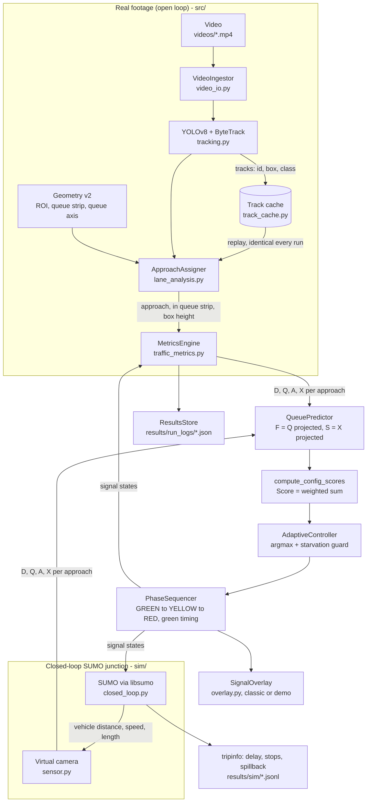

# Architecture

The project has **two front ends that feed one controller**. On real video, the
measurements come from the computer-vision pipeline. In the closed-loop evaluation
they come from a simulated junction. The controller code in between is the same file
in both cases, which is what makes the simulation a test of *this* project's controller
rather than of a re-implementation.



## The two feedback loops

* **Video (open loop).** The phase sequencer's signal state flows back into the
  `MetricsEngine` only to *book-keep* waiting time and vehicles served. The recorded
  vehicles never see this simulated signal; they move when the real light that was
  filmed lets them. That is why video runs can demonstrate measurement and decisions,
  but cannot rank controllers (`AUDIT_REPORT.md`, W1).
* **Simulation (closed loop).** The signal state is written into SUMO every 0.5 s, so the
  simulated vehicles stop and go because of *our* controller. Queues, delay and spillback
  then depend on the controller. This is the loop the ablation is measured in.

## Order of operations per frame (identical in both front ends)

```
sequencer.tick(scores from previous frame)   -> decides a new phase only at a phase boundary
signal states applied                        -> video: book-keeping; sim: traffic lights in SUMO
measure this frame                           -> MetricsEngine (video) / virtual camera (sim)
QueuePredictor.predict                       -> fills F (count forecast) and S (spillback risk)
compute_config_scores                        -> the scores the next decision will read
```

A decision therefore uses the scores measured on the frame before it, and the run log
records that frame as `selection_score_frame`.

## Where each module lives

| Stage | File | Notes |
|---|---|---|
| Video input, constant 30 fps clock | `src/video_io.py` | |
| Detection + tracking | `src/tracking.py` | Ultralytics YOLOv8 + built-in ByteTrack (`persist=True`) |
| Track cache | `src/track_cache.py` | records tracker output once; every ablation arm replays it |
| Geometry, assignment, queue axis | `src/lane_analysis.py` | bottom-centre point in polygon; drawn polyline axis |
| Measurements D, Q, A, X; waiting, served | `src/traffic_metrics.py` (`MetricsEngine`) | windowed stopped test, contiguous queue tail |
| Forecasts F and S | `src/traffic_metrics.py` (`QueuePredictor`) | least-squares slope over 2.5 s |
| Score | `src/traffic_metrics.py` (`compute_score_weighted`) | convex combination, all terms in [0, 1] |
| Controllers | `src/signal_controller.py` | `FixedTimeController`, `AdaptiveController` |
| Signal state machine and green timing | `src/signal_controller.py` (`PhaseSequencer`) | bands or actuated gap-out |
| Overlay | `src/overlay.py` | `--overlay demo` = research dashboard |
| Run logs, tables, graphs | `src/results_store.py`, `src/evaluation.py` | |
| Closed-loop junction, demand | `sim/scenario.py` | SUMO network, 9 scenarios |
| Virtual camera | `sim/sensor.py` | same definitions as the video measurements |
| Closed-loop runner, ablation arms | `sim/closed_loop.py` | |
| Experiment grid and statistics | `sim/experiment.py`, `sim/PROTOCOL.md` | paired 95% CIs over 20 seeds |
