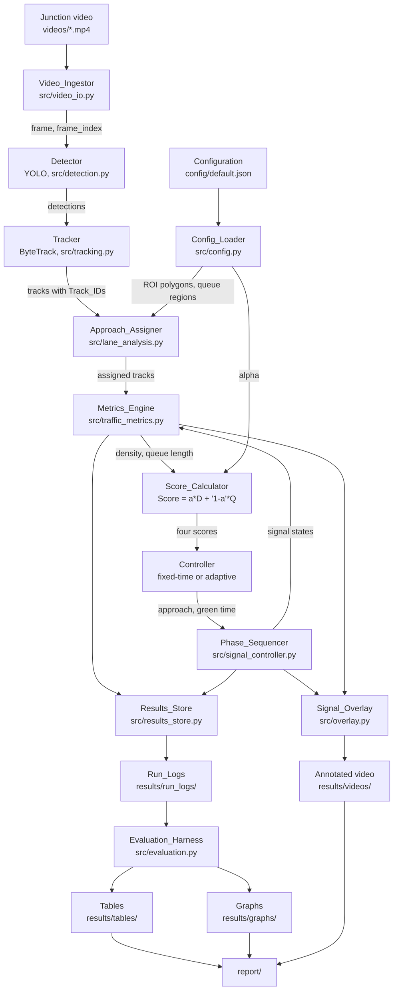

# Architecture

Pipeline stages, from video input to evaluation (Requirement 17.2).

The only feedback edge is Phase_Sequencer back into Metrics_Engine: Waiting_Time is
held while an approach is GREEN, so the measurement stage needs the signal state in
force on the frame it is measuring. Everything else flows forward.
