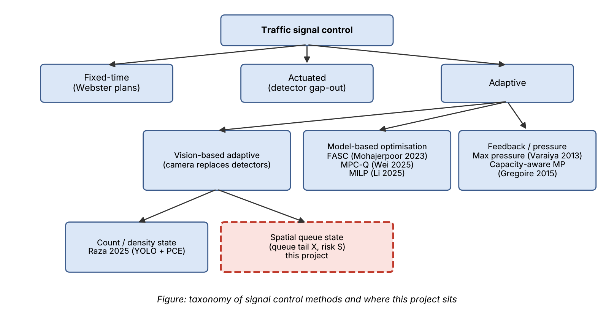
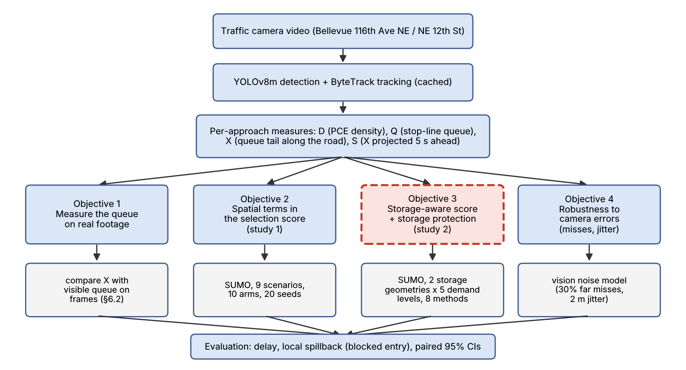
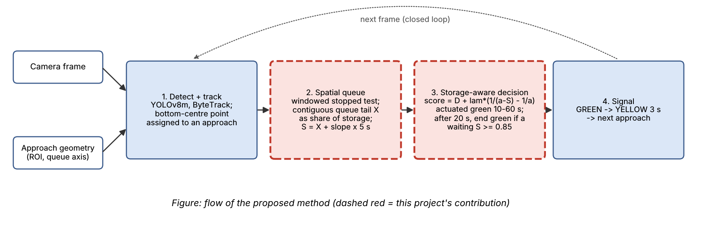
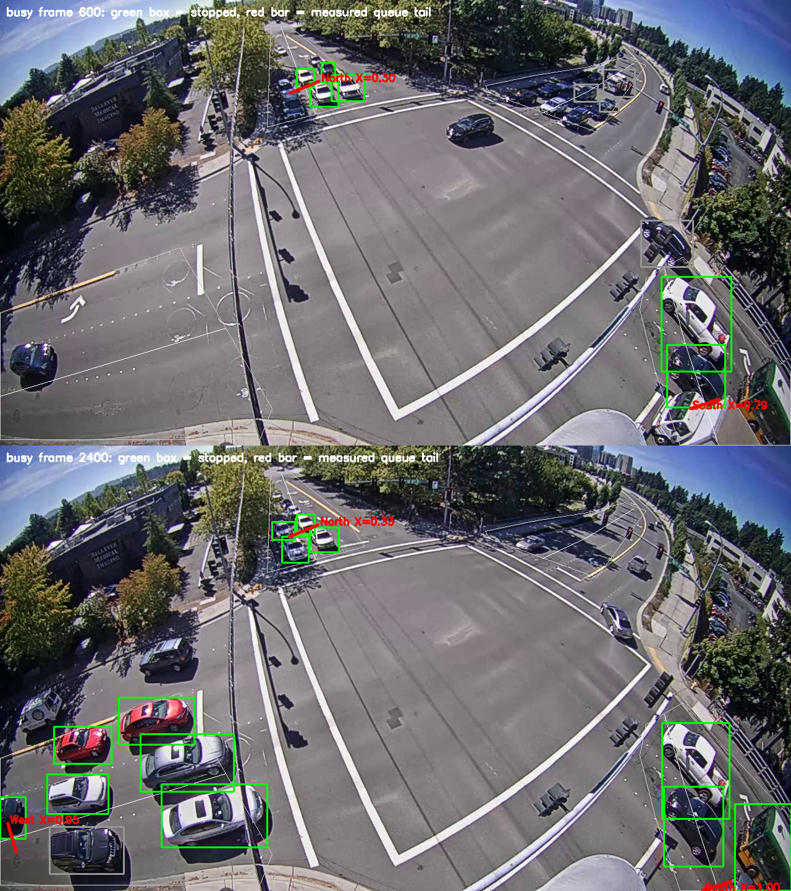
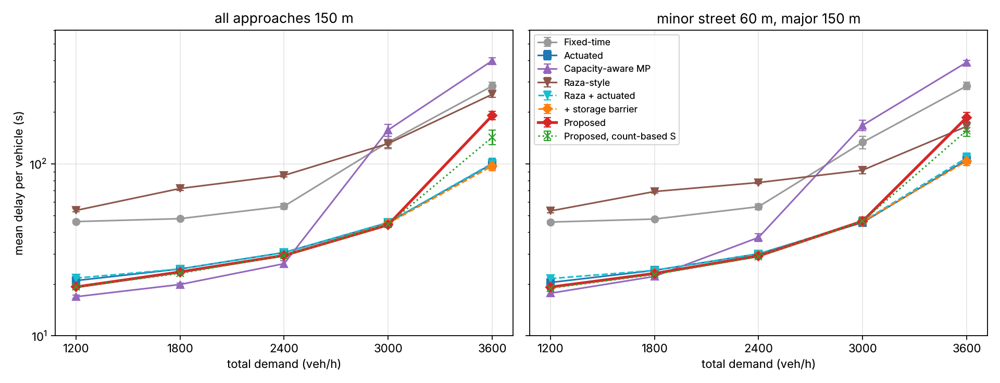
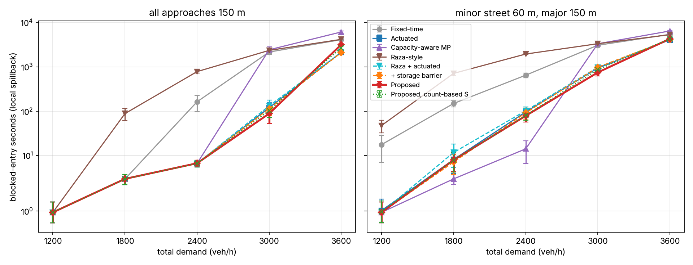
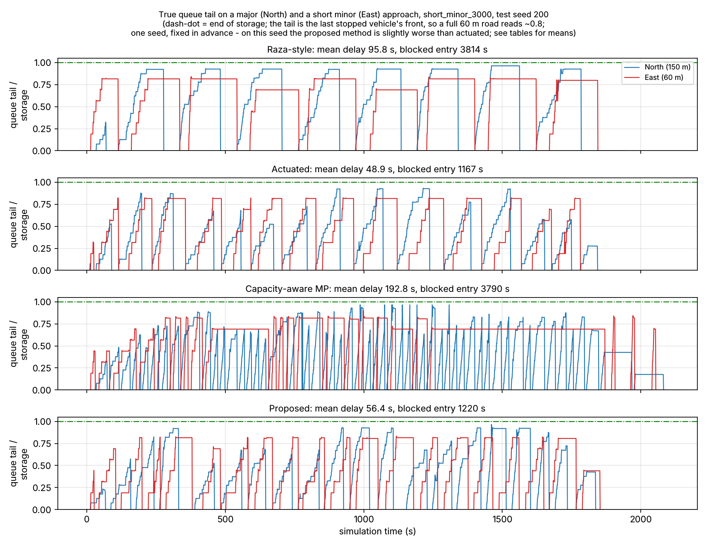

# Vision-Measured Spatial Queues for Storage-Aware Adaptive Traffic Signal Control

*Computer Vision course project. Laid out in the department's research-presentation order:
introduction → challenges → applications → problem formulation → related literature and
gaps → motivation → objectives → workflow → datasets and metrics → contributions with
results → summary and takeaways → references. Every number is produced by a script in this
repository; the command is given next to it.*

---

## Table of contents

1. Introduction to vision-based signal control
2. Challenges
3. Applications in smart cities
4. Problem formulation
5. Related literature and research gaps
6. Research motivation
7. Objectives
8. Proposed workflow
9. Data, simulation testbed and evaluation measures
10. Research contributions and results
    * C1: robust spatial queue measurement from video
    * C2: spatial terms in the selection score (study 1)
    * C3: storage-aware score and storage protection (study 2)
11. Summary and key takeaways
12. References

---

## 1. Introduction

**What is vision-based adaptive signal control?** A signalised junction repeatedly
decides *which approach gets green next and for how long*. Fixed-time plans repeat the
same timings whatever traffic is present. Adaptive control measures the traffic and
decides from the measurement. Vision-based adaptive control uses a camera as the sensor:
a detector (YOLO) finds vehicles, a tracker (ByteTrack) follows each one across frames,
and the per-approach measurements drive the controller.

**Why a camera, not loop detectors?** A loop detector is a wire coil in the road that
reports whether a vehicle is over it. It sees one spot. A camera sees the whole approach,
so it can measure *where the queue ends*, not only whether a vehicle is at the stop line.

**Example.** On the Bellevue camera (116th Ave NE / NE 12th St), the queue on the South
approach backs up past the stop-line area during red. A count of vehicles in the stop-line
zone saturates at the zone's capacity; the queue tail measured along the road keeps moving
back (`report/queue_tail_validation.png`).

## 2. Challenges

* **Perspective.** Vehicles far from the camera are small; a fixed pixel threshold for
  "stopped" is wrong for near and far vehicles alike.
* **Detection recall at distance.** Small, distant, occluded vehicles are missed; on a
  test frame YOLOv8m found 4 of about 9 queued cars on the far North leg.
* **Tracking noise.** Bounding boxes jitter frame to frame; a parked-looking jitter can
  read as motion, and an ID switch breaks a vehicle's history.
* **Closed-loop evaluation.** Recorded video cannot answer "what if the signal had been
  different?": the filmed vehicles obey the real signal, not ours.
* **Over-saturation.** When demand exceeds capacity, queues reach the end of the road
  (spillback). Counting sensors saturate exactly there.

## 3. Applications in smart cities

* **Adaptive junction control** from existing traffic cameras, without cutting loops
  into the road.
* **Spillback monitoring:** knowing when an approach is about to run out of storage,
  which in a network blocks the junction upstream.
* **Traffic analytics:** queue lengths, stops per vehicle and approach demand for
  planning (the demand shares used in the calibrated simulation scenario come from the
  video counts).

## 4. Problem formulation

Each approach `i` of the junction has visible storage of length `L_i` (metres along the
road). At time `t` its queue tail is at distance `x_i(t)` from the stop line. The camera
image `I_t` is the only sensor:

```
measurement:   X̂_i(t) = h(I_t, I_{t-1}, ...; θ) ≈ x_i(t) / L_i          (1)
```

where `h` is the vision pipeline (detection, tracking, stopped test, queue-tail search)
with parameters `θ`. A controller `π` turns the measurements into a decision:

```
control:       (p_k, g_k) = π( X̂(t), D̂(t), ... )                        (2)
```

`p_k` is the approach served in green `k` and `g_k` its green time. The goal is

```
minimise   total delay  Σ_v ( t_v,actual − t_v,free )
subject to x_i(t) ≤ β_i · L_i          (spillback avoidance, Mohajerpoor et al. 2023, Eq. 9)
           g_min ≤ g_k ≤ g_max
```

`β_i ≥ 1` relaxes the constraint for low-priority movements (Mohajerpoor et al. set
β = 1 for the major and 5 for the minor road). The question this project answers is
whether a camera-measured `X̂_i` can serve this constraint, and whether doing so lowers
delay or spillback.

**The base controller (Raza et al. 2025).** Density is a PCE-weighted count,

```
D_i = Σ_c n_i,c · PCE_c                                                  (3)
p_k = argmax_i D_i  (with a starvation guard),   g_k = band(D_{p_k}) ∈ {low, medium, high}
```

(their Eq. 1, Algorithm 1; 40/60/120 s in the paper, 30/45/60 s here). Its state is a
count. It does not know how long the road is, or where the queue ends.

## 5. Related literature and research gaps

### Taxonomy



### Table 1: summary of signal-control methods relevant to this project

| S.No. | Method | Contribution | Salient features | Limitation |
|---|---|---|---|---|
| 1 | 1958, Webster fixed-time [1] | Optimal cycle length and splits from average flows | Simple, no sensors | Cannot react to fluctuating demand; wastes green on empty approaches |
| 2 | Actuated control (gap-out / max-out) [2] | Green ends when the detector sees no vehicle for a passage time | Responds to presence; industry standard | Sees only the detector zone; cannot tell how far back the queue reaches |
| 3 | 2013, Max pressure [3] | Throughput-optimal decentralised feedback | Serves the phase with the largest queue difference | Assumes unlimited link storage, so ignores spillback |
| 4 | 2015, Capacity-aware backpressure [4] | Normalises pressure by link capacity | Accounts for finite storage | Needs vehicle counts on every link; frequent switching |
| 5 | 2023, FASC, Mohajerpoor et al. [5] | Optimal dynamic cycles and splits for over-saturated isolated junctions | Shockwave (kinematic-wave) queue model; spillback-avoidance constraint; mixed delay + spillback-probability objective; 63/55/40% less delay than fixed/actuated/capacity-aware MP | Needs demand prediction; queue position is *estimated* from a model and loop detectors; non-convex optimisation |
| 6 | 2025, Li et al. [6] | Multi-objective corridor coordination with queue-profile estimation | Under/over-saturation test from queue discharge time | Offline fixed-time; needs connected-vehicle trajectories and a MILP solver |
| 7 | 2025, Wei et al. [7] | Hierarchical MPC with link-transmission queue dynamics | Predicts queue growth, acts before spillback | State estimation is assumed, not built; network-scale solver |
| 8 | 2025, Raza et al. [8] (base paper) | Edge-deployed YOLO + PCE density controller | PCE weighting, lane priority, green-denial counter; SUMO and real footage | State is a count: storage-blind; fixed green bands |

### Relevant methods, with their equations and limitations

**Raza et al. (base).** Eq. (3) above. *Limitation:* the count `D_i` treats 10 vehicles
on a 60 m road and 10 on a 150 m road alike, though the first is nearly full; the green
time is a fixed band, so a green never ends early when its queue has cleared.

**Capacity-aware max pressure (Gregoire et al.).** For an isolated junction, serve

```
p = argmax_i  n_i / C_i                                                   (4)
```

with `n_i` the vehicles on approach `i` and `C_i` its storage capacity, re-decided every
few seconds. *Limitation:* it re-decides on every small change in the ratio, so under
heavy demand it switches often and loses time to yellow phases (seen in §10.3).

**FASC (Mohajerpoor et al.).** Minimises delay subject to the spillback-avoidance
constraint `x_p ≤ β_p Λ_p`, and in the queue-formation period adds a penalty

```
0.5 ω₂ Σ_k Σ_p  Λ_p / (α_p Λ_p − δ_p(k))                                 (5)
```

that grows without bound as the queue `δ_p` approaches the scaled link length `α_p Λ_p`.
*Limitation:* `δ_p` comes from a shockwave model fed by predicted demand and loop
detectors, because the detectors cannot see the queue position.

### Research gaps

* Vision-based controllers (Raza) measure **counts**. They are blind to *where* the queue
  is relative to the end of the road, which is exactly what spillback avoidance needs.
* Spillback-aware methods (FASC, Wei) need the queue position but **estimate** it from
  models, predicted demand or assumed state estimators. None measures it directly.
* Counting sensors **saturate** at the stop-line zone's capacity: once it is full, a
  count forecast reads "steady" however fast the queue grows (§10.1).

## 6. Research motivation

* A camera already sees the whole approach. If the queue position can be measured
  robustly from detections and tracks, it supplies the quantity that FASC and Wei must
  model.
* If a controller uses that measured position *in the way the literature says it matters*
  (as a storage constraint, not just one more term in a ranking), it may reduce spillback
  on short approaches without costing delay.
* Whether it does is an empirical question, and recorded video cannot answer it (§2), so
  it needs a closed-loop testbed and a pre-registered comparison.

## 7. Objectives

1. Design a robust **spatial queue measurement** from YOLO + ByteTrack: the queue tail `X`
   along the road and its 5-second projection `S` (local spillback risk).
2. Test whether `X`/`S` improve a Raza-style controller when added to the **selection
   score** (study 1).
3. Design a **storage-aware** extension in the spirit of Mohajerpoor et al.: a reciprocal
   storage barrier on `S` in the score and **storage protection** in the green timing,
   and test it against standard and literature baselines over graded demand (study 2).
4. Measure **robustness** to camera errors (missed far vehicles, position jitter).

## 8. Proposed workflow



## 9. Data, simulation testbed and evaluation measures

**Video.** City of Bellevue Traffic Video Dataset (released for research), camera at
116th Ave NE / NE 12th St, three clips of 107 s, 240 s and 240 s, constant 30 fps. Used for
measurement (Objective 1) and to calibrate the demand shares of one simulation scenario.

**Closed-loop testbed.** SUMO (Simulation of Urban MObility, an open-source traffic
simulator) through `libsumo`. A four-arm junction, two lanes per approach, one approach
served per phase, 3 s yellow. A *virtual camera* measures `D`, `Q`, `X`, `S` from the
simulated vehicles with the same definitions as the video pipeline (`sim/sensor.py`), and
a *vision noise* mode drops up to 30% of far vehicles and jitters positions by 2 m.

**Measures.**
* **Mean delay per vehicle** (s): SUMO time loss plus the time a vehicle waited to enter
  a full road. Primary metric.
* **Blocked-entry seconds** (local spillback): seconds, summed over approaches, during
  which arriving vehicles could not enter because the queue reached the upstream end of
  the approach.
* 95% confidence intervals from paired seeds (the same random demand for every method).
* **Pre-registration.** Every free choice is made on validation seeds; the protocol is
  committed before the test seeds run (`sim/PROTOCOL.md`, `sim/PROTOCOL_STUDY2.md`).


## 10. Research contributions and results



*Flow of the proposed method. Dashed red boxes are this project's contribution; steps 1 and
4 use existing tools (YOLOv8, ByteTrack, a standard signal state machine).*

---

### C1 — Robust spatial queue measurement from video

**Method.** For each approach a polyline (the *queue axis*) is drawn from the stop line
back along the inbound lanes; a point's position is its arc length along it, 0 at the
stop line and 1 at the far edge of the view. Then, per frame:

```
stopped_v   ⇔  displacement of v over the last 1 s  <  0.2 × (v's box extent along the road)     (6)
X_i         =  position of the last vehicle in the contiguous chain of stopped vehicles
               that starts at the stop line (consecutive members ≤ 2 vehicle lengths apart)   (7)
S_i         =  clamp( X_i + (dX_i/dt) · 5 s ),  slope by least squares over 2.5 s             (8)
```

Eq. (6) is scaled by each vehicle's own size, so it works the same for near (large) and far
(small) vehicles: this is the perspective correction. Eq. (7) needs tracking: "stopped"
compares the *same* vehicle across frames.

**Result (real footage, busy clip;** `python audit/measurement_compare.py`**).**

| | original pipeline | + robust stopped test | + robust test, redrawn geometry |
|---|---|---|---|
| stops per vehicle (lower = less false stopping) | 4.28 | 0.46 | **0.76** (0.74 with YOLOv8m) |
| North: frames with a queue / with a jump > 0.3 | 99% / 7.3% | 0.2% / 0.06% | 71% / 0.06% |
| South: frames with a queue / with a jump > 0.3 | 58% / 3.0% | 0% / 0% | 48% / 1.1% |
| West: frames with a queue / with a jump > 0.3 | 59% / 4.8% | 0.2% / 0% | 58% / 0.5% |



**Contributions**
* A calibration-free, perspective-normalised measurement of where the queue ends, from
  standard detections and tracks.
* The measured tail sits at the back of the visible queue wherever the detector sees the
  vehicles. Its limit is detector recall at distance (YOLOv8m found 4 of about 9 queued
  cars on the far North leg), not the queue logic.

---

### C2 — Spatial terms in the selection score (study 1)

**Method.** Raza-style score with the spatial terms added as weights:
`Score_i = 0.4·(α D_i + (1−α) Q_i) + 0.3·F_i + 0.3·S_i`, compared against the same score
without them, a weight-matched null control, and variants (10 controllers × 9 scenarios ×
20 paired test seeds, protocol `sim/PROTOCOL.md`).

**Result.** Adding X or S never changed mean delay by more than ±0.5 s, in any scenario.
It changed which approach got the green in **1 of 40** inspected runs. What did matter was
the green-time rule: actuated timing roughly halved delay against fixed-time and cut it
about 9× under unequal over-saturated demand (300.6 → 33.8 s), while Raza-style bands were
worse than fixed-time in most scenarios.

**Why (the finding that shaped C3).** At the moment a green ends, every other approach has
been red and is building a queue; the longest queue is also the one with most vehicles, so
X ranks approaches exactly as density does, and an argmax cannot change. Spatial
information can only matter where the count does *not* already say the same thing: in the
*timing*, and relative to *how much road each approach has*. That is Mohajerpoor et al.'s
formulation, and it is what C3 tests.

---

### C3 — Storage-aware score and storage protection (study 2)

**Method.** The proposed objective is almost the same as Eq. (3), except for one storage
term and one timing rule:

```
Raza:      score_i = D_i                                                                   (3)
Proposed:  score_i = D_i + λ · ( 1 / (α − S_i)  −  1 / α )        λ = 1, α = 1.1            (9)

Timing:    actuated green, 10–60 s, ends after the stop-line zone is empty for 2 s;
           and, after 20 s of green, ends when a waiting approach j has
           S_j ≥ β (= 0.85) and S_j > S_active                                             (10)
```

`D_i` is Raza's PCE count with one common normaliser, so it is storage-blind, as in the
paper. `S_i` is the camera's queue tail as a share of **that approach's own** visible
storage, so Eq. (9) is storage-aware by construction. The reciprocal term is Mohajerpoor
et al.'s penalty (Eq. 5): near zero for a short queue, very large as the queue nears the end
of its road. Eq. (10) is their spillback-avoidance constraint applied online.

**Testbed.** Two storage geometries (all approaches 150 m; minor street shortened to 60 m),
five demand levels from well under to beyond capacity (the analogue of the noise densities
in a super-resolution table), eight methods, 20 paired test seeds (200–219). Settings
(λ, α, β, the 20 s guard) were chosen on validation seeds 0–9 by a rule written before the
guard results were seen; the protocol was committed before any test seed ran
(`sim/PROTOCOL_STUDY2.md`). `python -m sim.study2_figures` produces every number below.

**Table 2: mean delay per vehicle (s), lower is better. \* = proposed; best per column in bold.**

*All approaches 150 m*

| Method | 1200 veh/h | 1800 | 2400 | 3000 | 3600 |
|---|---|---|---|---|---|
| Fixed-time [1] | 46.2 | 48.0 | 56.7 | 133.5 | 283.6 |
| Actuated [2] | 20.9 | 24.5 | 30.5 | 45.5 | 99.9 |
| Capacity-aware MP [4] | **16.9** | **19.9** | **26.3** | 157.4 | 397.8 |
| Raza-style [8] | 53.6 | 71.9 | 85.6 | 131.2 | 253.5 |
| Raza + actuated (ablation) | 21.7 | 24.5 | 30.5 | 45.6 | 100.6 |
| + storage barrier, Eq. (9) (ablation) | 19.2 | 23.5 | 29.3 | 45.1 | **97.1** |
| **Proposed\*, Eqs. (9)+(10)** | 19.2 | 23.5 | 29.3 | **44.2** | 190.8 |
| Proposed, S from a stopped count (control) | 19.2 | 23.1 | 29.3 | 44.4 | 142.8 |
| Proposed, with camera errors | 19.8 | 23.3 | 29.1 | 44.1 | 189.2 |

*Minor street 60 m, major street 150 m*

| Method | 1200 veh/h | 1800 | 2400 | 3000 | 3600 |
|---|---|---|---|---|---|
| Fixed-time [1] | 45.9 | 47.7 | 56.3 | 133.4 | 283.7 |
| Actuated [2] | 20.4 | 24.0 | 30.0 | **45.6** | 105.5 |
| Capacity-aware MP [4] | **17.7** | **22.1** | 37.3 | 167.6 | 389.5 |
| Raza-style [8] | 53.2 | 69.0 | 77.8 | 91.9 | 165.2 |
| Raza + actuated (ablation) | 21.5 | 24.0 | 30.0 | 46.1 | 108.5 |
| + storage barrier, Eq. (9) (ablation) | 19.2 | 23.0 | 29.4 | 46.1 | **103.7** |
| **Proposed\*, Eqs. (9)+(10)** | 19.2 | 23.0 | 29.1 | 46.4 | 186.2 |
| Proposed, S from a stopped count (control) | 18.9 | 22.7 | **28.9** | 46.5 | 156.3 |
| Proposed, with camera errors | 20.0 | 23.9 | 29.3 | 53.7 | 196.7 |

**Table 3: local spillback, blocked-entry seconds (lower is better).**

| Method | uniform 2400 | uniform 3000 | uniform 3600 | short-minor 2400 | short-minor 3000 | short-minor 3600 |
|---|---|---|---|---|---|---|
| Fixed-time | 163.6 | 2171.9 | 4135.2 | 652.1 | 3093.2 | 5441.2 |
| Actuated | 6.7 | 120.5 | 2136.4 | 96.5 | 945.0 | **4097.2** |
| Capacity-aware MP | **6.6** | 2442.3 | 6163.9 | **14.2** | 3343.2 | 6495.0 |
| Raza-style | 784.8 | 2365.9 | 4194.5 | 1957.2 | 3346.8 | 5360.8 |
| + storage barrier (ablation) | 6.7 | 113.9 | **2105.1** | 92.2 | 982.4 | 4161.2 |
| **Proposed\*** | 6.7 | **88.6** | 3193.3 | 79.0 | **753.2** | 4326.1 |
| Proposed, count-based S | **6.6** | 103.7 | 2718.2 | 81.2 | 868.6 | 4364.7 |
| Proposed, camera errors | 6.6 | 80.8 | 3142.8 | 92.1 | 922.1 | 4339.9 |

(Below 2400 veh/h every actuated method has under 10 blocked seconds; full tables in
`results/sim/study2/tables.md`.)




**Paired comparisons (proposed − reference, mean ± 95% CI over 20 seeds; negative = proposed better).**

| Question | Condition | Δ delay (s) | Δ blocked-entry (s) |
|---|---|---|---|
| Better than the base paper? | 9 of 10 conditions | −34 to −87, all significant | lower or equal |
| | short-minor 3600 | **+21.0 ± 10.5 (worse)** | −1035 ± 149 |
| Better than standard actuated? | ≤ 2400 veh/h (6 conditions) | −0.9 to −1.7, all significant | no difference, except short-minor 2400: −17.6 ± 14.9 |
| | uniform 3000 | −1.3 ± 0.9 | **−31.9 ± 20.6 (−26%)** |
| | short-minor 3000 | +0.8 ± 1.6 (n.s.) | **−191.8 ± 73.3 (−20%)** |
| | 3600 (both geometries) | **+90.9 ± 9.8, +80.7 ± 8.1 (worse)** | +1057, +229 (worse) |
| Does storage protection, Eq. (10), help? (vs barrier only) | uniform 3000 | −0.9 ± 0.9 (n.s.) | **−25.3 ± 19.1** |
| | short-minor 3000 | +0.3 ± 1.6 (n.s.) | **−229.2 ± 70.3** |
| | 3600 | **+93.7, +82.6 (worse)** | +1088, +165 (worse) |
| Does the camera's spatial measure beat a count? | short-minor 3000 | −0.1 ± 1.9 (n.s.) | **−115.4 ± 81.2** |
| | other conditions ≤ 3000 | within ±0.4 (one cell, uniform 1800, +0.4 ± 0.3, excludes 0) | n.s. |
| | 3600 | **+48.0, +29.9 (worse)** | mixed |

**Visual comparison.** True queue tail on the major (North, 150 m) and short minor (East,
60 m) approach, one test seed fixed in advance, short-minor 3000 veh/h:



Raza-style holds every green for its band, so queues sit near the end of storage for long
stretches. Capacity-aware max pressure re-decides every 5 s and switches constantly; the
yellow time it loses makes its queues longer, not shorter. Actuated and the proposed
method serve in short, queue-driven greens. On this particular seed the proposed method is
slightly worse than actuated; across the 20 seeds it has 20% less spillback at the same
delay (Table 3).

**Contributions**
* A storage-aware extension of a vision controller that is a one-term change to the base
  equation (Eq. 9) plus one timing rule (Eq. 10), both taken from Mohajerpoor et al.'s
  formulation and driven by a camera measurement instead of a shockwave model.
* Near capacity it **reduces local spillback by 20–26% against actuated control without
  increasing delay**. On the junction with a short minor street, the camera's spatial
  measurement does this better than a stopped-vehicle count (−115 s blocked entry): the one
  place in this project where measuring *where* the queue is beats counting it.
* Against the base paper it reduces mean delay by 34–87 s (63–67% under capacity) in 9 of 10
  conditions. The ablation shows most of this comes from actuated timing (Raza + actuated
  is within 1–2 s), not from the spatial terms.
* **Beyond capacity, storage protection fails:** it cuts greens so often that delay
  roughly doubles against actuated control. This is the regime Mohajerpoor et al. warn
  about, where spillback cannot be avoided and the constraint must be relaxed; our guard
  (protect only after 20 s of green) reduced the damage on validation but did not remove it.
* With camera errors (30% far misses, 2 m jitter) results hold up to 2400 veh/h and on
  the uniform junction at 3000 veh/h. Near capacity on the short-road junction the
  benefit mostly disappears: 922 blocked seconds (753 with an exact sensor, 945 for
  actuated) and delay rises from 46.4 to 53.7 s.

## 11. Summary and key takeaways

### Summary
* A robust, calibration-free measurement of the queue tail from YOLO + ByteTrack works on
  real footage wherever the detector sees the vehicles (C1).
* Used only to *rank* approaches, the spatial measure adds nothing: it ranks them as the
  count already does (C2, pre-registered, 20 seeds).
* Used as Mohajerpoor et al. use spatial queue information (a storage barrier and a
  storage constraint on the green), it reduces local spillback by 20–26% near capacity at
  no delay cost, and on short roads the camera's spatial measure beats a count (C3).
* It cuts delay against the Raza-style base by 34–87 s, mostly through actuated timing.

### Key takeaways
* **Where the information enters matters more than what is measured.** The same X was
  useless in the score (C2) and useful in the green-time constraint (C3).
* **Storage protection needs a regime switch.** In the queue-formation regime beyond
  capacity, spillback cannot be avoided and protection makes things worse. A natural next
  step, following FASC, is to detect that regime from the camera (all approaches near full
  at once) and relax β automatically.
* **An isolated junction under-values spillback.** Here a blocked vehicle only waits; in a
  network it blocks the junction upstream. A two-junction corridor in SUMO would measure the
  benefit Mohajerpoor et al. and Wei et al. target.
* **Detector recall at distance is the binding limit** of the measurement, and camera
  errors erode the near-capacity benefit on short roads. A higher-resolution model or
  tiling on the far approaches is the first thing to improve.
* **Capacity-aware max pressure is the strongest method at light demand** (about 2 s less
  delay); a fair comparison should report that.

## 12. References

1. F. V. Webster, "Traffic Signal Settings," Road Research Technical Paper No. 39, HMSO, London, 1958.
2. T. Urbanik et al., *Signal Timing Manual*, 2nd ed., NCHRP Report 812, Transportation Research Board, 2015.
3. P. Varaiya, "Max pressure control of a network of signalized intersections," *Transportation Research Part C*, vol. 36, pp. 177–195, 2013.
4. J. Gregoire, X. Qian, E. Frazzoli, A. de La Fortelle, T. Wongpiromsarn, "Capacity-Aware Backpressure Traffic Signal Control," *IEEE Trans. Control of Network Systems*, vol. 2, no. 2, pp. 164–173, 2015.
5. R. Mohajerpoor, C. Cai, M. Ramezani, "Optimal Traffic Signal Control of Isolated Oversaturated Intersections Using Predicted Demand," *IEEE Trans. Intell. Transp. Syst.*, vol. 24, no. 1, pp. 815–826, 2023, doi:10.1109/TITS.2022.3209606.
6. C. Li, Y. Lu, H. Wang, "A Multi-Objective Model for Traffic Signal Coordination Control With Queue Profile Estimation," *IEEE Trans. Intell. Transp. Syst.*, vol. 26, no. 12, pp. 23389–23406, 2025, doi:10.1109/TITS.2025.3616119.
7. Wei, Ampountolas, Hirrle, Wang, "Hierarchical Predictive Control of Network Traffic Signals Using Link Transmission Model With Queue Dynamics," *IEEE Trans. Intell. Transp. Syst.*, vol. 26, no. 10, pp. 16391–16404, 2025, doi:10.1109/TITS.2025.3568869.
8. M. Raza et al., "An Edge-Deployed Real-Time Adaptive Traffic Light Control System Using YOLO-Based Vehicle Detection and PCE-Aware Density Estimation," *IEEE Access*, vol. 13, 2025, doi:10.1109/ACCESS.2025.3602844.
9. G. Jocher et al., Ultralytics YOLOv8, 2023, https://github.com/ultralytics/ultralytics.
10. Y. Zhang et al., "ByteTrack: Multi-Object Tracking by Associating Every Detection Box," *ECCV*, 2022.
11. P. A. Lopez et al., "Microscopic Traffic Simulation using SUMO," *IEEE ITSC*, 2018.
12. City of Bellevue, Traffic Video Dataset, https://github.com/City-of-Bellevue/TrafficVideoDataset.
